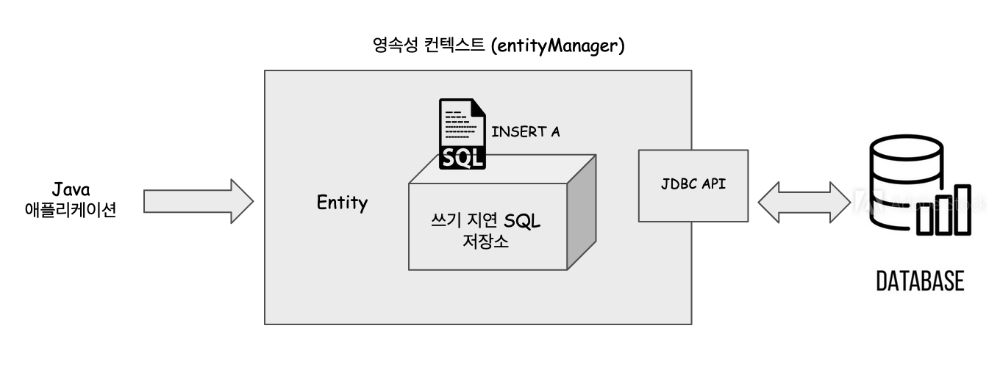
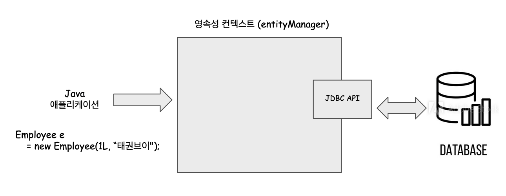
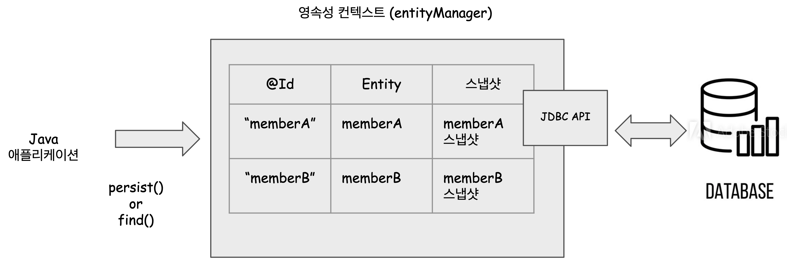
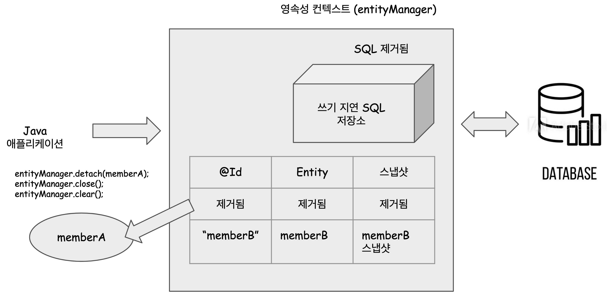

# 0. 영속성 컨텍스트, 엔티티

JPA 개념을 다시봐야 할 때마다 이 페이지를 20분안에 속독할 수 있도록 써머리 해보려 한다. TMI를 배제하고 최대한 요약하는 방식으로 정리예정이다. 

개인적으로 공부할 때 느꼈던 점은... 엔티티 매니저는 불필요하게 트랜잭션을 자주 생성하지 않도록 도와주고, SQL이 너무 자주 Database에 전달되지 않도록 하고 Transaction 단위로 연산이 수행되도록 어느 정도 데이터베이스 연산을 하기 직전에 사용되는 **버퍼**와 같은 역할을 하는 것이 아닐까 하는 생각을 자주 했던 것 같다. 

 

그런데 사실, 쌩 Java 프로그램이 아닌, 스프링 부트 웹 에서 EntityManager 가 생성되는 시점은 요청이 발생했을 때 새롭게 생성되고, Request가 종료되면 EntityManager가 종료되는 것으로 추측...하고 있다.(확실하지는 않다.) 이런 이유로 웹 요청 하나에 대해 짧은 비지니스 로직만 갖고 있는 경우는 장점을 확실히 체감할 수 어려울수 있겠다는 생각이 들었다. 

 

하지만, 실제로 하나의 웹 요청에 대한 비지니스 로직이 4000줄이 넘어가는 경우가 있다. 이렇게 DB 접근로직이 굉장히 긴 경우, 요청 하나에 대해 엔티티 캐시로 담아두고 처리하는 것도 어느 정도는 장점이 될 듯하다. 그리고 레디스/멤캐시에 데이터가 없거나 유효기간이 지났을 때에만 DB에 직접 접근하도록 한다면 DB를 덜 힘들게 할 수 있지 않을까 싶다. 

 

## 영속성 컨텍스트, EntityManager

나는 일단 이렇게 이해했다. 영속성 컨텍스트는 아래와 같은 모양이다.

이 영속성 컨텍스트라는 것은 하나의 컨테이너라는 개념이다. 이 컨테이너 내에서는 JDBC API를 추상화한 여러가지 클래스 들이 있다. 그리고 이 클래스들은 entity 의 버전관리를 하거나, Entity 캐시처리, 쓰기지연 등등 여러가지 작업을 처리하는 기능을 하는 여러가지 기능들이 있을 것이다. 이 영속성 컨텍스트에서 연산을 수행하는 것은 EntityManager 라고 하는 클래스의 인스턴스로 접근한다. 흔히 "영속성 컨텍스트는 ~ 를 한다." 이렇게 책이나 강의에서 설명하는 경우가 많다. 그리고 대부분 EntityManager와 영속성 컨텍스트는 같은 개념이라고 생각하면 된다고 설명하는 편이다. 

그리고 영속성 컨텍스트 = 영속성 컨테이너 라고 이야기하기도 한다. 

그래서 나도 그냥 통념에 반항하지 않고 EntityManager = 영속성 컨텍스트 = 영속성 컨테이너로 정리한 후에 요약을 해보려 한다. 

 

## EntityManager 의 동작(메서드) 명세

[docs.oracle.com - EntityManager](https://docs.oracle.com/javaee/7/api/javax/persistence/EntityManager.html) 에 있는 메서드가 매우 많다. 영속성 컨텍스트에 접근할 때 사용하는 동작(메서드)를 몇가지 추려보면 아래와 같다.

- clear()
- close()
- flush()
- setFlushMode()
- getTransaction() : EntityTransaction
- persist(Object entity) (엔티티 Managed 상태로...)
- find()
- detach(Object entity)
- remove()

 

## 엔티티의 4가지 상태

영속성 컨텍스트(영속 컨테이너)가 관리하는 엔티티는 아래의 4가지 상태(**N-M-D-R**)로 존재할 수 있다.

- 생성(NEW)
  - 프로그램 상에서 엔티티 객체는 생성했지만, 영속성 컨테이너(엔티티 매니저)에 등록하지는 않은 상태
  - em.persist() 하지 않은 상태
- 관리(MANAGED)
  - 영속성 컨테이너에 엔티티를 등록한 상태
- 분리(DETACHED)
  - 영속성 컨테이너에서 엔티티를 분리한 상태
- 삭제(REMOVED)
  - 영속성 컨테이너에서 엔티티를 삭제 처리한 상태

 

### Entity의 상태 (1) - 생성(NEW)

프로그램 상에서 객체만 생성한 상태이고 영속성 컨텍스트에는 등록하지 않은 상태이다.

### Entity의 상태 (2) - 관리(Managed)

관리 상태를 흔히 영속 상태라고도 한다. 엔티티가 영속 컨테이너의 관리하에 들어가게 된다. 

영속성 컨테이너에 엔티티 객체가 등록되는 경우는 두가지 경우이다. 

영속성 컨텍스트가 생성하는 SQL은 트랜잭션에 밀접하게 관련되어 있다. 

- EntityManager.persist() 를 호출했을 때
  - persist() 가 호출된 후 transaction 이 commit 되면 실제 DB에 INSERT 연산이 수행되게 된다.
  - persist() 호출 전 Transaction이 시작되어야 하고, persist() 호출 후 Transaction이 종료되어야 한다.
- EntityManager.find() 를 호출했을 때
  - 엔티티가 영속성 컨테이너에 있으면(이미 관리상태 이면) 해당 엔티티를 반환한다.
  - 영속성 컨테이너에 없을 경우 DB에서 조회후, 엔티티의 인스턴스를 생성해 영속성 컨텍스트 안에 두어 관리상태로 만든다.
  - 그리고 find()의 경우 Java 애플리케이션에서 호출한 것이기에 영속성 컨테이너는 이 관리상태로 변한 엔티티 인스턴스를 반환해준다.

 

### 참고) 더티체킹

> 뒤에서도 한번 더 자세하게 정리할 예정이다.  

만약, 관리상태에 진입한 인스턴스가 이미 존재하고 있는 상태에서 Java 애플리케이션이 엔티티를 수정하려고 한다고 해보자.  

예를 들어,`{id = 1L, name = "김철수"}` 인 객체가 이미 영속성 컨테이너에 존재하고 있는 상황이라고 해보자. 이 경우, find()를 통해 조회해와서 영속성 컨텍스트에 존재하고 있는 상태이든, persist()를 통해 영속성 컨텍스트에 존재하고 있는 상태이든, 어쨌든 영속성 컨텍스트 내에 존재하고 있는 상태이니 관리상태이다. 이 때, 엔티티 1L 에 해당하는 객체를 `{id = 1L, name = "석가모니"}` 로 수정했다고 해보자. 

이때 영속성 컨텍스트는 이러한 엔티티의 값 변화를 감지해서 데이터베이스에 UPDATE 를 처리해주게 된다. 이러한 값 변화 감지를 수행하는 것을 더티체킹이라고 한다. 더 자세한 트랜잭션 처리 등에 대해서는 아래에서 정리해볼 예정이다. 

 

## Entity의 상태 (3) - 분리(DETACHED)

> 스프링 부트/스프링 내에서 EntityManager 객체가 생성되고, 소멸되는 시점에 대한 자료들은 추후 따로 또 찾아봐야 할 것같다.  

 

흔히 엔티티가 영속성 컨텍스트에서 관리되다가 분리된 상태를 준 영속 상태라고 한다. 

EntityManager 의 detach, close, clear 를 호출했을 때 엔티티는 준 영속 상태로 진입한다. 

영속성 컨테이너에 있던 엔티티가 detach, close, clear 로 인해 영속성 컨텍스트에서 벗어난다. 

영속성 컨테이너에서 벗어난 상태이지만 여전히 식별자 값은 남아있는 상태이다. 

 

- detach(Entity)
  - 특정 엔티티만 분리 상태로 전환한다.
- clear()
  - 영속 컨테이너가 관리하는 모든 엔티티들을 DETACHED(분리) 상태로 전환한다.
- close()
  - 영속 컨테이너를 종료한다.
  - 종료하기 전에 영속성 컨테이너가 가지고 있는 자원들(Entity 객체들, 커넥션, 트랜잭션)을 반환해야 하므로, Entity들 역시도 모두 분리상태로 전환된다.

 

 

## Entity의 상태 (4) - 삭제 (REMOVED)

영속성 컨테이너 내에서 엔티티가 제거된 상태이다. 

EntityManger.remove(Entity) 연산으로 수행된다. 

EntityManger.detach(Entity) 와 EntityManger.remove(Entity) 는 다른 개념이다. 

remove()는 삭제 연산인데, 실제 DB에서도 삭제된다. detach()는 분리연산인데, 나중에 merge() 메서드로 영속성 컨텍스트 내에 관리되는 상태인 관리 상태로 되돌리는 것이 가능하다. 

 

## 영속성 컨테이너와 엔티티 캐시

관리상태의 엔티티는 곧바로 Database에 SQL로 반영되지는 않는다. 관리 상태의 엔티티를 데이터베이스에 INSERT 하기 위해서는 반드시 transaction.commit() 과 같은 메서드로 트랜잭션을 종료해야 INSERT/UPDATE 구문이 Database 에 전송된다. 

### 엔티티 캐시

영속성 컨텍스트 내부에는 엔티티 캐시라는 저장공간이 있다. 이 엔티티 캐시는 Key, Value 를 쌍으로 엔티티를 저장하고 관리하는 Map과 같은 역할을 한다. 

 

### 플러시

플러시 실행시 엔티티 매니저는 캐시에 등로된 모든 엔티티의 상태를 체크 후 SQL을 생성한다. 

쉽게 설명하면, 캐시에 저장된 엔티티의 상태변화를 데이터베이스에 반영하는 동기화과정을 수행하는 역할을 한다. 

캐시 플러시가 수행되는 경우는 아래의 세가지 경우이다.

- 명시적 플러시
  - `entityManager.flush()`와 같은 메서드로 명시적으로 플러시 수행
- 묵시적 플러시
  - `transaction.commit()`과 같은 트랜잭션 정상 종료시 묵시적으로 플러시가 실행됨
  - `JPQL` 을 이용해 쿼리를 실행하기 직전에는 자동으로 플러시가 수행된다
    - select 쿼리를 실행할 때 영속성 컨테이너(=엔티티 매니저)는 쿼리를 전송하기 바로 직전에 엔티티 캐시에 대한 플러시를 수행한다.

 

플러시 실행시 엔티티의 여러가지 상태에 따라 수행되는 동작은 아래와 같다. 

- 관리상태 
  - persist 메서드로 관리상태 만든 경우 insert연산수행
  - 값이 변경된 경우 더티체킹을 통해 트랜잭션 종료시 update 수행
- 삭제상태일 경우 
  - remove 메서드로 삭제 상태 만든 경우 delete 연산 수행

 

### 플러시 모드 설정

캐시 플러시가 수행되는 경우는 아래의 세가지 경우이다.

- 명시적 플러시
  - `entityManager.flush()`와 같은 메서드로 명시적으로 플러시 수행
- 묵시적 플러시
  - `transaction.commit()`과 같은 트랜잭션 정상 종료시 묵시적으로 플러시가 실행됨
  - `JPQL` 을 이용해 쿼리를 실행하기 직전에는 자동으로 플러시가 수행된다

 

그런데, entityManager에 직접 접근해서, 플러시 모드의 동작모드를 설정하는 방식이 있다. 

EntityManager.setFlushMode() 메서드를 통해 플러시 모드를 변경할 수 있다. 

설정할 수 있는 플러시 모드의 종류는 아래의 두가지 이다. 

- `FlushModeType.AUTO` 
  - EntityManager의 기본 설정에서 플러시 모드 타입은 FlushModeType.AUTO 이다.
- `FlushModeType.COMMIT` 
  - 트랜잭션이 커밋될 때에만 플러시가 동작한다.
  - JPQL 이 실행될 때에는 플러시가 동작하지 않는다.

 

## 더티체킹

만약, 관리상태에 진입한 인스턴스가 이미 존재하고 있는 상태에서 Java 애플리케이션이 엔티티를 수정하려고 한다고 해보자.  

예를 들어,`{id = 1L, name = "김철수"}` 인 객체가 이미 영속성 컨테이너에 존재하고 있는 상황이라고 해보자. 이 경우, find()를 통해 조회해와서 영속성 컨텍스트에 존재하고 있는 상태이든, persist()를 통해 영속성 컨텍스트에 존재하고 있는 상태이든, 어쨌든 영속성 컨텍스트 내에 존재하고 있는 상태이니 관리상태이다. 이 때, 엔티티 1L 에 해당하는 객체를 `{id = 1L, name = "석가모니"}` 로 수정했다고 해보자. 

이때 영속성 컨텍스트는 이러한 엔티티의 값 변화를 감지해서 데이터베이스에 UPDATE 를 처리해주게 된다. 이렇게 엔티티가 값이 변화되었는지를 체크하는 동작을 더티체킹이라고 한다. 위의 경우 석가모니로 이름이 변경되었기 때문에, 엔티티 매니저는 석가모니 라고 이름이 변경된 엔티티를 찾아낸다. 그리고 UPDATE 구문을 만든다. 이후 트랜잭션이 커밋되어 트랜잭션이 종료되면, 내부적으로 플러시가 발생된다. 

 

## 분리상태와 merge 메서드

## 라이프사이클

TODO 정리 필요 

https://girawhale.tistory.com/122

