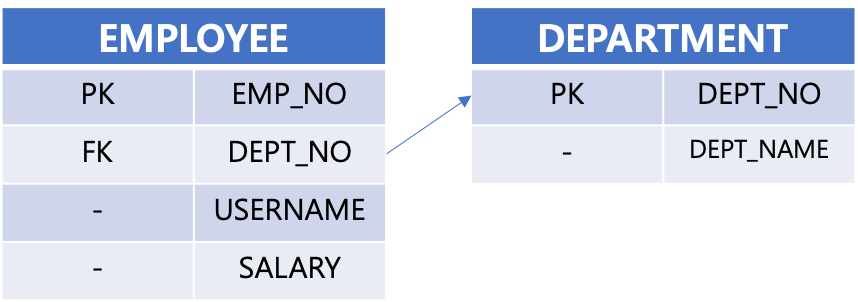
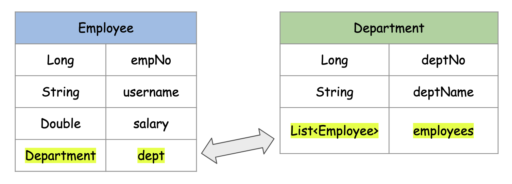
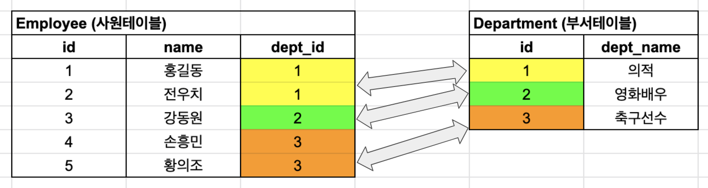
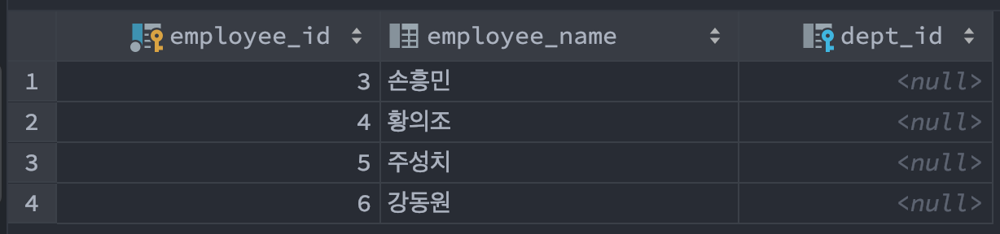
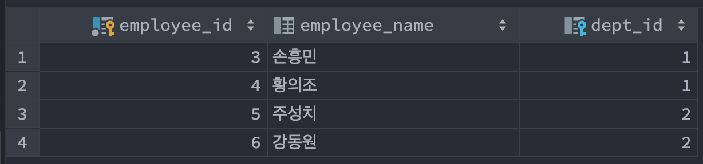
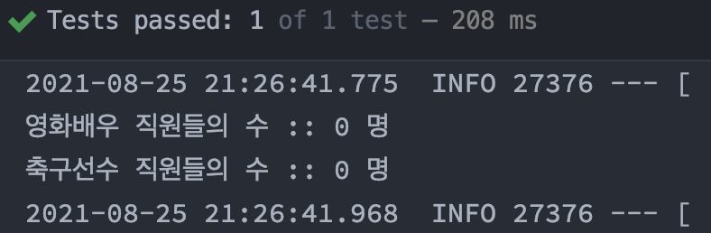
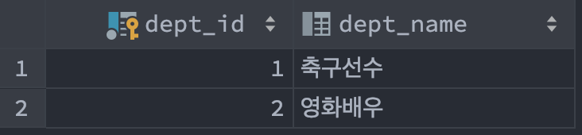
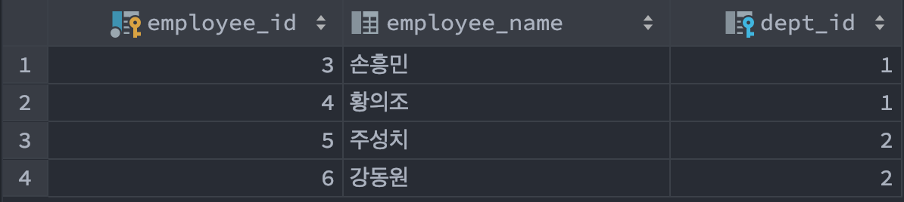
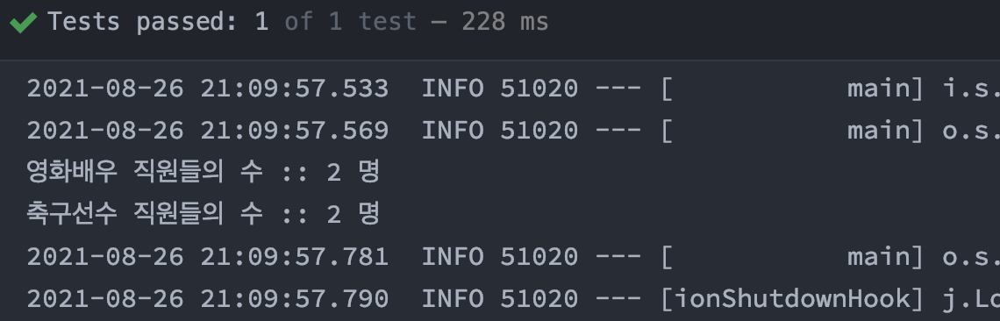

# 1.1 엔티티매핑 ManyToOne 양방향

막상 글을 쓰려고 하다보니 뭐부터 시작해야 할 지도 모르겠고, 머릿속으로는 너무나 쉽게 만들어지고, 예제로도 엄청 쉽게 작성하는 것을 글로 설명하는 것은 정말 힘들었다. 썼다 지웠다를 정말 한시간 이상 반복했다.<br>

오늘은 일단 개념정리다. 개념 설명하는게 진짜 힘들다. 나도 모르게 적었던 문장을 반복할까봐 계속 의식하면서 정리하게 됬었다.<br>

<br>

## 참고자료


## ManyToOne 

다대일이라는 말로 많이 불리는 개념인데, 일본어 같기도 하고 전문용어처럼 따로 용어를 부르는게 마음에 들지 않아서 그냥 ManyToOne 이라고 부르는 편이다.<br>

ManyToOne 양방향을 공부하기 시작하기 전에, 한가지 개념을 살짝 요약해둬야 할 것 같다. 연관관계의 주인이라는 개념이다.<br>

<br>

## 연관관계의 주인

흔히 연관관계의 주인은 @JoinColumn 어노테이션으로 상대편 객체의 키를 바인딩한다.<br>

@JoinColumn 이 표기된 필드는 테이블 개념으로 표현했을 때 외래키를 의미한다. <br>

그리고 이렇게 외래키를 소유한 테이블을 표현한 객체 클래스를 연관관계의 주인이라고 부른다.<br>

Employee 와 Department 테이블의 서로간의 관계는 아래와 같이 표현한 경우를 예로 들수 있다.<br>



<br>

Employee 테이블은 DEPT_NO 라는 컬럼을 가지고 있다. 그리고 Employee 테이블이 소유하고 있는 DEPT_NO 컬럼은 상대편 테이블인 DEPARTMENT 테이블의 기본키인 DEPT_NO 로 데이터 하나를 고유하게 식별하기 위한 컬럼이다. 이렇게 테이블 하나에서 다른 테이블의 키(PK)를 가지고 있는 경우 이 키를 외래키(FK)라고 부른다.<br>

그리고 이 외래키를 소유한 Employee 테이블과, 매핑을 당하는 입장인 Department 테이블을 양방향 객체의 관계로 표현해보면 아래와 같다. (그림을 잃어버려서 다시 그리느라 시간이 조금 걸렸었다.)<br>



<br>

**Employee 객체 내의 dept 필드**<br>

Department 의 외래키를 관리하기 위해 Department 를 참조하는 필드이다. 외래키를 관리하는 이런 필드들은 보통 `@JoinColumn` 이라는 애노테이션을 추가해준다.<br>

멤버필드 dept 처럼 외래키(@JoinColumn)와 매핑하는 참조변수를 연관관계의 주인(Owner)라고 부른다.<br>

<br>

**Department 객체 내의 employees 필드**<br>

부서 내에 속한 여러 명의 직원들의 데이터를 List 형태로 바인딩하고 있다. <br>

필드 employees 처럼 상대편 테이블의 @JoinColumn 에 의해 매핑당하는 변수는 어노테이션에 mappedBy를 지정해준다.<br>

<br>

## mappedBy

아쉽게도 JPA 에서는 연관관계의 주인 또는 주인테이블을 명확히 표시하는 키워드가 없다. 대신 mappedBy 라는 키워드로 주인 테이블의 상대편을 암묵적으로 표시할 수 있다.<br>

즉, 요약해보면 이렇다.

- 연관관계의 주인, 주인테이블 표현객체 (= ex. Employee 객체)
  - mappedBy 키워드가 없고 @JoinColumn 어노테이션으로 외래키들을 표현해놓은 엔티티
- 연관관계의 주인의 상대편, 상대편 테이블 표현객체 (= ex. Department 객체)
  - mappedBy 키워드가 있는 엔티티 클래스

그래서... 엄청 처음 공부하는 입장이라면 그냥 쉽게 `@JoinColumn 어노테이션이 있는 곳은 연관관계의 주인` 이고, `mappedBy 키워드가 있는 엔티티는 연관관계의 주인의 상대편` 으로 외워두는게 낫지 않을까 싶다.<br>

> - Django, Node.js 같은 프레임워크에서는 그런 키워드가 있을지 궁금하기는 하다. 오히려 Node.js가 객체 관계 표현은 더 쉽지 않을까 싶기도 하다.<br>
> - 외래키를 가지고 있는 테이블은 흔히 주인테이블이라고 부른다. 남의 테이블의 킷값을 가지고 있어서 그런가 보다 싶기는 하다. <br>

<br>

## 양방향 매핑 시의 객체와 테이블의 차이점

**테이블**<br>

컬럼 명을 기반으로 서로 다른 테이블과 서로 키의 값으로 서로를 비교해 매핑을 할 수 있다.<br>

**ex)**

```sql
select e.e.username, e.salary, e.dept_no, d.dept_name
from employee e
inner join department d
on e.dept_no = d.dept_no
```

<br>

employee 테이블에서 department 의 dept_id 가 필요하면 그냥 값이 같은 행을 찾아서 병합하는 과정을 거친다.예를 들면 아래와 같은 방식이다.<br>



<br>

**객체**

테이블의 매핑관계에 비해 조금 복잡해진다. 객체를 양방향으로 연결하려면 객체 양쪽에 서로를 참조하는 변수를 두어야 한다.<br>

단적인 예를 들어보면, 서로 다른 두 객체가 참조관계를 가지려면 아래와 같이 서로의 메모리 주소를 알 수 있도록 해주는 참조변수를 양쪽에 하나씩 가지고 있어야 한다.

ex)

**Employee.java**<br>

```java
@Getter @Setter
public class Employee{
    private String name;
    private Double salary;
    private Department deptNo;
}
```

<br>

**Department.java**<br>

```java
public class Department{
    private Long deptNo;
    private Employee emp;   // 상대편인 Employee 를 참조하는 변수다.
}
```

<br>

양방향 매핑에서는 위의 그림처럼 단적으로 연결되지는 않는다. @ManyToOne 의 경우 프로그램에 테이블의 데이터를 올려둘때 예를 들면 아래와 같은 데이터의 묶음을 표현하게 된다.<br>

```javascript
var 의적 = {
  id: 1,
  dept_name: 의적,
  employeeList: [		// 부서 입장에서는 직원 객체들이 이곳에 말려들어가야 한다.
    {id:1, name:'홍길동', dept_id:1},
    {id:2, name:'전우치', dept_id:1},
  ]
},
var 영화배우 = {
  id: 2,
  dept_name: '영화배우',
  employeeList: [		// 부서 입장에서는 직원 객체들이 이곳에 말려들어가야 한다.
    {id:3, name: '강동원', dept_id:2}
  ]
},
var 축구선수 = {
  id: 3,
  dept_name: '축구선수',
  employeeList: {		// 부서 입장에서는 직원 객체들이 이곳에 말려들어가야 한다.
    {id:4, name: '손흥민', dept_id:3},
    {id:5, name: '황의조', dept_id:3}
  }
}
```

javascript 로 표현해봤는데, 설명이 투머치하고, 뭔가 요점이 없는 느낌이 있어서 이 부분은 다시 정리를 해야 하지 않을까싶다. <br>

<br>

## @ManyToOne, @OneToMany 의 기본 fetch

**@ManyToOne 의 fetch 기본 설정값은 FetchType.EAGER 이다.**<br>

One 에 해당하는 객체가 하나 밖에 없으므로 Many 에 해당하는 객체 조회시 즉시 가져오는 것을 효율적으로 가정한 기본 설정값. 항상 그렇듯 기본 옵션은 항상 커스터마이징해야 한다.<br>

**@OneToMany 의 fetch 기본 설정값은 FetchType.LAZY 이다.**<br>

Many에 해당하는 객체가 많기 때문에 가능한 지연로딩하는 것이 유리하다...는 것을 가정한 기본 설정값.<br>

<br>

## @ManyToOne 의 optional

@ManyToOne 의 기본 optional 설정은 true다. 즉, 아무런 설정도 하지 않으면 outer join 으로 값을 가져온다.

<br>

## @ManyToOne 기반 도메인 로직 구현시 주의사항

연관관계의 주인의 맞은 편은 @OneToMany 관계를 맺게 되는데, 이 @OneToMany 관계를 갖는 엔티티는 주로 List, Set 형태의 데이터를 갖게 된다.


## 예제

### 엔티티 매핑

#### Employee.java

```java
@Getter
@Entity
@Table(name = "EMP", schema = "public")
public class Employee {

    @Id @GeneratedValue(strategy = GenerationType.AUTO)
    @Column(name = "EMPLOYEE_ID")
    private Long id;

    @Column(name = "EMPLOYEE_NAME")
    private String name;

    @ManyToOne
    @JoinColumn(name = "DEPT_ID")
    private Department dept;

    public Employee(){}

    @Builder
    public Employee(Long id, String name, Department department){
        this.id = id;
        this.name = name;
        this.dept = department;
    }

    public void setDept(Department dept){
        this.dept = dept;
    }
  
    public void assignDept(Department dept){
        this.dept = dept;
        dept.getEmployees().add(this);
    }
}

```

<br>

#### Department.java

```java
@Getter
@Entity
@Table(name = "DEPT", schema = "public")
public class Department {

    @Id @GeneratedValue(strategy = GenerationType.AUTO)
    @Column(name = "DEPT_ID")
    private Long id;

    @Column(name = "DEPT_NAME")
    private String deptName;

    @OneToMany(mappedBy = "dept")
    List<Employee> employees = new ArrayList<>();

    public Department(){}

    @Builder
    public Department(Long id, String deptName){
        this.id = id;
        this.deptName = deptName;
    }
}
```

<br>


###  테스트 코드 1) Department 에만 Employee 를 추가했을 경우

> 보통 @OneToMany 측에서 List, Set 자료형의 변수에만 Employee 를 추가하고, 주인 객체에는 아무 작업도 하지 않았을 경우이다. <br>

<br>

**예제 테스트코드**<br>

전체 테스트 코드는 아래와 같다.

```java
@SpringBootTest
@Transactional
public class ManyToOneTwoWayTest {

	@Autowired
	EntityManager em;

	@Rollback(false)
	@Test
	@DisplayName("Department에만_Employee를_추가했을_경우")
	void Department에만_Employee를_추가했을_경우(){
		Department deptSoccer = Department.builder().deptName("축구선수").build();
		Department deptActor = Department.builder().deptName("영화배우").build();

		Employee son = Employee.builder()
			.name("손흥민")
			// .department(deptSoccer)
			.build();

		Employee hwang = Employee.builder()
			.name("황의조")
			// .department(deptSoccer)
			.build();

		Employee ju = Employee.builder()
			.name("주성치")
			// .department(deptActor)
			.build();

		Employee kang = Employee.builder()
			.name("강동원")
			// .department(deptActor)
			.build();

		deptSoccer.getEmployees().add(son);
		deptSoccer.getEmployees().add(hwang);
		deptActor.getEmployees().add(ju);
		deptActor.getEmployees().add(kang);

		em.persist(deptSoccer);
		em.persist(deptActor);
		em.persist(son);em.persist(hwang);em.persist(ju);em.persist(kang);
		em.flush();
	}
}
```

자세히 보면 Employee를 선언하는 코드는 아래와 같이 선언되어있다. Employee 객체에 department 필드를 지정하는 부분을 주석처리 했다. 

```java
Employee kang = Employee.builder()
  .name("강동원")
  // .department(deptActor)
  .build();
```

Department 를 선언하는 코드는 아래와 같이 선언했다. Department 객체 내에는 사원을 추가하고 있다.

```java
deptSoccer.getEmployees().add(son);
deptSoccer.getEmployees().add(hwang);
deptActor.getEmployees().add(ju);
deptActor.getEmployees().add(kang);
```

<br>

**데이터 저장 결과**<br>

부서정보가 null 인체로 사원정보가 persist 되어 있다. 위의 코드에서 Employee 객체 내의 deptartment 필드는 세팅하지 않았기 때문이다.



<br>

### 테스트 코드 2) Employee 에만 Department 를 추가했을 경우

**예제 테스트코드**<br>

전체 테스트 코드는 아래와 같다.

```java
@SpringBootTest
@Transactional
public class ManyToOneTwoWayTest {

	@Autowired
	EntityManager em;

	@Rollback(false)
	@Test
	@DisplayName("Employee에만_Department를_추가했을_경우")
	void Employee에만_Department를_추가했을_경우(){
		Department deptSoccer = Department.builder().deptName("축구선수").build();
		Department deptActor = Department.builder().deptName("영화배우").build();

		em.persist(deptSoccer); em.persist(deptActor);

		Employee son = Employee.builder()
			.name("손흥민")
			.department(deptSoccer)
			.build();

		Employee hwang = Employee.builder()
			.name("황의조")
			.department(deptSoccer)
			.build();

		Employee ju = Employee.builder()
			.name("주성치")
			.department(deptActor)
			.build();

		Employee kang = Employee.builder()
			.name("강동원")
			.department(deptActor)
			.build();

		// deptSoccer.getEmployees().add(son);
		// deptSoccer.getEmployees().add(hwang);
		// deptActor.getEmployees().add(ju);
		// deptActor.getEmployees().add(kang);

		em.persist(deptSoccer);
		em.persist(deptActor);
		em.persist(son);em.persist(hwang);em.persist(ju);em.persist(kang);
		em.flush();

		System.out.println("영화배우 직원들의 수 :: " + deptActor.getEmployees().size() + " 명");
		System.out.println("축구선수 직원들의 수 :: " + deptSoccer.getEmployees().size() + " 명");
	}
}
```

필요한 코드들만 추려서 요점을 확인해보자.<br>

먼저 Employee 객체는 아래와 같이 세팅해주고 있다.<br>

```java
Employee son = Employee.builder()
  .name("손흥민")
  .department(deptSoccer)
  .build();

Employee hwang = Employee.builder()
  .name("황의조")
  .department(deptSoccer)
  .build();

Employee ju = Employee.builder()
  .name("주성치")
  .department(deptActor)
  .build();

Employee kang = Employee.builder()
  .name("강동원")
  .department(deptActor)
  .build();
```

<br>

이번에는 Department 객체를 직접 세팅해준다. Department 객체는 아래와 같이 세팅해주고 있다. Department 객체 내의 list 타입인 employees 내에 객체를 추가해주는 부분을 주석처리했다.<br>

```java
Department deptSoccer = Department.builder().deptName("축구선수").build();
Department deptActor = Department.builder().deptName("영화배우").build();

em.persist(deptSoccer); em.persist(deptActor);

Employee son = Employee.builder()...build();

// ... 생략

// deptSoccer.getEmployees().add(son);
// deptSoccer.getEmployees().add(hwang);
// deptActor.getEmployees().add(ju);
// deptActor.getEmployees().add(kang);

em.persist(deptSoccer);
em.persist(deptActor);
em.persist(son);em.persist(hwang);em.persist(ju);em.persist(kang);
em.flush();
```

<br>

이렇게 하면, 데이터는 올바르게 저장되지만, Department 객체입장에서는 업데이트 된 Employee 객체의 상태를 파악할 수 없다. (JPA에서만 자동으로 이런것을 안해주는 것인지는 잘 모르겠다.)<br>

실제 저장된 데이터베이스의 결과를 확인해보자.<br>



그런데 객체를 직접 확인해보기 위해 아래와 같이 표준 출력으로 데이터를 찍어보는 코드를 추가했다고 해보자.

```java
Department deptSoccer = Department.builder().deptName("축구선수").build();
// ... 생략
em.persist(son);
// ... 생략
em.flush();
System.out.println("영화배우 직원들의 수 :: " + deptActor.getEmployees().size() + " 명");
System.out.println("축구선수 직원들의 수 :: " + deptSoccer.getEmployees().size() + " 명");
```

이렇게 department 객체 내의 `List<Employee> employees` 를 출력해보면 아래와 같이 각 리스트의 사이즈 = 0 으로 나타나게 된다.<br>




### 테스트 코드 3) 정상 동작 코드

테스트코드1, 테스트코드2가 정상적으로 동작하도록 하기 위해 `연관관계 편의 메서드` 라는 것을 사용할 수 있다. 연관관계 편의 메서드 주로 객체 측에서 상대편 객체의 상태도 함께 일괄적으로 변경할 때 사용한다. 이렇게 하면 프로그램의 논리적인 집약도도 높아지고, 전반적으로 실수가 생길 가능성도 방지할 수 있다.<br>

참고로, `연관관계 편의 메서드`는 주로 연관관계의 주인(owner) 역할을 하는 메서드에 정의하는 편이다. 물론, 연관관계 편의메서드에 모아서 쓰는 대신 객체 바깥에 쓰는 방법도 있다. 이 경우 객체에 add() 하는 등의 동작들이 이곳 저곳에 퍼지게 되어 관리가 힘들어지게 된다.<br>

**Employee.java**<br>

```java
@Getter
@Entity
@Table(name = "EMP", schema = "public")
public class Employee {

    @Id @GeneratedValue(strategy = GenerationType.AUTO)
    @Column(name = "EMPLOYEE_ID")
    private Long id;

    @Column(name = "EMPLOYEE_NAME")
    private String name;

    @ManyToOne
    @JoinColumn(name = "DEPT_ID")
    private Department dept;

    public Employee(){}

    @Builder
    public Employee(Long id, String name, Department department){
        this.id = id;
        this.name = name;
        this.dept = department;
    }

		// ...
  
    public void assignDept(Department dept){
        this.dept = dept;
        dept.getEmployees().add(this);
    }
}
```

<br>

위의 코드에서 주목할 내용은 아래와 같다.

```java
public class Employee{
  
  // ...
  
  public void assignDept(Department dept){
    this.dept = dept;
    dept.getEmployees().add(this);
  }
}
```

Employee 객체 내에 department 객체를 세팅해줄 때 Department 객체내의 employees 에도 지금 현재 객체인 Employee 객체를 추가해주는 방식이다. 이런 방식의 메서드를 연관관계 편의 메서드라고 부른다. 영어로는 어떻게 부르는지는 찾아봐야 할 것 같다.<br>

**테스트 코드**<br>

테스트 코드의 모습은 아래와 같다.<br>

```java
@SpringBootTest
@Transactional
public class ManyToOneTwoWayTest {

	@Autowired
	EntityManager em;
  
  // ...
  
	@Rollback(false)
	@Test
	@DisplayName("연관관계_편의메서드를_사용하는_경우")
	void 연관관계_편의메서드를_사용하는_경우(){
		Department deptSoccer = Department.builder().deptName("축구선수").build();
		Department deptActor = Department.builder().deptName("영화배우").build();

		em.persist(deptSoccer); em.persist(deptActor);

		Employee son = Employee.builder()
			.name("손흥민")
			.department(deptSoccer)
			.build();
		son.assignDept(deptSoccer);

		Employee hwang = Employee.builder()
			.name("황의조")
			.department(deptSoccer)
			.build();
		hwang.assignDept(deptSoccer);

		Employee ju = Employee.builder()
			.name("주성치")
			.department(deptActor)
			.build();
		ju.assignDept(deptActor);

		Employee kang = Employee.builder()
			.name("강동원")
			.department(deptActor)
			.build();
		kang.assignDept(deptActor);

		em.persist(deptSoccer);
		em.persist(deptActor);
		em.persist(son);em.persist(hwang);em.persist(ju);em.persist(kang);
		em.flush();

		System.out.println("영화배우 직원들의 수 :: " + deptActor.getEmployees().size() + " 명");
		System.out.println("축구선수 직원들의 수 :: " + deptSoccer.getEmployees().size() + " 명");
	}
}
```

<br>

위의 코드에서 주목해서 볼 부분은 아래와 같다.

```java
Employee son = Employee.builder()
  .name("손흥민")
  .department(deptSoccer)
  .build();
son.assignDept(deptSoccer);	// 연관관계 편의 메서드를 호출하고 있다.

Employee hwang = Employee.builder()
  .name("황의조")
  .department(deptSoccer)
  .build();
hwang.assignDept(deptSoccer);	// 연관관계 편의 메서드를 호출하고 있다.

Employee ju = Employee.builder()
  .name("주성치")
  .department(deptActor)
  .build();
ju.assignDept(deptActor);			// 연관관계 편의 메서드를 호출하고 있다.

Employee kang = Employee.builder()
  .name("강동원")
  .department(deptActor)
  .build();
kang.assignDept(deptActor);		// 연관관계 편의 메서드를 호출하고 있다.
```

<br>

테스트 코드를 돌려보고 나서 Database 에 실제로 저장된 모습을 확인해보면 아래와 같다.

**Department 테이블**<br>



<br>

**Employee 테이블**<br>



<br>

객체 측에 데이터가 업데이트 되었는지도 확인해보면, 역시 아래 그림처럼 잘 나오는 것을 확인할 수 있다.<br>



<br>

### N+1 문제 해결하기

여기다 정리하려고 했었는지 갑자기 기억이 안난다. 예제를 만들어놓고 깜빡하고 있었다. 저번주 워킹데이에 밤샘한번, 주말에 밤샘 한번 했더니, 내가 뭘 했었는지 일일이 기억하기 힘들어졌다. 잠을 한숨 잘 자고나야 머리가 깨끗하게 정리될 것 같다. 일단 정리했던 예제코드만 싹다 여기다 옮겨놓고 정리해야 할 것 같다. 작성했던 예제는 연관관계 편의 메서드를 적극적으로 활용했다.<br>

오늘 설명은 일단 지저분하더라도 생각나는 데로 그냥 써놓고 나중에 컨디션이 좋을 때 다시 정리해야 할 것 같다. N+1 관련 예제는 일단 잘 정리해서 작성하는 것 자체가 쉬운 일은 아닌 것 같다는 걸 느꼈다. 이런 개념을 글로 잘 정리한다는 것은 인내심이 필요한...작업이 아닐까 싶다. 쉽게 설명하는게 어렵다면 아직 나도 아직은 정확히 아는 것은 아니다. 완전한 결론을 단순명료하게 낼 줄 알아야 잘 아는 건데, 난 아직은 사용법만 정확히 아는 사람인 것 같다. 뭔가 JPA의 트랜잭션에 대해 설명할수는 있겠는데, 설명 시작하면 자꾸 횡설수설하게 된다ㅋㅋㅋ. 그래서 이번엔 일주일 내내 정리를 하게 되더라도 제대로 정리해놓고 넘어갈 생각이다. 예제도 이미 만들어놓고 커밋을 안하고 있다...;;; 지저분하고 정리도 안되고 있다<br>

---

예를 들면 아래의 쿼리를 날린다고 해보자.

```sql
select e from Employee e join e.dept
```

이 경우 dept 내의 `employees` (List타입 데이터)는 `[]` 로 읽혀져서 dept 내의 컬렉션 객체인 사원 목록, `employees` 를 for 문으로 개별 순회시 일일이 select 하게 된다. 이런 문제를 n+1 이라고 한다.<br>

이런 n+1 문제를 해결하는 방법은 아래의 세가지 방식이 있다.

- querydsl 을 사용할 경우 : join() 또는 innerJoin() 구문 뒤에 fetchJoin() 을 한번 더 체이닝 해준다.
- Jpql 을 사용할 경우 : jpql 에서는 fetch 구문을 사용하면 된다. 예를 들면 아래와 같이 `join fetch` 를 사용하는 구문이다.
  - `@Query("select e from Employee e join fetch e.dept where e.name = :name")` 
- EntityGraph 를 사용하는 경우 : 별로 추천하는 방식은 아니다. 모든 연관관계 그래프가 모두 불러오기에 join이 이중삼중으로 덧데어 지게 될 수 있다. 예를 들면 아래와 같은 구문이다.
  - `@EntityGraph(attributePaths = {"dept"})` 

이번 문서에서는 아래의 예제들을 모두 정리해놓을 예정이다. 정리하다가 너무 길어질것 같다 싶으면 `N+1 문제 - @ManyToOne` 이라는 문서를 따로 만들지 않을까 싶다.

- 연관관계 편의 메서드 
- 서비스 로직에서 @Transactional 단위로 연관관계 편의 메서들르 호출하는 로직
- querydsl의 fetchJoin()
- jpql 의 join fetch
- @EntityGraph
- 연관관계 편의 메서드에 오류가 있더라도 em.clear() 후 jpql의 fetch join 해서 영속성 컨텍스트 비운 후에 강제업데이트하는 예제 (비추천. 단순 디버깅을 확인해보기 위한 예제)

사실 querydsl 을 정리하면서도 정리했었는데, 해당 문서를 이제와서 보니 정말 개판으로 정리한 것 같아서 다시 정리해야 한다 ㅋㅋㅋ... 아...(=사실 fetchJoin() 메서드를 한번 더 호출하는 것으로 해결되지만 원리와 이유를 설명하는게 정말 힘든 것 같다. 1차 캐시를 정리하는게 이리 힘들줄이야)

<br> jpa의 N+1 문제도 찾아보니 예전에 문서로 한번 정리했었는데, 다시 보니 썩 마음에 들지 않았다. 차주 내로 깔끔하게 한번 더 정리해야 할 것 같다.<br>

단, N+1 문제를 해결하기 위해 fetch join 류의 로직들을 추가하더라도 전제조건이 하나 있다. (이 문제에 대해서도 테스트 케이스로 정리해볼 예정이다.)<br>

아무리 fetch join 을 잘 걸어놓았다고 하더라도 이상한 함정에 걸린 것처럼 상대편 연관관계의 컬렉션(List, Set)이 비어있는 상태 ( `[]` ) 로 조회되는 경우가 있다. 이런 현상은 연관관계 편의 메서드로 상대편 객체에 데이터를 추가하지 않았기 때문에 테이블에는 데이터가 반영되었지만, 메모리에는 데이터가 반영되지 않아서 발생되는 문제다. 이때 해결방법은 em.clear() -> jpql fetch join 하는 더러운 방법이 있다. 하지만, 앵간하면 연관관계 편의메서드를 트랜잭션 단위로 잘 작성하는 것이 좋은 습관이고, 프로그램의 오류를 줄일 수 있는 방법 중 하나이다.<br>

예제도 정리하려고 했는데, 오늘은 너무 피곤하다. 조금씩 시간을 내서 정리해야 할 것 같다. 프로젝트도 엄청 사람을 아프게 괴롭히는데, 쉬는날 괴로워서야 되겠나. 다음주부터 시작!!!!!<br>

