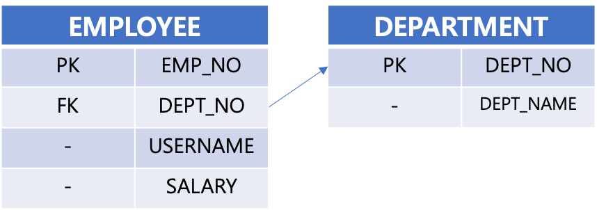
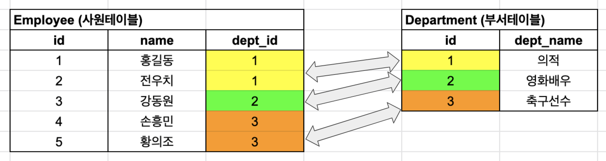
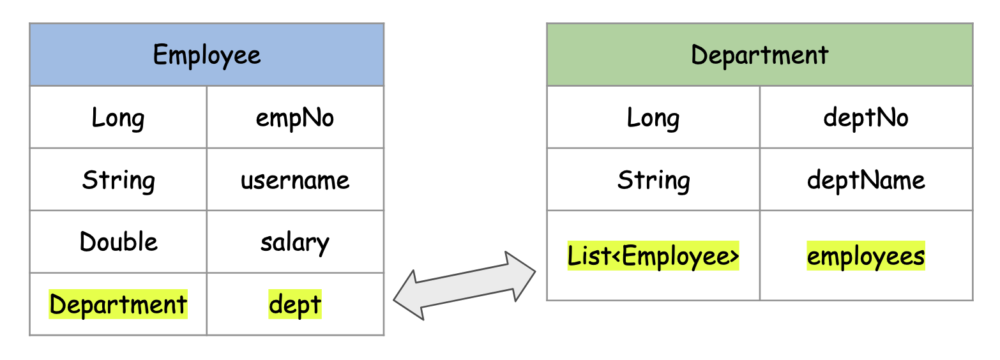

# N+1문제,@ManyToOne,연관관계 편의메서드, Transactional

N+1 문제에서의 @ManyToOne 문제를 정리해보자. '사원 - 부서' 관계를 예로 들어서 정리해보려 한다. 오늘 정리하는 예제에서는 단순히 N+1 문제말고도, 연관관계 편의 메서드, @Transactional 도 곁가지로 정리해두려 한다. 설명하는게 너무 힘들고 짜증 나는 일이기도 해서 한방에 정리하려는 얕은 속셈이기도 하다. 그래서 제목도 짬뽕처럼 모두 섞어서 지었다<br>


## 테이블 매핑

테이블 매핑은 아래와 같다.



<br>

이렇게 테이블이 작성되어 있고 실제로 데이터를 저장하다보면 아래와 같은 모양으로 저장될수 있다.



<br>

이렇게 매핑된 테이블 매핑을 객체관계로 옮겨보자. 테이블의 관계를 프로그램상의 객체관계로 메모리 상으로 옮길때는 조금 모양이 다르다. 자세한 내용들은 [여기](https://github.com/gosgjung/study-querydsl-jpa/blob/develop/JPA-%EC%9A%94%EC%A0%90%EC%A0%95%EB%A6%AC/1.1-%EC%97%94%ED%8B%B0%ED%8B%B0%EB%A7%A4%ED%95%91-ManyToOne-%EC%96%91%EB%B0%A9%ED%96%A5.md) 에 정리해두었다.<br>


## 엔티티 매핑

위의 테이블 매핑과, 엑셀에 데이터를 나열해본 모양을 객체의 관계로 표현해보면 아래와 같다.



**Employee 객체 내의 dept 필드**

Department 의 외래키를 관리하기 위해 Department 를 참조하는 필드이다. 외래키를 관리하는 이런 필드들은 보통 `@JoinColumn` 이라는 애노테이션을 추가해준다.<br>

멤버필드 dept 처럼 외래키(@JoinColumn)와 매핑하는 참조변수를 연관관계의 주인(Owner)라고 부른다.<br>

<br>

**Department 객체 내의 employees 필드**

부서 내에 속한 여러 명의 직원들의 데이터를 List 형태로 바인딩하고 있다.

필드 employees 처럼 상대편 테이블의 @JoinColumn 에 의해 매핑당하는 변수는 어노테이션에 mappedBy를 지정해준다.<br>

<br>

## 엔티티 매핑 코드

### Employee.java

```java
@Getter
@Entity
@Table(name = "EMP", schema = "public")
@ToString(exclude = "dept")
public class Employee {

    @Id @GeneratedValue(strategy = GenerationType.AUTO)
    @Column(name = "EMPLOYEE_ID")
    private Long id;

    @Column(name = "EMPLOYEE_NAME")
    private String name;

    @Column(name = "EMPLOYEE_SALARY")
    private Double salary;

    @ManyToOne(fetch = FetchType.LAZY)
    @JoinColumn(name = "DEPT_ID")
    private Department dept;

    public Employee(){}

    @Builder
    public Employee(Long id, String name, Department department){
        this.id = id;
        this.name = name;
        this.dept = department;
    }

    public void changeName(String name){
        this.name = name;
    }

    public void setDept(Department dept){
        this.dept = dept;
    }

    public void assignDept(Department dept){
        this.dept = dept;
        dept.getEmployees().add(this);
    }

    public void changeDept(Department moveTo){
        // 변경 전 부서 내의 사원 목록에서 remove
        this.dept.getEmployees().remove(this);
        // 변경하려는 부서로 부서 변경
        this.dept = moveTo;
        // 변경하려는 부서내의 사원 목록에 add
        this.dept.getEmployees().add(this);
    }

    public void deleteDept(Long id){
        this.dept.getEmployees().remove(this);
        this.dept = null;
    }
}
```


### Department.java

```java
@Getter
@Entity
@Table(name = "DEPT", schema = "public")
@ToString
public class Department {

    @Id @GeneratedValue(strategy = GenerationType.AUTO)
    @Column(name = "DEPT_ID")
    private Long id;

    @Column(name = "DEPT_NAME")
    private String deptName;

    @OneToMany(mappedBy = "dept", fetch = FetchType.LAZY)
    private List<Employee> employees = new ArrayList<>();

    public Department(){}

    @Builder
    public Department(Long id, String deptName){
        this.id = id;
        this.deptName = deptName;
    }
}
```


## 연관관계 편의 메서드

연관관계 편의 메서드는 주로 연관관계의 주인 역할을 수행하는 엔티티에 작성하는 편이다. 둘중 아무데나 해도 되지만, 사람들(=개발자분들)의 인식은 대부분 연관관계의 주인을 중심으로 생각하는 듯 하다. 위에서 정리한  Employee.java 의 엔티티 코드 내에서 연관관계 편의 메서드들은 아래와 같다.<br>

**Employee.java**

```java
@Getter
@Entity
@Table(name = "EMP", schema = "public")
@ToString(exclude = "dept")
public class Employee {
  
  	// ... 중략 ...
  
    public void assignDept(Department dept){
        this.dept = dept;
        dept.getEmployees().add(this);
    }

    public void changeDept(Department moveTo){
        // 변경 전 부서 내의 사원 목록에서 remove
        this.dept.getEmployees().remove(this);
        // 변경하려는 부서로 부서 변경
        this.dept = moveTo;
        // 변경하려는 부서내의 사원 목록에 add
        this.dept.getEmployees().add(this);
    }

    public void deleteDept(Long id){
        this.dept.getEmployees().remove(this);
        this.dept = null;
    }
}
```

부서를 배정하는 코드는 아래와 같다.<br>

부서 내의 연관관계 컬렉션에 Employee 객체를 추가해주고 있다. 이렇게 @ManyToOne 과 같은 연관관계를 갖는 객체 관계에서는 상대편에 이런 연산을 해줘야 테이블에 반영된 데이터도 컬렉션에 반영할 수 있다. <br>

만약 이런 코드를(상대편 객체의 연산도 같이 해주는 코드) 작성하지 않고 테이블의 내용을 객체에도 반영하려면 em.clear() 후에 fetch join 으로 select 하면 된다. 하지만 권장되지는 않는 방식이고, 하나의 논리적인 트랜잭션 범위 내에서 연관관계의 상대편 연산을 잘 맺어주는 것이 더 좋은 방식이다. 사람이 실수를 할 수도 있기 때문에 이런 코드를 작성할때 테스트 코드를 작성하게 된다. <br>

테스트 코드를 작성하지 않으면 내가 짠 코드도 불안하게 느껴지는 것 같다.

```java
public void assignDept(Department dept){
  this.dept = dept;
  dept.getEmployees().add(this);
}
```

부서를 변경하는 코드는 아래와 같다.<br>

주석에 설명을 잘 달아놓았으니 설명은 생략해도 될 것 같다. 요즘 설명 울렁증이 좀 있어서...

```java
public void changeDept(Department moveTo){
  // 변경 전 부서 내의 사원 목록에서 remove
  this.dept.getEmployees().remove(this);
  // 변경하려는 부서로 부서 변경
  this.dept = moveTo;
  // 변경하려는 부서내의 사원 목록에 add
  this.dept.getEmployees().add(this);
}
```

<br>

이번엔 삭제 연산이다.

```java
public void deleteDept(Long id){
  this.dept.getEmployees().remove(this);
  this.dept = null;
}
```

<br>

## @Transactional

위에서는 엔티티 클래스 Employee에 연관관계 편의 메서드들을 정의했다. 연관관계의 주인 역할을 하는 Employee 객체 입장에서 맞은편 연관관계인 Department 내에 말려 들어가는 컬렉션 객체인 `List <Employee> employees` 에 대해 삽입/삭제/수정을 하는 연산들을 직접 작성했다. 이렇게 하는 이유는 트랜잭션이 끝나고 나서 JPA 는 flush() 를 수행하는데 이때 테이블에는 데이터가 반영되더라도 객체에는 반영되지 않기에 반대편에 대한 연산도 추가해주는 것이다.

<br>

이렇게 엔티티에 작성한 연관관계 편의메서드와 함께 트랜잭셔널(@Transactional)한 연산을 수행하는 예제를 살펴보자. 엔티티에 각 엔티티간의 삭제/수정/삽입 연산을 해놓았다면, 이것을 DB에 반영되도록 실제 쿼리에도 적용되도록 서비스 로직에서 수행하는 절차들이다. 방법이 정해진 것은 아니지만, 그래도 이렇게 예제로 정리해두면 나중에 응용이 되기에 고생을 감수해서라도 정리를 시작했다.

<br>

### EmployeeServiceImpl.java

전체 예제는 아래와 같다. 

- 사원이름 변경
- 사원 삭제 (실수로 deleteEmployeeName 이라고 지었는데, 추후 예제를 수정할 예정이다.)
- 부서 이동

<br>

```java
@Service
@RequiredArgsConstructor
public class EmployeeServiceImpl implements EmployeeService{

	private final EmployeeRepository employeeRepository;
	private final DepartmentRepository departmentRepository;

	@Transactional
	@Override
	public void modifyEmployeeName(Long id, String name) {
		Employee targetEmployee = employeeRepository.findById(id)
			.orElseThrow(() -> new NoEmployeeFoundException("해당 사원이 존재하지 않습니다."));

		targetEmployee.changeName(name);
    employeeRepository.save(targetEmployee);
	}

	@Transactional
	@Override
	public void deleteEmployeeName(Long id) {
		Employee deleteEmployee = employeeRepository.findById(id)
			.orElseThrow(() -> new NoEmployeeFoundException("해당 사원이 존재하지 않습니다."));
		employeeRepository.delete(deleteEmployee);
	}

	@Transactional
	@Override
	public void changeDept(Long id, Long deptId) {
		Employee targetEmployee = employeeRepository.findById(id)
			.orElseThrow(() -> new NoEmployeeFoundException("해당 사원이 존재하지 않습니다."));

		Department department = departmentRepository.findById(deptId)
			.orElseThrow(() -> new NoDepartmentFoundException("해당 부서가 존재하지 않습니다."));

		targetEmployee.changeDept(department);
		employeeRepository.save(targetEmployee);
	}

	@Transactional
	@Override
	public void removeEmployee(Long id) {
		Employee employee = employeeRepository.findById(id)
			.orElseThrow(() -> new NoEmployeeFoundException("해당 사원이 존재하지 않습니다"));
		employee.deleteDept(id);
		employeeRepository.delete(employee);
	}
}
```

<br>

#### 사원명 변경

```java
@Transactional
@Override
public void modifyEmployeeName(Long id, String name) {
  Employee targetEmployee = employeeRepository.findById(id)
    .orElseThrow(() -> new NoEmployeeFoundException("해당 사원이 존재하지 않습니다."));

  targetEmployee.changeName(name);
}
```

- `Employee targetEmployee = employeeRepository.findById(id)
  .orElseThrow (() -> new NoEmployeeFoundException("해당 사원이 존재하지 않습니다."))`
  - 수정하려는 사원 정보를 Database 에서 조회해서 가져온다.
  - 만드는 사람에 따라 다르겠지만, 연관관계를 이용해 `@Entity` 로 지정된 Department 에서 찾아오려고 하는 시도를 할 수도 있다. 하지만 트랜잭션의 시작 지점에서는 항상 정확하게 갱신된 정보를 들고와야 에러를 내지 않는다.
- targetEmployee.changeName(name)
  - 가져온 employee 엔티티에 대해 name 값을 수정한다. chnageName 메서드는 Employee.java 에 기술한 메서드이다. 연관관계 편의메서드는 아니고, setName(String name) 과 같은 코드보다 setter/getter 규약과는 다른 이름을 사용하는 changeName 이라는 이름의 메서드를 따로 만들어서 사용하도록 정의했었다. 이렇게 하는 이유는 setter 코드가 엔티티 코드에 있는 것은 위험하기도 하고, 단순 setter 보다는 비지니스 로직의 의미/기능을 명확히 드러내야 하기 때문이다.
- employeeRepository.save(targetEmployee)
  - Repository 를 이용해 엔티티 객체를 save 한다. 
  - entityManager 의 flush() 메서드로 영속성 컨텍스트의 내용을 Database 에 반영할 수 있다. 하지만, @Transactional 애노테이션을 적용했다면, spring-data-jpa 는 @Transactional 의 해당 로직이 종료되는 시점에 데이터베이스에 수정 내용이 반영되게 된다.

<br>

#### 부서 변경

```java
@Transactional
@Override
public void changeDept(Long id, Long deptId) {
  Employee targetEmployee = employeeRepository.findById(id)
    .orElseThrow(() -> new NoEmployeeFoundException("해당 사원이 존재하지 않습니다."));

  Department department = departmentRepository.findById(deptId)
    .orElseThrow(() -> new NoDepartmentFoundException("해당 부서가 존재하지 않습니다."));

  targetEmployee.changeDept(department);
  employeeRepository.save(targetEmployee);
}
```

- `Employee targetEmployee = employeeRepository.findById(id)
  .orElseThrow(() -> new NoEmployeeFoundException("해당 사원이 존재하지 않습니다."));`
  - 부서를 변경하려는 사원의 엔티티 객체를 조회해온다.
- `Department department = departmentRepository.findById(deptId)
  .orElseThrow(() -> new NoDepartmentFoundException("해당 부서가 존재하지 않습니다."));`
  - 이동하려는 부서의 부서 데이터를 Database 에서 조회해온다.
- `targetEmployee.changeDept(department);` 
  - 변경하려는 사원 엔티티 객체의 부서 객체를 변경해준다.
- `employeeRepository.save(targetEmployee);`
  - 엔티티 변경사항을 저장한다. @Transactional 이 적용되어 있으므로 메서드의 실행을 종료하면서 spring-data-jpa 는 @Transactional 의 마지막 시점에 변경사항을 flush 해준다.

<br>

#### 사원 삭제

```java
@Transactional
@Override
public void removeEmployee(Long id) {
  Employee employee = employeeRepository.findById(id)
    .orElseThrow(() -> new NoEmployeeFoundException("해당 사원이 존재하지 않습니다"));
  employee.deleteDept(id);
  employeeRepository.delete(employee);
}
```

- `Employee employee = employeeRepository.findById(id)
  .orElseThrow(() -> new NoEmployeeFoundException("해당 사원이 존재하지 않습니다"));`
  - 삭제하려는 사원의 엔티티 객체를 조회해온다.
- employee.deleteDept(id)
  - 삭제 연산을 수행한다. 실제 repository 연산은 아니고, 연관관계 상대편 객체인 Department 객체 내에 말려들어가 있는 `List<Employee> employees` 내에서 `id` 에 해당하는 사원을 메모리 상에서 제거한다.
- employeeRepository.delete(employee)
  - 엔티티의 변경사항을 Database 에 반영한다.

<br>

## N+1 문제

### N+1 문제가 발생하는 경우

### N+1 문제를 해결하는 3가지 방법

여러가지 방법들이 있다. 이것을 이해하기 전에 엔티티의 상태(준영속, 관리 등등)을 이해해야 한다. 안그러면 영속성 컨텍스트에 저장되는게 어떤 의미인지 파악하지 못하게 될 수 있다.

### 예제1)


