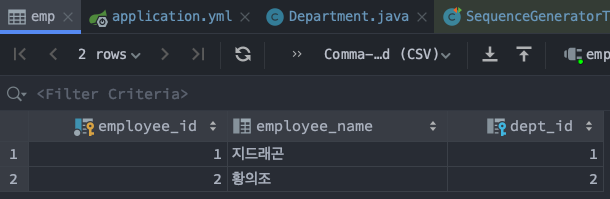
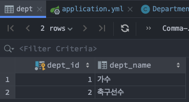

# 2-식별자전략

관계형 DB의 각 테이블에는 식별자라고 불리는 pk, id 같은 속성들이 있다. 테이블을 객체로 매핑한 JPA에서의 객체 역시도 테이블의 개별 로우 하나에 매칭되고, 고유하게 식별할 수 있는 방법이 필요하다. 이런 컨셉으로 존재하는 것이 식별자 전략인 듯하다. <br>

보통 @GeneratedValue, @TableGenerator 등을 이용해 식별자를 지정하고, 시퀀스 기반으로 식별할지, DB 에 식별전략을 위임할지 등을 지정하기 위해 JPA 설계자는 클래스 설계시 어노테이션에 특정 속성을 지정해서 매핑되도록 하는방식으로 설계한것 같다.

<br>

## 기본키 종류별 JPA 객체 식별 방식들

책에서는 보통 strategy라는 말이 들어가있어서 `식별자전략` 이렇게 번역된 곳이 많다. 아래에서부터는 식별자 전략 이라는 용어로 개념을 정리할 예정이다. 일본어같은 느낌이 너무 강한것 같아서 `식별자 전략` 이라는 용어에 정이가지를 않는다.<br>

<br>

**@GeneratedValue 로 식별자 전략 선택**

- `GeneratedValue.strategy`
  - @GenerationValue(strategy = GenerationType.[IDENTITY|SEQUENCE|TABLE|AUTO]) 
  - 식별자 값 자동 생성 전략을 선택한다.(GenerationType)
- `GeneratedValue.generator`
  - Mysql과 같은 시퀀스를 지원하지 않는 DBMS에서 시퀀스 기반 전략을 사용할 경우 별도의 설정이 필요하다. 이때 Generator 를 사용하게 된다. 해당 내용은 아래에서 정리할 예정

<br>

**식별자 전략의 종류**

- `GenerationType.IDENTITY`
  - auto_increment 또는 identity 를 활용해 PK 값을 생성한다.
  - 일반적으로 MySQL같은 데이터베이스를 이용시 사용
  - 키 생성에 대한 처리를 데이터베이스에게 위임(=데이터베이스에서 키가 생성됨)
  - Oracle의 경우 12g 버전부터는 IDENTITY 전략을 지원하기 시작했다.
  - persist() 메서드가 호출되는 순간 INSERT 구문이 생성된다.
  - auto increment 이기 때문에, INSERT 구문에 null 을 넣어서 INSERT를 해서 DBMS가 직접 increment 하도록 지정하는 것.
- `GenerationType.SEQUENCE`
  - 시퀀스를 이용해 PK값을 생성
  - Oracle, Postgresql 과 같은 시퀀스를 지원하는 데이터베이스에서만 사용할 수 있다.
  - 트랜잭션이 커밋되는 시점에 INSERT 구문이 생성된다.
- `GenerationType.TABLE`
  - 키 관리를 위한 전용 테이블을 사용해 PK 값을 생성
  - 트랜잭션이 커밋되는 시점에 INSERT 구문이 생성된다.
  - IDENTITY, SEQUENCE 전략은 DB에서 지원하는 경우에만 사용할 수 있다. 하지만, 데이터베이스 종류에 무관하게 시퀀스처럼 사용할 수 있는 전략이 GenrationType.TABLE 전략이다.
- `GenerationType.AUTO`
  - 기본 값이다.
  - Database에 맞는 PK 생성전략을 선택

<br>

## GenerationType.IDENTITY

> `auto_increment` 가 지원되는 DBMS에 대해  JPA 구현체인 hibernate에서 `GenerationType.IDENITY` 라는 타입으로 지원하는 타입이다.

주로 MySQL 같은 종류의 데이터베이스에서 사용하는 편이다.<br>

키 생성에 대한 처리를 데이터베이스에게 위임<br>

애플리케이션 레벨에서 persist() 메서드를 호출하는 순간 곧바로 INSERT 구문이 생성된다.<br>

```java
@Data
@Entity
@Table(name = "S_EMP")
public class Employee{
  @Id @GeneratedValue(strategy = GenerationType.IDENTITY)
  private Long id;
  
  private String name;
}
```

<br>

테스트해보기

```java
public class EmployeeTest{
  public static void main(String [] args){
    EntityManagerFactory emf = Persistence.createEntityManagerFactory("chapter02");
    EntityManager em = emf.createEntityManager();
    EntityTransaction tx = em.getTransaction();
    
    try{
      Employee employee = new Employee();
      // employee.setId(1L);
      employee.setName("지드래곤");
      
      tx.begin();
      System.out.println("등록 전 id : " + employee.getId());
      em.persist(employee);
      
      for(int i=0; i<30; i++){
        Thread.sleep(1000);
        System.out.println("=======");
      }
      
      System.out.println("persist() 후 id : " + employee.getId());
      transaction.commit();
      System.out.println("트랜잭션 커밋 후 id : " + employee.getId());
    }
    catch(Exception e){
      e.printStackTrace();
      tx.rollback();
    }
    finally{
      em.close();
      emf.close();
    }
  }
}
```

<br>

출력결과

```plain
```

<br>

## GenerationType.SEQUENCE

> DBMS에서 시퀀스를 지원하는 경우에 사용하는 방식

유일키를 생성하기 위해 시퀀스(sequence)라는 별도의 오브젝트를 사용한다.<br>

시퀀스 전략은 시퀀스가 존재하는 Oracle, PostgreSQL 같은 데이터베이스에서만 사용할 수 있다.<br>

트랜잭션이 커밋되는 순간에 insert 구문이 생성된다.<br>

persist() 메서드로 등록 요청시 아래의 동작들을 수행한다.<br>

- 먼저 어노테이션으로 지정한 DB의 시퀀스("S_EMP_SEQUENCE")로부터 next_value 같은 증가된 값을 얻어온다.<br>
- 트랜잭션이 커밋되는 시점에 INSERT 구문 내에 id를 지정해서 생성된 INSERT 구문을 Database에 전송한다.

<br>

```java
@Data
@Entity
@SequenceGenerator(
    name = "employee_sequence",
    schema = "public", sequenceName = "EMP_SEQ",
    initialValue = 1, allocationSize = 1
)
@Table(name = "EMP", schema = "public")
public class Employee {

    @Id @GeneratedValue(strategy = GenerationType.SEQUENCE, generator = "employee_sequence")
    @Column(name = "EMPLOYEE_ID")
    private Long id;

    @Column(name = "EMPLOYEE_NAME")
    private String name;

    @ManyToOne
    @JoinColumn(name = "DEPT_ID")
    private Department dept;

}
```

<br>

**테스트해보기**<br>

데이터 인서트 시마다 SQL이 어떻게 생성되는지 보기 위해  em.flush() 를 각 인서트 구문 직후 마다 실행하도록 해주었다.<br>

```java
@SpringBootTest
@Transactional
@Commit
public class SequenceGeneratorTest {

    @Autowired
    EntityManager em;

    @Autowired
    EmployeeRepository employeeRepository;

    @Autowired
    DepartmentRepository departmentRepository;

    @Test
    @DisplayName("데이터_하나_추가해보기_테스트")
    void 데이터_하나_추가해보기_테스트(){
        Department deptSinger = new Department("가수");
        departmentRepository.save(deptSinger);
        em.flush();

        Department deptSoccerPlayer = new Department("축구선수");
        departmentRepository.save(deptSoccerPlayer);
        em.flush();

        Employee singer1 = new Employee("지드래곤", deptSinger);
        employeeRepository.save(singer1);
        em.flush();

        Employee soccerPlayer1 = new Employee("황의조", deptSoccerPlayer);
        employeeRepository.save(soccerPlayer1);
        em.flush();
    }
}
```

<br>

**DB 저장 결과**<br>

**EMP 테이블**<br>



<br>

**DEPT 테이블**<br>



<br>

**SQL**<br>

```sql
# 시퀀스 drop & create
Hibernate: 
    
    drop sequence if exists public.dept_seq
Hibernate: 
    
    drop sequence if exists public.emp_seq
Hibernate: create sequence public.dept_seq start 1 increment 1
Hibernate: create sequence public.emp_seq start 1 increment 1

# Dept, Emp 테이블 생성, 외래키 제약조건 추가
Hibernate: 
    
    create table public.dept (
       dept_id int8 not null,
        dept_name varchar(255),
        primary key (dept_id)
    )
Hibernate: 
    
    create table public.emp (
       employee_id int8 not null,
        employee_name varchar(255),
        dept_id int8,
        primary key (employee_id)
    )
Hibernate: 
    
    alter table public.emp 
       add constraint FKlf4q52cbln60sp28odam4nat2 
       foreign key (dept_id) 
       references public.dept


# 부서 "가수", "축구선수" 추가 시 SQL
Hibernate: 
    select
        nextval ('public.dept_seq')
Hibernate: 
    /* insert io.study.jpa.generation_strategy.company.department.Department
        */ insert 
        into
            public.dept
            (dept_name, dept_id) 
        values
            (?, ?)

Hibernate: 
    select
        nextval ('public.dept_seq')
Hibernate: 
    /* insert io.study.jpa.generation_strategy.company.department.Department
        */ insert 
        into
            public.dept
            (dept_name, dept_id) 
        values
            (?, ?)

# 사원 "지드래곤", "황의조" 추가 시 SQL
Hibernate: 
    select
        nextval ('public.emp_seq')
Hibernate: 
    /* insert io.study.jpa.generation_strategy.company.employee.Employee
        */ insert 
        into
            public.emp
            (dept_id, employee_name, employee_id) 
        values
            (?, ?, ?)
Hibernate: 
    select
        nextval ('public.emp_seq')
Hibernate: 
    /* insert io.study.jpa.generation_strategy.company.employee.Employee
        */ insert 
        into
            public.emp
            (dept_id, employee_name, employee_id) 
        values
            (?, ?, ?)
```

<br>

### allocationSize 속성으로 성능 최적화

insert 구문을 단건으로 꽤 자주 호출하게 될 경우 시퀀스를 매우 자주 호출하게 된다. 시퀀스를 너무 자주 호출하게 될 경우 성능상으로 조금 만족스럽지 않을 수 있다. 물론 insert 동작을 한번에 많이 수행하는 경우는 그리 많지 않다.(Bulk 연산 등을 사용할 경우는 충분히 가능)<br>

```java
@Data
@Entity
@Table(name = "S_EMP")
@SequenceGenerator(
  name = "S_EMP_GENERATOR",
  sequenceName = "S_EMP_SEQUENCE",
  initialValue = 1,
  allocationSize = 1
)
public class Employee{
  @Id @GeneratedValue(
    strategy = GenerationType.SEQUENCE,
    generator = "S_EMP_GENERATOR"
  )
  private Long id;
  
  private String name;
}
```

<br>

테스트해보기

```java
public class EmployeeTest{
  public static void main(String [] args){
    EntityManagerFactory emf = Persistence.createEntityManagerFactory("chapter02");
    EntityManager em = emf.createEntityManager();
    EntityTransaction tx = em.getTransaction();
    
    try{
      tx.begin();
      
      //100 명의 직원 정보 등록 처리
      for (int i=1; i<=100; i++){
        Employee employee = new Employee();
        employee.setName("직원 (" + i ")");
        em.persist(employee);
      }
      
      tx.commit();
    }
    catch(Exception e){
      e.printStackTrace();
      tx.rollback();
    }
    finally{
      em.close();
      emf.close();
    }
  }
}
```


출력결과

```plain
100번 시퀀스 조회
```


allocationSize 수정

```java
@Data
@Entity
@Table(name = "S_EMP")
@SequenceGenerator(
  name = "S_EMP_GENERATOR",
  sequenceName = "S_EMP_SEQUENCE",
  initialValue = 1,
  allocationSize = 50
)
public class Employee{
  @Id @GeneratedValue(
    strategy = GenerationType.SEQUENCE,
    generator = "S_EMP_GENERATOR"
  )
  private Long id;
  
  private String name;
}
```

<br>

**출력결과**

시퀀스를 한번 조회할 때마다 50씩 증가시킨다. 하지만 시퀀스가 50씩 증가한다고 해서 실제 S_EMP 테이블에 50씩 증가된 값이 저장되는 것은 아니다. 실제 S_EMP 테이블에 저장된 값을 조회해보면  1부터 100까지의 직원정보가 등록되어 있다.<br>

JPA 에서 한번에 증가된 50개의 값을 메모리 상에서 하나씩 꺼내서 사용하기 때문이다. 이렇게 @SequenceGenerator 의 allocationSize 속성을 이용하면 데이터베이스와의 연결을 줄일수 잇기에 등록작업의 성능을 향상시킬 수 있다. (하지만, 비즈니스 로직에서 이렇게 다수의 드옭작업을 한번에 처리하는 경우는 일반적이지 않아서 대부분 allocationSize 속성을 1로 설정해 사용한다.)

```plain
2번 시퀀스 조회
```

<br>

## GenrationType.TABLE

IDENTITY, SEQUENCE 전략은 DB에서 지원하는 경우에만 사용할 수 있다. 하지만, 데이터베이스 종류에 무관하게 시퀀스처럼 사용할 수 있는 전략이 GenrationType.TABLE 전략이다.

```java
@Data
@Entity
@Table(name = "EMP")
@TableGenerator(
  name = "SEQ_GENERATOR",
  table = "SHOPPING_SEQUENCES",
  pkColumnName = "SEQ_NAME",
  pkColumnValue = "EMP_SEQ",
  valueColumnName = "NEXT_VALUE",
  initialValue = 0, allocationSize = 1
)
public class Employee{
  @Id @GenratedValue(strategy = GenerationType.TABLE, generator = "SEQ_GENERATOR")
  private Long id;
  private String name;
}
```


- pkColumnName
- pkColumValue


## GenerationType.AUTO

<br>

## 복합키 지정해 사용해보기

### 복합키 식별자 클래스 작성

```java
@Embeddable
@NoArgsConstructor
@AllArgsConstructor
@Getter
@EqualsAndHashCode
@ToString
public class EmployeeId implements Serializable{
  private static final long serialVersionUID = 1L;
  
  private Long id;
  private String mailId;
}
```

식별자 클래스 위에  @Embeddable 애노테이션을 추가해서 이 클래스가 식별자로 사용되는 클래스임을 설정한다.<br>

당연히 식별자 클래스는 복합 키에 해당하는 변수들만 멤버로 가지며, 반드시 아래와 같은 제약조건을 지켜서 작성해야 한다.<br>

식별자 클래스 작성 규칙

- 클래스에  @Embeddable 어노테이션을 선언한다.
- 반드시 java.io.Serializable 인터페이스를 implements 한다.
- 기본 생성자와 모든 멤버를 초기화 하는 생성자를 선언한다.
- 복합키에 해당하는 변수들만 선언한다.
- 값을 임의로 변경할 수 없도록 Getter 메서드만 제공한다.
- equals와 hashCode 메서드를 재정의(overriding)한다.

<br>

```java
@Data
@Entity
@Table(name = "EMP")
public class Employee{
  
  @Id
  private EmployeeId empId;
  
  private String name;
}
```


### INSERT 테스트

식별자 클래스인 EmployeeId 객체를 생성한 후 직접 Employee 객체에 값을 할당한다.

```java
public class EmployeeTest{
  public static void main(String [] args){
    EntityManagerFactory emf = Persistence.createEntityManagerFactory("테스트-5");
    EntityManager em = emf.createEntityManager();
    EntityTransaction tx = em.getTransaction();
    
    try{
      tx.begin();
      EmployeeId employeeId = new EmployeeId(1L, "aaa");
      
      Employee employee = new Employee();
      employee.setEmpId(empId);
      employee.setName("지드래곤");
      em.persist(employee);
      
      tx.commit();
    }
    catch(Exception e){
      e.printStackTrace();
      tx.rollback();
    }
    finally{
      em.close();
      emf.close();
    }
  }
}
```

<br>

출력결과

```plain
```


### 조회 테스트 

```java
public class EmployeeTest{
  public static void main(String [] args){
    EntityManagerFactory emf = Persistence.createEntityManagerFactory("테스트-5");
    EntityManager em = emf.createEntityManager();
    EntityTransaction tx = em.getTransaction();
    
    try{
      EmployeeId empId = new EmployeeId(1L, "aaa");
      Employee findEmployee = em.find(Employee.class, empId);
      System.out.println("검색결과 :: " + findEmployee.toString())
    }
    catch(Exception e){
      e.printStackTrace();
    }
    finally{
      em.close();
      emf.close();
    }
  }
}
```

<br>

출력결과

```plain
```


