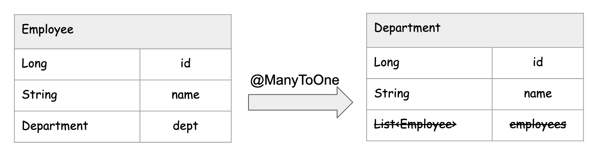
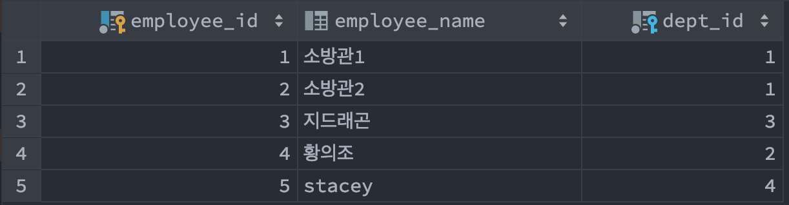
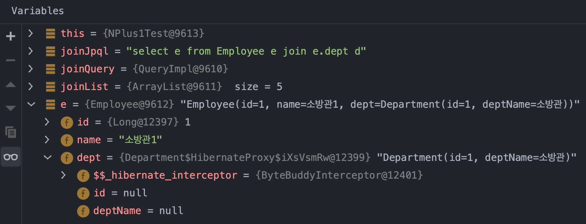
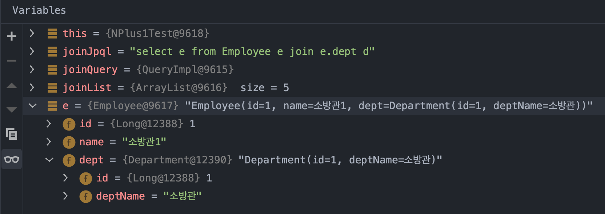
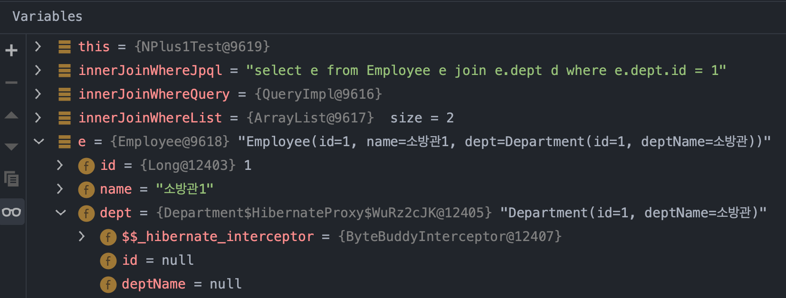
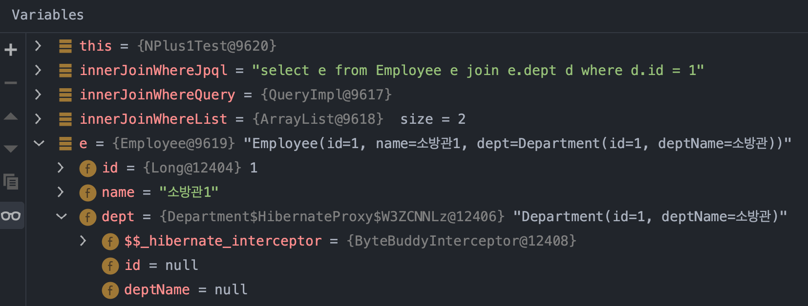
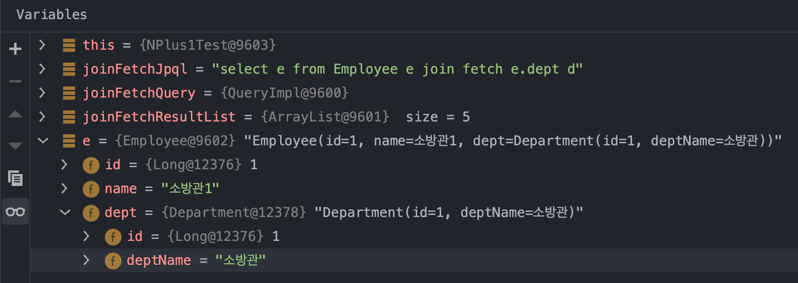

# N+1 문제

인터넷을 보면 N+1 문제라는 단어로 이것 저것 이야기하는 경우가 많다. 무슨 뜻인지 모를 때는 괜한 반항심에 전문용어를 왜 이렇게 쓰는거지? 하는 생각을 했었다. 오늘은 이 `N+1 문제` 와 `fetch` 조인, `@EntityGraph`에 대해 정리해보려 한다.

<br>

## 엔티티 매핑 (Employee, Department)

Employee, Department 라는 이름의 엔티티가 있다고 해보자. 이 Employee 와 Department의 참조관계는 아래와 같다.



최대한 예제를 단순하게 구성하기 위해서 단방향으로 예제를 만들었다.(사실 화살표 그림을 하나더 그리기 귀찮은 것도 있었다. 예제도 투머치하게 복잡해지는것 같아서 단방향으로 결정)<br>

Employee.java, Department.java 의 엔티티 매핑 코드는 아래와 같다.<br>

(예제는 PostgreSQL 기준으로 작성했다.)<br>

<br>

**Employee.java**<br>

```java
package io.study.jpa.generation_strategy.company.employee;

// ...

@Getter
@Entity
@SequenceGenerator(
    name = "employee_sequence",
    schema = "public", sequenceName = "EMP_SEQ",
    initialValue = 1, allocationSize = 1
)
@Table(name = "EMP", schema = "public")
public class Employee {

    @Id @GeneratedValue(strategy = GenerationType.SEQUENCE, generator = "employee_sequence")
    @Column(name = "EMPLOYEE_ID")
    private Long id;

    @Column(name = "EMPLOYEE_NAME")
    private String name;

    @ManyToOne(optional = false, fetch = FetchType.LAZY)
    @JoinColumn(name = "DEPT_ID")
    private Department dept;

    public Employee(String name, Department dept){
        this.name = name;
        this.dept = dept;
    }
}
```

연관관계의 상대편인 DEPT 테이블에 대한 객체인 Department 객체를 FetchType.LAZY로 로딩하도록 설정해두었다.

<br>

**Department.java**<br>

```java
package io.study.jpa.generation_strategy.company.department;

// ...

@Entity
@SequenceGenerator(
    schema = "public", sequenceName = "DEPT_SEQ", name = "department_seq",
    initialValue = 1, allocationSize = 1
)
@Table(name = "DEPT", schema = "public")
public class Department {

    @Id @GeneratedValue(strategy = GenerationType.SEQUENCE, generator = "department_seq")
    @Column(name = "DEPT_ID")
    private Long id;

    @Column(name = "DEPT_NAME")
    private String deptName;

//    @OneToMany(mappedBy = "dept")
//    List<Employee> employees = new ArrayList<>();

    public Department(String deptName){
        this.deptName = deptName;
    }
}
```

<br>

## N+1 문제가 발생하는 예

아래와 같이 전체 사원들의 리스트를 select all 로 불러온 후에 연관 객체인 부서정보를 코드 내에서 불러올 때 부서 정보를 조회하는 SQL이 한번 더 발생하는 경우가 있다.

```java
@Test
@DisplayName("N_Plus_1_조회테스트")
public void N_Plus_1_조회테스트(){
  em.clear();
  List<Employee> list = repository.findAll();

  for(Employee e : list){
    String deptName = e.getDept().getDeptName();
    System.out.println(e.getName() + "의 소속부서 : " + deptName);
  }
}
```

<br>

### 1) 대표적인 예 : 단건조회

예를 들어 아래와 같은 코드가 있다고 해보자.

```java
@Test
@DisplayName("N_Plus_1_조회테스트")
public void N_Plus_1_조회테스트(){
  em.clear();
  List<Employee> list = repository.findAll();

  for(Employee e : list){
    String deptName = e.getDept().getDeptName();
    System.out.println(e.getName() + "의 소속부서 : " + deptName);
  }
}
```

<br>

아래의 로직까지는 SQL이 1회 발생한다.

```java
em.clear();
List<Employee> list = repository.findAll();
```

<br>

위의 Java 코드가 생성한 SQL은 아래와 같다.

```sql
Hibernate: 
	select
		employee0_.employee_id 		as employee1_1_,
		employee0_.dept_id 				as dept_id3_1_,
		employee0_.employee_name 	as employee2_1_ 
	from
		public.emp employee0_
```

<br>

실제로 저장되어 있는 데이터는 아래와 같은데, select All 을 했으니 아래의 데이터를 모두 `List <Employee>` 로 받아오게 된다.



<br>

이 데이터들의 부서명을 뽑아내기 위해서는 Employee.dept 변수를 접근해서 `getDeptName()` 함수를 호출해야 한다. 예를 들면 아래와 같은 방식으로 호출하게 된다.

```java
@Test
@DisplayName("N_Plus_1_조회테스트")
public void N_Plus_1_조회테스트(){
  em.clear();
  List<Employee> list = repository.findAll();

  for(Employee e : list){
    String deptName = e.getDept().getDeptName();
    System.out.println(e.getName() + "의 소속부서 : " + deptName);
  }
}
```

위 코드에서는 e.getDept().getDeptName() 을 list의 사이즈 만큼 호출하고 있다.<br>

이때 디버깅 모드로 사원리스트를  for 문으로 순회하는 순간에 브레이크 포인트를 걸어서, Employee.dept 객체의 내부 값을 조회해본 결과는 아래와 같다.<br>



자세히 살펴보면 Employee 객체 내의 Department 객체 dept 내에  id, deptName 값이 바인딩 되지 않아 null 로 설정되어 있음을 확인할 수 있다.<br>

<br>

**조회 SQL 결과 확인**<br>

위의 코드에서 부서를 조회하는 SQL은 아래처럼 직원 수(=list의 사이즈) 만큼 생성되게 된다.<br>

```sql
Hibernate: 
    select
        department0_.dept_id as dept_id1_0_0_,
        department0_.dept_name as dept_nam2_0_0_ 
    from
        public.dept department0_ 
    where
        department0_.dept_id=?
소방관1의 소속부서 : 소방관
소방관2의 소속부서 : 소방관
Hibernate: 
    select
        department0_.dept_id as dept_id1_0_0_,
        department0_.dept_name as dept_nam2_0_0_ 
    from
        public.dept department0_ 
    where
        department0_.dept_id=?
지드래곤의 소속부서 : 가수
Hibernate: 
    select
        department0_.dept_id as dept_id1_0_0_,
        department0_.dept_name as dept_nam2_0_0_ 
    from
        public.dept department0_ 
    where
        department0_.dept_id=?
황의조의 소속부서 : 축구선수
Hibernate: 
    select
        department0_.dept_id as dept_id1_0_0_,
        department0_.dept_name as dept_nam2_0_0_ 
    from
        public.dept department0_ 
    where
        department0_.dept_id=?
stacey의 소속부서 : 개발자
```

<br>

이렇게 해서 JAVA코드에 의해 JDBC계층에서 생성된 SQL의 호출 횟수는 아래와 같다.

> select all employee 1회 + 각 사원에 대한 부서명 조회 n 회 = n+1회

<br>

이렇게 사원 객체 n 개에 대한 부서명 조회 n회 + 사원 리스트 조회 1회 의 쿼리가 생성되는 것을 N+1 문제라고 이야기한다.<br>

<br>

### 1-1) FetchType.EAGER 설정시

위에서 예를 들어 정리한 N+1 SQL 호출 문제를 해결하기 위해 Employee 객체의  `Department dept` 필드에 대한 참조관계를 FetchType.EAGER 로 지정했을 경우에도 N+1 문제가 발생한다.<br>

**Employee.java**<br>

FetchType.EAGER로 연관객체 fetch 방식을 변경해주었다.

```java
@Data
@Entity
@SequenceGenerator(
    name = "employee_sequence",
    schema = "public", sequenceName = "EMP_SEQ",
    initialValue = 1, allocationSize = 1
)
@Table(name = "EMP", schema = "public")
public class Employee {

    @Id @GeneratedValue(strategy = GenerationType.SEQUENCE, generator = "employee_sequence")
    @Column(name = "EMPLOYEE_ID")
    private Long id;

    @Column(name = "EMPLOYEE_NAME")
    private String name;

    @ManyToOne(optional = false, fetch = FetchType.EAGER)
    @JoinColumn(name = "DEPT_ID")
    private Department dept;

    public Employee(){}

    public Employee(String name, Department dept){
        this.name = name;
        this.dept = dept;
    }
}
```

<br>

디버깅 모드로 Employee 의 리스트를 조회할 때에는 아래와 같이 Department 객체에 정보가 각각 세팅되어 있는 것을 확인 가능하다.



<br>

**SQL 출력결과**<br>

디버깅 모드에서 확인할 때는 부서의 정보 각각이 사원정보에 바인딩 되어 있었다. <br>

하지만, SQL 출력결과를 확인해보면 여전히  n+1 회의 SQL이 조회된다.

> 사원 리스트 조회 SQL 1회 + 부서 단건 조회 n회 = n+1 회

SQL을 확인해보면, 사원 리스트 조회를 한번에 모두 한 뒤에, 부서 정보를 한번씩 수행하면서 Employee 객체 각각에 바인딩해주고 있다는 것을 유추할 수 있다.

```sql
Hibernate: 
				select
            employee0_.employee_id as employee1_1_,
            employee0_.dept_id as dept_id3_1_,
            employee0_.employee_name as employee2_1_ 
        from
            public.emp employee0_ 
        inner join
            public.dept department1_ 
                on employee0_.dept_id=department1_.dept_id
Hibernate: 
    select
        department0_.dept_id as dept_id1_0_0_,
        department0_.dept_name as dept_nam2_0_0_ 
    from
        public.dept department0_ 
    where
        department0_.dept_id=?
Hibernate: 
    select
        department0_.dept_id as dept_id1_0_0_,
        department0_.dept_name as dept_nam2_0_0_ 
    from
        public.dept department0_ 
    where
        department0_.dept_id=?
Hibernate: 
    select
        department0_.dept_id as dept_id1_0_0_,
        department0_.dept_name as dept_nam2_0_0_ 
    from
        public.dept department0_ 
    where
        department0_.dept_id=?
Hibernate: 
    select
        department0_.dept_id as dept_id1_0_0_,
        department0_.dept_name as dept_nam2_0_0_ 
    from
        public.dept department0_ 
    where
        department0_.dept_id=?
소방관1
소방관2
지드래곤
황의조
stacey
```

<br>

### 2) 일반 조인 - 전체 조회

Join, 또는 inner join 등으로 조인을 하더라도 N+1이 발생할 수 있다. 아래 예제를 보자.

```java
@Test
@DisplayName("일반조인을_활용한_조회테스트")
public void 일반조인을_활용한_조회테스트(){
  em.clear();
  String joinJpql = "select e from Employee e join e.dept d";
  TypedQuery<Employee> joinQuery = em.createQuery(joinJpql, Employee.class);
  List<Employee> joinList = joinQuery.getResultList();

  for(Employee e : joinList){
    System.out.println(e.getName());
  }
}
```

Department 테이블과 조인을 해서 전체 직원들을 조회해왔다. 이때 전체직원들의 리스트인 `joinList` 를 for 문으로 순회할 때 각각의 Employee 객체를 디버그 모드로 검사해보면 아래와 같은 모습이다.<br>


자세히 살펴보면  dept 내의 id, deptName은 현재 값이 채워져 있지 않다. 또한 HibernateProxy 라는 이름의 Inner Class가 생성되어 있음을 확인 가능하다. <br>

생성된 SQL 역시도 아래와 같다. <br>

```sql
Hibernate: 
	select
            employee0_.employee_id as employee1_1_,
            employee0_.dept_id as dept_id3_1_,
            employee0_.employee_name as employee2_1_ 
        from
            public.emp employee0_ 
        inner join
            public.dept department1_ 
                on employee0_.dept_id=department1_.dept_id
Hibernate: 
    select
        department0_.dept_id as dept_id1_0_0_,
        department0_.dept_name as dept_nam2_0_0_ 
    from
        public.dept department0_ 
    where
        department0_.dept_id=?

소방관1
소방관2

Hibernate: 
    select
        department0_.dept_id as dept_id1_0_0_,
        department0_.dept_name as dept_nam2_0_0_ 
    from
        public.dept department0_ 
    where
        department0_.dept_id=?

지드래곤
Hibernate: 
    select
        department0_.dept_id as dept_id1_0_0_,
        department0_.dept_name as dept_nam2_0_0_ 
    from
        public.dept department0_ 
    where
        department0_.dept_id=?

황의조
Hibernate: 
    select
        department0_.dept_id as dept_id1_0_0_,
        department0_.dept_name as dept_nam2_0_0_ 
    from
        public.dept department0_ 
    where
        department0_.dept_id=?
stacey
```

<br>

inner join 을 해서 개별 Employee 에 대한 정보들을 가져왔지만 , Department 에 등록된 모든 부서들에 대한 정보들을 조회해오고 있는 것이 보인다.<br>

결과적으로 

> 부서 조회 m회(부서 갯수) + 사원 조회 1회(select all 쿼리)  = m+1 회

의 SQL이 발생한 것을 확인 가능하다.<br>

<br>

### 3) 일반 조인 - 조건식 조회 (1)

부서가 1인 사원들만을 조회해서 각 직원들을 for 문으로 순회하는 예제이다.

```java
@Test
@DisplayName("일반_INNER_조인_조건식_조회테스트")
public void 일반_INNER_조인_조건식_조회테스트(){
  em.clear();
  String innerJoinWhereJpql = "select e from Employee e join e.dept d where e.dept.id = 1";
  TypedQuery<Employee> innerJoinWhereQuery = em.createQuery(innerJoinWhereJpql, Employee.class);
  List<Employee> innerJoinWhereList = innerJoinWhereQuery.getResultList();

  for(Employee e : innerJoinWhereList){
    System.out.println(e.getName() + " 의 부서 : " + e.getDept().getDeptName());
  }
}
```

이 경우에도 역시 Debug 모드로 객체의 상태를 확인해보면 Hibernate Proxy 객체가 Inner 객체로 생성되어 있고, dept 객체 내의 id, name 필드는 null로 채워져 있는 것을 확인 가능하다.<br>



<br>

생성된 SQL을 확인해보면 아래와 같다.

```sql
Hibernate: 
		select
				employee0_.employee_id as employee1_1_,
				employee0_.dept_id as dept_id3_1_,
				employee0_.employee_name as employee2_1_ 
		from
				public.emp employee0_ 
		inner join
				public.dept department1_ 
			on employee0_.dept_id=department1_.dept_id 
		where
			department1_.dept_id=1
Hibernate: 
    select
        department0_.dept_id as dept_id1_0_0_,
        department0_.dept_name as dept_nam2_0_0_ 
    from
        public.dept department0_ 
    where
        department0_.dept_id=?

소방관1
소방관2
```

inner join 을 해서 개별 Employee 에 대한 정보들 중 부서 ID 가 1인 데이터 만을 가져왔지만 , 부서 ID 가 1인 부서들을 한번 더 조회하는 것을 확인 가능하다.<br>

결과적으로 

> 부서 조회 1회(=where e.dept.id = 1) + 사원 조회 1회(select all 쿼리)  = 1+1 회

의 SQL이 발생한 것을 확인 가능하다.<br>

### 4) 일반 조인 - 조건식 조회 (2)

이번에는 e.dept.id = 1 을 where 조건으로 주는 것이 아니라  d.dept.id = 1 로 조건절 조회를 해보는 코드를 작성했다. 결과는 `3) 일반조인 - 조건식 조회 (1)` 과 같은 결과가 나온다.<br>

```java
@Test
@DisplayName("일반_INNER_조인_조건식_조회테스트_2")
public void 일반_INNER_조인_조건식_조회테스트_2(){
  em.clear();
  String innerJoinWhereJpql = "select e from Employee e join e.dept d where d.id = 1";
  TypedQuery<Employee> innerJoinWhereQuery = em.createQuery(innerJoinWhereJpql, Employee.class);
  List<Employee> innerJoinWhereList = innerJoinWhereQuery.getResultList();

  for(Employee e : innerJoinWhereList){
    System.out.println(e.getName() + " 의 부서 : " + e.getDept().getDeptName());
  }
}
```

<br>

이 경우에도 역시 Debug 모드로 객체의 상태를 확인해보면 Hibernate Proxy 객체가 Inner 객체로 생성되어 있고, dept 객체 내의 id, name 필드는 null로 채워져 있는 것을 확인 가능하다.<br>



<br>

생성된 SQL도 확인해보자.

```sql
Hibernate: 
		select
				employee0_.employee_id as employee1_1_,
				employee0_.dept_id as dept_id3_1_,
				employee0_.employee_name as employee2_1_ 
		from
				public.emp employee0_ 
		inner join
				public.dept department1_ 
			on employee0_.dept_id=department1_.dept_id 
		where
				department1_.dept_id=1
Hibernate: 
    select
        department0_.dept_id as dept_id1_0_0_,
        department0_.dept_name as dept_nam2_0_0_ 
    from
        public.dept department0_ 
    where
        department0_.dept_id=?
소방관1 의 부서 : 소방관
소방관2 의 부서 : 소방관
```

inner join 을 해서 개별 Employee 에 대한 정보들 중 부서 ID 가 1인 데이터 만을 가져왔지만 , 부서 ID 가 1인 부서들을 한번 더 조회하는 것을 확인 가능하다.<br>

결과적으로 

> 부서 조회 1회(=where d.id = 1) + 사원 조회 1회(select all 쿼리)  = 1+1 회

의 SQL이 발생한 것을 확인 가능하다.<br>

<br>

## 해결방법

위와 같이 

- 리스트 SQL 조회 1회 + 연관조회 SQL 조회 1~n 회

가 발생하는 경우, SQL 조회 1회로 해결할 수 있는 방법은 아래의 방법들이 있다.<br>

- JPQL 페치 조인 (join fetch)
- Querydsl 페치 조인 (이번 문서에서는 정리하지 않을 예정)
- @EntityGraph

이 3가지의 방법들 중에서 오늘 문서에서 정리해볼 내용은 `JPQL 페치 조인(join fetch)` , `@EntityGraph` 를 사용한 예제이다.<br>

<br>

물론 항상 페치 조인을 사용하는 것만이 최선은 아니다. 어떤 연관 참조 관계의 데이터를 DTO로 프로젝션으로 가져와야 할때, 테이블 설계를 잘 해놔서 시퀀스 기반으로 서브쿼리를 이용해 데이터를 가져올 수 있다면 페치 조인을 하지 않아도 된다. <br>

그런데, 미래의 제품 기획변경 상황까지 모두 파악해서 완벽한 테이블 설계만을 할 수 있는 것은 아니다. 조인을 할 수밖에 없는 상황 역시 많을 수 밖에 없다. 조인을 사용할 경우 페치 조인을 사용하면 조회 쿼리의 호출 횟수를 줄일 수 있다는 점이 장점이다.<br>

페치 조인시 주의할 점으로는 조인으로 가져올 데이터의 리스트를 페이지네이션과 같은 조건식으로 어느 정도 범위로 한정해야 성능상의 이슈가 생기지 않는 것 같다.<br>

<br>

### (1) fetch join (JPQL)

사원 리스트를 한번 불러올 때 JPQL의 fetch join 을 사용하면, 영속성 컨텍스트(=엔티티 저장소) 내의 부서명에 대한 엔티티 버전과 값들도 업데이트 하게 된다.<br>

**fetch join 조회 테스트 코드**

```java
@Test
@DisplayName("페치조인을_활용한_조회테스트")
public void 페치조인을_활용한_조회테스트(){
  em.clear();
  String joinFetchJpql = "select e from Employee e join fetch e.dept d";
  TypedQuery<Employee> joinFetchQuery = em.createQuery(joinFetchJpql, Employee.class);
  List<Employee> joinFetchResultList = joinFetchQuery.getResultList();

  for(Employee e : joinFetchResultList){
    System.out.println(e.getName() + " 의 부서 : " + e.getDept().getDeptName());
  }
}
```

디버그 모드로 Employee 리스트를 조회시에 각 Employee 객체 내에 Department 객체의 값이 채워져 있는지 확인해보면 아래와 같이 값이 모두 채워져 있음을 확인 가능하다.<br>



<br>

생성된 SQL도 확인해보면 사원을 리스트로 조회할 때 연관 테이블의 조인을  fetch로 조인할 경우 한번에 가져오는 것을 확인가능하다.

```sql
Hibernate: 
	select
			employee0_.employee_id as employee1_1_0_,
			department1_.dept_id as dept_id1_0_1_,
			employee0_.dept_id as dept_id3_1_0_,
			employee0_.employee_name as employee2_1_0_,
			department1_.dept_name as dept_nam2_0_1_ 
	from
			public.emp employee0_ 
	inner join
			public.dept department1_ 
		on employee0_.dept_id=department1_.dept_id

소방관1 의 부서 : 소방관
소방관2 의 부서 : 소방관
지드래곤 의 부서 : 가수
황의조 의 부서 : 축구선수
stacey 의 부서 : 개발자
```

<br>

### (2) @EntityGraph

추천되는 편은 아니다. SQL 조회구문이 복잡해질 경우에는 사용할 수 없기 때문이다.

**EmployeeRepository.java**<br>

- EmployeeRepository 내에 아래와 같이 코드를 추가해주자.

```java
public interface EmployeeRepository extends JpaRepository<Employee, Long> {

	@EntityGraph(attributePaths = {"dept"})
	@Query("select e from Employee e join e.dept d")
	public List<Employee> findAllUsingEntityGraph();
}
```

<br>

**생성된 SQL**<br>

SQL이 아래와 같이 한번만 수행되는 것을 확인가능하다.

```sql
Hibernate: 
	select
		employee0_.employee_id as employee1_1_0_,
		department1_.dept_id as dept_id1_0_1_,
		employee0_.dept_id as dept_id3_1_0_,
		employee0_.employee_name as employee2_1_0_,
		department1_.dept_name as dept_nam2_0_1_ 
	from
		public.emp employee0_ 
	inner join
		public.dept department1_ 
		on employee0_.dept_id=department1_.dept_id
```

<br>