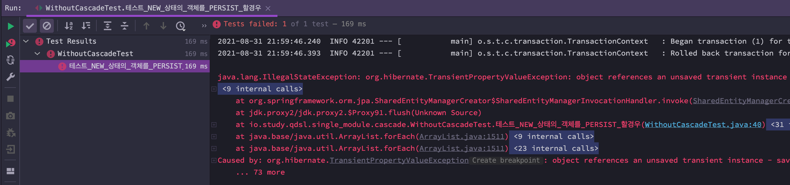
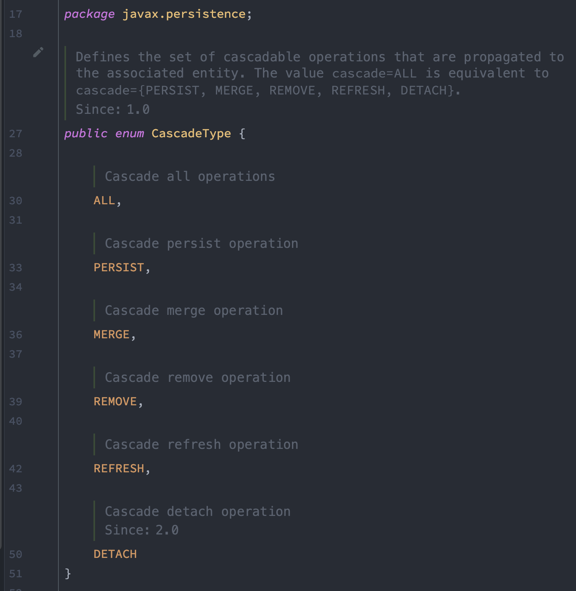
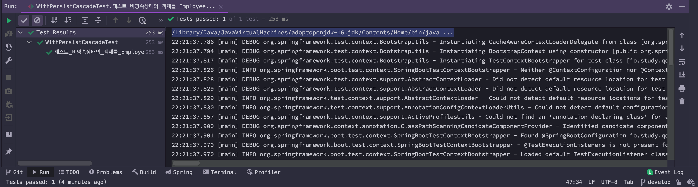
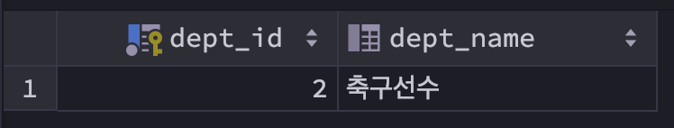
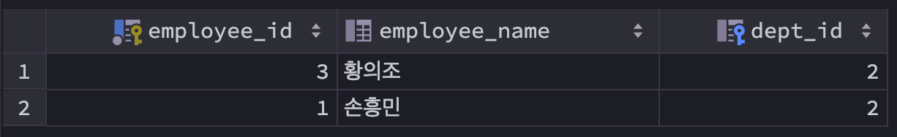

# 영속성 전이

@ManyToOne 정리문서에 이미 예제를 설명을 해놓아서 귀찮아서 파일을 하나 따로 만들지 않았었다. 하지만 하다보니 결국은 파일을 하나 더 만들어야 했었다.<br>

일단 결론부터 적고 시작해야 할 것 같다. 영속성 전이를 사용하기보다는, null 객체로 세팅하고 연관관계 편의 메서드를 통해 잘 조합을 해서 하나의 트랜잭션 단위를 의미를 지어서 구분지어 놓는 것이 좋은 방식인 것 같다. 자동으로 처리되게끔 영속성 전이를 걸어놓았는데, 최악의 경우, 데이터 삭제시 참조의 참조, 그 참조의 또 참조 까지 타고 내려가면서 알수 없는 데이터까지 삭제되게 되는 대참사가 발생할 수도 있기 때문이다.<br>

<br>

## 예제 엔티티 매핑

예제로 사용할 엔티티 매핑은 아래와 같다 ([참고](https://github.com/gosgjung/study-querydsl-jpa/blob/develop/JPA-%EC%9A%94%EC%A0%90%EC%A0%95%EB%A6%AC/1.1-%EC%97%94%ED%8B%B0%ED%8B%B0%EB%A7%A4%ED%95%91-ManyToOne-%EC%96%91%EB%B0%A9%ED%96%A5.md))

<br>

### Employee.java

```java
// ...

@Getter
@Entity
@Table(name = "EMP", schema = "public")
public class Employee {

    @Id @GeneratedValue(strategy = GenerationType.AUTO)
    @Column(name = "EMPLOYEE_ID")
    private Long id;

    @Column(name = "EMPLOYEE_NAME")
    private String name;

    @ManyToOne(fetch = FetchType.LAZY)
    @JoinColumn(name = "DEPT_ID")
    private Department dept;

    public Employee(){}

    @Builder
    public Employee(Long id, String name, Department department){
        this.id = id;
        this.name = name;
        this.dept = department;
    }

    public void setDept(Department dept){
        this.dept = dept;
    }

    public void assignDept(Department dept){
        this.dept = dept;
        dept.getEmployees().add(this);
    }
}
```

<br>

### Department.java

```java
// ...

@Getter
@Entity
@Table(name = "DEPT", schema = "public")
public class Department {

    @Id @GeneratedValue(strategy = GenerationType.AUTO)
    @Column(name = "DEPT_ID")
    private Long id;

    @Column(name = "DEPT_NAME")
    private String deptName;

    @OneToMany(mappedBy = "dept", fetch = FetchType.LAZY)
    private final List<Employee> employees = new ArrayList<>();

    public Department(){}

    @Builder
    public Department(Long id, String deptName){
        this.id = id;
        this.deptName = deptName;
    }
}
```

<br>

## 비영속 상태의 엔티티를 다른 객체에 지정하여 저장할때

```java
// ...
@SpringBootTest
@Transactional
public class WithoutCascadeTest {

	@Autowired
	EntityManager em;

	@Transactional
	@Test
	void 테스트_NEW_상태의_객체를_PERSIST_할경우(){
		Department deptSoccer = Department.builder().deptName("축구선수").build();

		Employee son = Employee.builder()
			.name("손흥민")
			.department(deptSoccer)
			.build();

		Employee hwang = Employee.builder()
			.name("황의조")
			.department(deptSoccer)
			.build();

		deptSoccer.getEmployees().add(son);
		deptSoccer.getEmployees().add(hwang);

		// em.persist(deptSoccer);
		em.persist(son);em.persist(hwang);
		em.flush();
	}
}
```

<br>

위의 예제에서 주목할 부분은 아래와 같다.

```java
Department deptSoccer = Department.builder().deptName("축구선수").build();

// ...

deptSoccer.getEmployees().add(son);
deptSoccer.getEmployees().add(hwang);

// em.persist(deptSoccer);
em.persist(son);em.persist(hwang);
em.flush();
```

<br>

이렇게 하면 deptSoccer 객체는 persist 하지 않았기 때문에 비영속 상태의 객체다. 그런데 이 객체가 EntityManager 를 거치지 않는다면 전혀 에러가 나지 않는데, 아래와 같이 관리 상태의 객체 내에 세팅을 해주고 있다.

```java
Employee son = Employee.builder()
  .name("손흥민")
  .department(deptSoccer)
  .build();
```

<br>

관리 상태의 객체에서 비영속 상태의 객체를 세팅해주고 있는데, 이것을 아래와 같이 persist 할 경우 에러를 내게 된다. 즉, 객체하나에 다른 엔티티 객체를 담아서 persist 할 경우 해당 다른 객체 역시도 관리 상태에 있어야 한다는 것이다.

```java
em.persist(son);
em.persist(hwang);
```

<br>

**출력결과(캡처)**<br>



<br>

> 이론적인 용어를 통해 말을 정리하다보니 말이 너무 이상해서, 위의 현상들을 요약해보면 아래와 같다.<br>
>
> - Employee 객체 son, hwang 은 EntityManager 객체 내에 바인딩 되어 있는 상태이지만
> - Department 객체의 경우 객체 생성만 했고 EntityManager 객체와 스치지도 않은 상태
>
> 이 상태에서 Employee 객체의 department 객체를 지정해주고 있다. Department 객체는 EntityManager와 스치지도 않았다. Employee 객체를 persist 할때 EntityManager 는 영속성 컨텍스트 내부에 Department 객체가 보이지 않아서 Exception을 내게 된다.

<br>

## 영속성 전이 (cascade)

영속성을 전이 시킨다는 개념이다. 영속성으로 지정되지 않았어도 저장할 때 일괄적으로 저장할 수록 있도록 하거나 하는 개념이다. 영속성 전이는 @ManyToOne, @OneToOne, @OneToMany, @ManyToMany 에서 모두 cascade 라는 속성으로 지정 가능하다.<br>

영속성 전이로 지정할 수 있는 타입들은 아래와 같다.<br>



- ALL
- PERSIST
- MERGE
- REMOVE
- REFRESH
- DETACH

이렇게 6가지의 CascadeType 이 있다.<br>

여러가지를 공부해볼 수 있지만, 이 중에서 PERSIST, REMOVE 만 예제로 확인해볼 예정이다. <br>

<br>

### CascadeType.PERSIST 를 사용하는 경우

Employee.java 클래스를 아래와 같이 수정해보자.

```java
@Getter
@Entity
@Table(name = "EMP", schema = "public")
public class Employee {

    @Id @GeneratedValue(strategy = GenerationType.AUTO)
    @Column(name = "EMPLOYEE_ID")
    private Long id;

    @Column(name = "EMPLOYEE_NAME")
    private String name;

    @ManyToOne(fetch = FetchType.LAZY, cascade = CascadeType.PERSIST)
    @JoinColumn(name = "DEPT_ID")
    private Department dept;

    public Employee(){}

    @Builder
    public Employee(Long id, String name, Department department){
        this.id = id;
        this.name = name;
        this.dept = department;
    }

    public void setDept(Department dept){
        this.dept = dept;
    }

    public void assignDept(Department dept){
        this.dept = dept;
        dept.getEmployees().add(this);
    }
}
```

아까의 예제에 비해서 이번 예제에서 달라진 점은 아래와 같다. ( `cascade = CascadeType.PERSIST` 를 추가해주었다.)

```java
@Getter
@Entity
@Table(name = "EMP", schema = "public")
public class Employee {
  // ...

  @ManyToOne(fetch = FetchType.LAZY, cascade = CascadeType.PERSIST) // 이 부분이 달라졌다.
  @JoinColumn(name = "DEPT_ID")
  private Department dept;

  // ...
}
```

<br>

**`CascadeType.PERSIST`** <br>

Employee 에 Department 객체를 지정해서 저장하려고 할 때, Department 객체가 관리 상태가 아닐 경우 관리상태로 전환해주고, 자동으로 Employee 저장시에 Department 객체 역시도 저장해주도록 하는 옵션이다.<br>

이제 테스트 코드를 작성해보자. 

```java
package io.study.qdsl.single_module.cascade;

import javax.persistence.EntityManager;

import org.junit.jupiter.api.Test;
import org.springframework.beans.factory.annotation.Autowired;
import org.springframework.boot.test.context.SpringBootTest;
import org.springframework.transaction.annotation.Transactional;

import io.study.qdsl.single_module.company.department.Department;
import io.study.qdsl.single_module.company.employee.Employee;

@SpringBootTest
@Transactional
public class WithPersistCascadeTest {

	@Autowired
	private EntityManager em;

	@Test
	void 테스트_비영속상태의_객체를_Employee에_지정하더라도_Cascade_PERSIST_라면_저장이된다(){
		Department deptSoccer = Department.builder().deptName("축구선수").build();

		Employee son = Employee.builder()
			.name("손흥민")
			.department(deptSoccer)
			.build();

		Employee hwang = Employee.builder()
			.name("황의조")
			.department(deptSoccer)
			.build();

		deptSoccer.getEmployees().add(son);
		deptSoccer.getEmployees().add(hwang);

		// em.persist(deptSoccer);
		em.persist(son);em.persist(hwang);
		em.flush();
	}
}
```

위의 코드에서는 아래와 같이 Department 객체를 생성하고 em.persist로 EntityManager 객체 내부의 영속성 컨텍스트 내에 등록하지 않았다. 

```java
Department deptSoccer = Department.builder().deptName("축구선수").build();

// ...
// deptSoccer는 객체생성을 했지만, persist를 하지는 않았다.
// ...
em.persist(son);
em.persist(hwang);
```

위 코드를 실행한 결과는 아래와 같이 초록불로 에러 없이 잘 실행된다.



<br>

Dept 테이블에는 위의 코드대로 정상적으로 데이터가 저장되었음을 확인할 수 있다.<br>



<br>

Employee 테이블에는 위의 코드대로 정상적으로 데이터가 저장되었다.<br>



<br>

### CascadeType.REMOVE를 사용하는 경우

**'축구선수'**라는 부서에는 황의조, 손흥민 사원이 있다. **'축구선수'** 부서를 삭제하기 위해서는 먼저 **'축구선수'** 부서에 속하는 직원인 황의조, 손흥민 사원을 삭제해야 한다. <br>

만약 **'축구선수'**라는 부서를 삭제할 때 Department 엔티티에 CascadeType.REMOVE 를 지정할 경우 별도로 사원들을 삭제하는 코드를 작성하지 않아도 부서 객체를 삭제하면 사원 데이터와 부서 데이터가 모두 삭제되게 된다.<br>

> 시간 내서 정리하고 있지만, 실무에서 사용 안했으면 하는 코드다. 테스트 환경에서 찌꺼기 데이터를 지울때는 사용할 만 하다. 하지만 @Transactional 이라는 좋은 도구를 놔두고 굳이 엔티티를 수정하면서 cascade를 사용하는 것은 조금 선뜻 손이 안가기는 하는 방식이기는 하다.<br>

<br>

**엔티티 매핑**<br>

**Employee.java**<br>

```java
@Getter
@Entity
@Table(name = "EMP", schema = "public")
public class Employee {

    @Id @GeneratedValue(strategy = GenerationType.AUTO)
    @Column(name = "EMPLOYEE_ID")
    private Long id;

    @Column(name = "EMPLOYEE_NAME")
    private String name;

    @ManyToOne(fetch = FetchType.LAZY, cascade = CascadeType.PERSIST)
    @JoinColumn(name = "DEPT_ID")
    private Department dept;

    public Employee(){}

    @Builder
    public Employee(Long id, String name, Department department){
        this.id = id;
        this.name = name;
        this.dept = department;
    }

    public void setDept(Department dept){
        this.dept = dept;
    }

    public void assignDept(Department dept){
        this.dept = dept;
        dept.getEmployees().add(this);
    }
}
```

<br>

**Department.java**<br>

```java
@Getter
@Entity
@Table(name = "DEPT", schema = "public")
public class Department {

    @Id @GeneratedValue(strategy = GenerationType.AUTO)
    @Column(name = "DEPT_ID")
    private Long id;

    @Column(name = "DEPT_NAME")
    private String deptName;

    @OneToMany(mappedBy = "dept", fetch = FetchType.LAZY, cascade = CascadeType.REMOVE)
    private final List<Employee> employees = new ArrayList<>();

    public Department(){}

    @Builder
    public Department(Long id, String deptName){
        this.id = id;
        this.deptName = deptName;
    }
}
```

<br>

위 코드에서 CascadeType.REMOVE 를 지정한 부분은 아래와 같다.

```java
@OneToMany(mappedBy = "dept", fetch = FetchType.LAZY, cascade = {CascadeType.PERSIST, CascadeType.REMOVE})
private final List<Employee> employees = new ArrayList<>();
```

<br>

그리고 삭제하는 코드는 아래와 같다.<br>

```java
// ...
@Transactional
@SpringBootTest
public class WithRemoveCascadeTest {

	@Autowired
	private EntityManager em;

	@Rollback(value = false)
	@Test
	void 테스트_Department_객체_삭제시_CascadeType_REMOVE를_지정하면_연관객객체인_Employee들도_모두_삭제되어야한다(){
		Department deptSoccer = Department.builder().deptName("축구선수").build();

		Employee son = Employee.builder()
			.name("손흥민")
			.department(deptSoccer)
			.build();

		Employee hwang = Employee.builder()
			.name("황의조")
			.department(deptSoccer)
			.build();

		deptSoccer.getEmployees().add(son);
		deptSoccer.getEmployees().add(hwang);

		// em.persist(deptSoccer);
		em.persist(son);
		em.persist(hwang);
		em.flush();


		em.remove(deptSoccer);
		System.out.println(son);
		System.out.println(hwang);
	}
}
```

데이터가 삭제된 모습들은 아래와 같다.<br>

먼저 department 테이블이다.<br>


<br>

Employee 테이블도 역시 모든 데이터들이 깔끔하게 지워져 있다.<br>


<br>

## 권장되는 방식 : null 지정하는 방식

이번 부분은 내일 정리해야 할 것 같다. 오늘 드디어 대망의 프리테스트를 서버인스턴스에서 해보는 날이다. 그래서 오늘은 여기까지만 하고 서버 배포를 준비해야할 것같다... 10시 반에 트래픽이 폭주하는데 (=1초에 5000건 ~ 9000건) 캐시를 잘 활용해서 결합도를 많이 낮춰서 해결했었다. 어제 테스트 할때는 프리테스트 서버가 한번은 뻗었고, 11시 쯤에 래빗엠큐 설정을 수정해서 다시 구동시키니 20분간 안정적으로 동작했다.<br>

오늘은 준비한 서버가 실제 인스턴스에서 어떻게 동작하는지 확인해보게 될 것 같다.!!! 내일은 아마도 배포 준비를 하면서 공부했던 logback-spring.xml 관련된 내용과 off-heap 옵션 관련해서도 정리하게 되지 않을까 싶다.<br>

<br>


