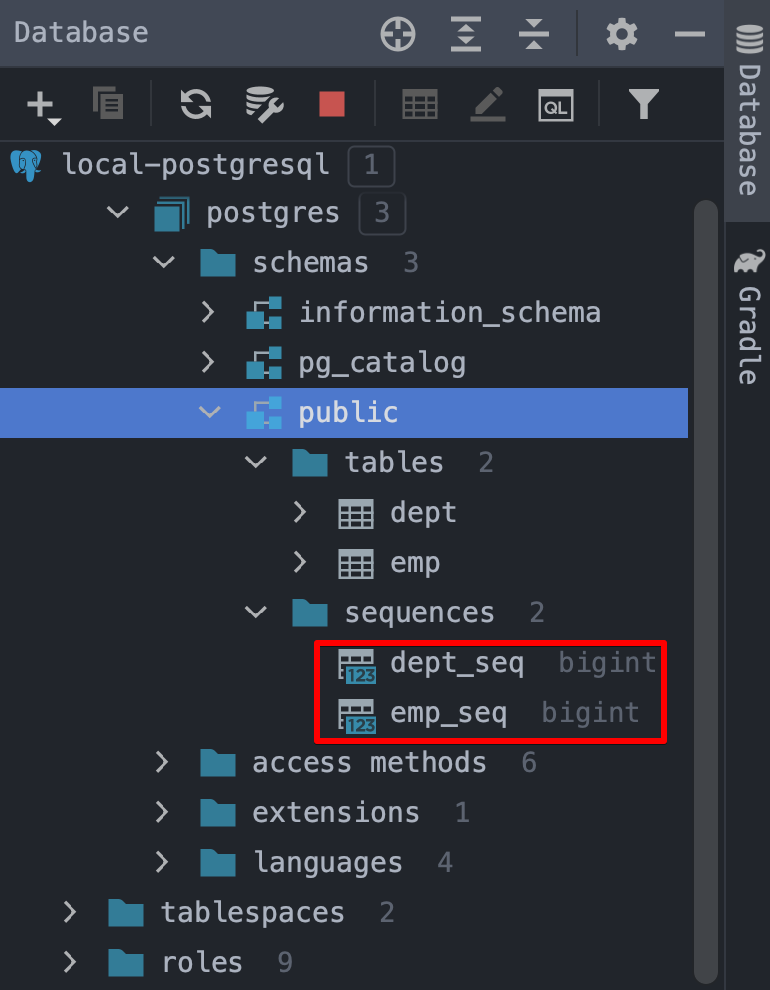

# PostgreSQL 기반 시퀀스 지정 예제

PostgreSQL, Oracle 기반의  DBMS를 객체로 매핑할 때와 MySQL 기반의 DBMS에서 테이블을 객체로 매핑할 때 식별자를 지정하는 방식이 조금 다르다.<br>

PostgreSQL, Oracle 에는 시퀀스라는 개념이 있다. 이런 이유로 `@SequenceGenerator` 와 `GenerationType.SEQUENCE` 를 활용해서 시퀀스를 객체에 매핑해서 표현하는 것이 가능하다. (MySQL의 경우는 auto_increment 를 사용하는 필드를 `GenerationType.IDENTITY` 로 표현가능하다.)<br>

## 시퀀스 표현

> 참고 : [docs.jboss.org](https://docs.jboss.org/hibernate/jpa/2.1/api/javax/persistence/SequenceGenerator.html)<br>

```java
@Entity
@SequenceGenerator(
  name = "employee_sequence",
  schema = "public", sequenceName = "EMP_SEQ",
  initialValue = 1, allocationSize = 1
)
@Table(name = "EMP", schema = "public")
public class Employee { ... }
```

- `@SequenceGenerator` 
  - DBMS 내의 시퀀스를 표현하는 어노테이션이다. 만약 `spring.jpa.hibernate.ddl-auto` 가 create 또는 create-drop 으로 지정되었을 경우 시퀀스를 생성하게 된다.
  - 테이블에 대한 기본키가 참조할 시퀀스의 증감연산에 대한 표시를 객체 측에 해준다.
  - 만약 `spring.jpa.hibernate.ddl-auto` 가 none 으로 지정되었을 경우 DB의 시퀀스를 객체에 매핑하여 엔티티 객체 내에 객체의 방식으로 시퀀스를 표현하게 된다.
- `@SequenceGenerator.name`
  - 엔티티 매핑된 클래스 내에서 또는 엔티티 매핑에서 시퀀스를 식별하기 위한 이름이다. 
  - 만약 위에 예제처럼 name 으로 `employee_sequence` 를 지정할 경우 `@Id` 가 적용된 다른 필드에서 이 `employee_sequence` 라는 이름으로 접근가능하다.
- `@SequenceGenerator.sequenceName`
  - 실제 물리적인 DB에서 사용되는 시퀀스의 이름이다.
  - 위의 예제에서는 `EMP_SEQ` 라는 이름으로 DB 내의 `EMP_SEQ` 라는 이름의 시퀀스를 참조하게 된다. 
- `initialValue` 
  - 시퀀스의 시작값
- `allocationSize` 
  - 만약 30 으로 지정하게 된다면, 서버애플리케이션 내에서 30까지 증가시킨 후에 DB 내의 시퀀스에 해당 증가분을 반영하게 된다.
  - 이렇게 잦은 시퀀스 증가를 하거나 insert 를 하는 경우는 배치 연산 외에는 없기에 자주 사용되는 옵션은 아니다.

<br>

## 시퀀스를 PK에 매핑

```java
@Entity
@SequenceGenerator(
    name = "employee_sequence", sequenceName = "EMP_SEQ",
		// ... 중략 ...
)
@Table(name = "EMP", schema = "public")
public class Employee {
  @Id @GeneratedValue(
    strategy = GenerationType.SEQUENCE, 
    generator = "employee_sequence"
  )
  @Column(name = "EMPLOYEE_ID")
  private Long id;
}
```

- `@GeneratedValue.strategy`
  - PostgreSQL 의 시퀀스에 대응되는 필드임을 명시하기 위해 식별자 전략옵션인 `strategy`를 `GenerationType.SEQUENCE` 로 지정해주었다.
- `generator` 
  - `@SequenceGenerator ` 에서 정의한 `employee_sequence` 를 지정해줬다.
  - 객체내에서 표현하고 있는 애플리케이션 레벨의 시퀀스에는 `employee_sequence`라는 이름을 붙여준 상태인데, 이 @Id 필드에 `employee_sequence`를 지정해서 애플리케이션 레벨에서 객체에 @Id 필드의 값을 할당할 수 있도록 해주었다.

<br>

## 엔티티 매핑

### Employee.java

```java
package io.study.jpa.generation_strategy.company.employee;

import io.study.jpa.generation_strategy.company.department.Department;
import lombok.Data;

import javax.persistence.*;

@Data
@Entity
@SequenceGenerator(
    name = "employee_sequence",
    schema = "public", sequenceName = "EMP_SEQ",
    initialValue = 1, allocationSize = 1
)
@Table(name = "EMP", schema = "public")
public class Employee {

    @Id @GeneratedValue(strategy = GenerationType.SEQUENCE, generator = "employee_sequence")
    @Column(name = "EMPLOYEE_ID")
    private Long id;

    @Column(name = "EMPLOYEE_NAME")
    private String name;

    @ManyToOne
    @JoinColumn(name = "DEPT_ID")
    private Department dept;

}
```

<br>

## application.yml

DBMS는 postgresql 을 선택했다. `jpa.hibernate.ddl-auto`는 `create`로 지정해서 애플리케이션 구동시 Table 을 삭제후 생성할 수 있도록 해주었다.

```yaml
spring:
  profiles:
    active: test-postgresql
---
spring:
  config:
    activate:
      on-profile: test-postgresql
  datasource:
    url: jdbc:postgresql://localhost:35432/postgres
    username: postgres
    password: 1111
    driver-class-name: org.postgresql.Driver
  jpa:
    hibernate:
      ddl-auto: create
    properties:
      hibernate:
        format_sql: true
        use_sql_comments: true
    database-platform: org.hibernate.dialect.PostgreSQLDialect
```

<br>

## 테스트 코드

그냥 웹 애플리케이션을 구동시켜도 되지만, 그냥 테스트 코드를 띄워봤다. 비어있는 테스트 코드이다. 그냥 웹 애플리케이션 컨텍스트를 구동하기 위해 `@SpringBootTest`를 지정해놓은 것 말고는 아무런 코드가 없다.

```java
package io.study.jpa.generation_strategy.sequence_test;

import org.junit.jupiter.api.DisplayName;
import org.junit.jupiter.api.Test;
import org.springframework.boot.test.context.SpringBootTest;

@SpringBootTest
public class SequenceGeneratorTest {

    @Test
    @DisplayName("비어있는_테스트")
    void 비어있는_테스트(){

    }
}
```

<br>

## 실제 시퀀스 생성 결과

아래 그림처럼 시퀀스가 잘 생성된 것을 확인 가능하다.



