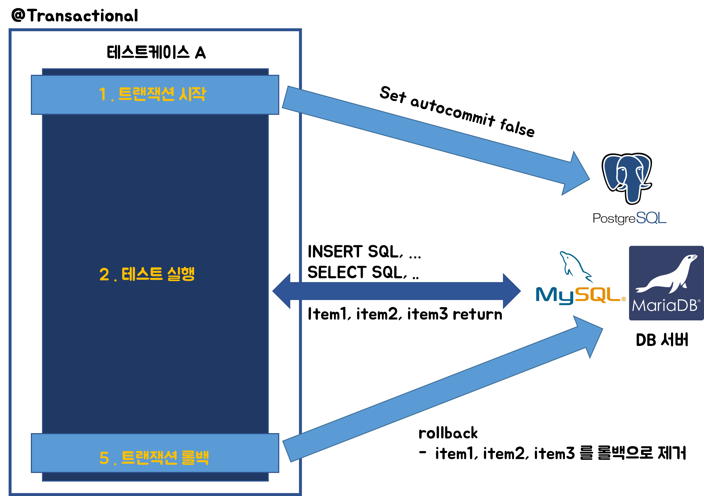

# 스프링 테스트와 Transactional,Rollback

# 테스트에서 중요한 원칙

- 테스트는 다른 테스트와 격리되어 있어야 한다.
- 테스트는 반복해서 실행할 수 있어야 한다.

<br>

# DB 연결 세팅

## application.properties

application.properties 파일은 애플리케이션 영역과 테스트 영역을 구분해서 지정가능하다.<br>

예를 들면 아래의 디렉터리에 따로 두고 사용할 수 있다.<br>

- src/main/resources/application.properties
- src/test/resources/application.properties

테스트코드에서 코드를 실행할 때에는 src/test/resources/application.properties 파일이 우선순위를 가지게 된다.<br>

<br>

## h2 세팅

h2 데이터베이스는 개발 PC에 설치해서 실행할 수도 있고, 인메모리로 실행할 수도 있다.

h2 접속 주소는 개발PC에 설치해서 사용할지, 인메모리로 사용할지에 따라서 접속주소가 달라지는데 각 접속 주소는 아래와 같아지게 된다.

- 개발 PC 에 접속해서 사용시 : `h2:tcp//localhost/~/test`
- 인메모리로 접속해서 사용시 : `jdbc:h2:mem:db;DB_CLOSE_DELAY=1`
  - 참고) 스프링부트는 데이터베이스에 대한 설정이 없을 경우 임베디드 데이터베이스를 사용한다.


<br>

### 애플리케이션 영역 properties 세팅

개발 PC에 설치해서 사용<br>

src/main/resources/application.properties

```
spring.profiles.active=local
spring.datasource.url=jdbc:h2:tcp//localhost/~/test
spring.datasource.username=sa
```

<br>

### 테스트 영역 properties 세팅

개발PC 의 h2 에 접속하도록 해서 실행

```
spring.profiles.active=test
spring.datasource.url=jdbc:h2:tcp//localhost/~/test
spring.datasource.username=sa
```

<br>

인메모리 h2 에 접속하도록 해서 실행<br>

src/test/resources/application.properties

```
spring.profiles.active=test
spring.datasoruce.url=jdbc:h2:mem:db;DB_CLOSE_DELAY=1
spring.datasource.username=sa
```

<br>

## h2 데이터베이스 용도별 분리

h2를 애플리케이션에서 사용할 때와 테스트에서 사용할 때의 데이터베이스를 다르게 줄수 있게끔 따로 데이터베이스를 생성하고 지정할 수 있다.<br>

예를 들면 아래와 같이 분리하는 것을 예로 들 수 있다.<br>

- 로컬에서 접속하는 h2 DB
  - jdbc:h2:tcp//localhost/~/test
- test 에서 접속하는 h2 DB
  - jdbc:h2:tcp://localhost/~/testCase

<br>

데이터베이스 파일을 생성하는 방법은 아래와 같다.

- 데이터베이스 서버를 종료하고 다시 실행
- 사용자명은 `sa` 입력
- JDBC URL 에 `jdbc:h2:~/testCase` 입력 (최초한번)
- `~/testcase.mv.db` 파일 생성 확인
- 이후 부터는 `jdbc:h2:tcp//localhost/~/testcase` 이렇게 접속

<br>

## h2 의 단점

실무에서는 h2만 사용해서 테스트를 작성하지 못하는 경우가 꽤 있다.<br>

예를 들면, UPSERT 기능을 써야만 하는 경우가 있었다.<br>

(조회 후에 업데이트 하는 방식의 연산을 수행할 경우 병렬수행시 데이터의 정합성에 문제가 생겨서 UPSERT 사용방식 외에는 대안이 없었다.)<br>

<br>

이 UPSERT 기능은 PostgreSQL, MySQL 마다 서로 문법이 다르고 jdbc template으로 실제 SQL을 작성해서 구현해야 한다. h2에서 지원이 안되는 SQL이 있기때문에 h2만 고집하다가는, 특정 케이스에서는 결국 기능개발을 못하게 되는 상황이었었다.<br>

이렇게 h2 외의 다른 DB를 테스트로 사용하면서, 인메모리/개발용도 DB를 사용할 필요가 있는 경우는, docker 기반의 mysql/postgresql 등을 띄우거나, `testcontainers` 와 `docker-compose` 를 활용해 테스트 케이스를 구축할 수 있다. 실제로 일했던 곳에서는 docker-compose 와 testcontainers 를 이용해 테스트 케이스를 구축했었었다.<br>

<br>

# 테스트 케이스에 대한 데이터 롤백

## 테스트 케이스마다 데이터가 롤백되어야 하는 이유

예를 들어 이전 테스트케이스에서 어떤 테이블에 A라는 데이터를 저장했고 커밋해둔 상태였다고 해보자. 그리고 이 데이터는 롤백하지 않은 채로 그대로 두었다.<br>

그리고 다른 테스트 케이스에서는 A라는 데이터를 insert 후에 이것이 유효성 체크를 통과 후에 조회를 제대로 하는지 체크하는 테스트를 구현해야 한다고 해보자. 이 경우 A라는 데이터가 이미 저장되어 있기에 중복된 키가 insert 되기에 테스트케이스가 실패하게 된다.<br>

이런 이유로 테스트 케이스에서는 아래와 같은 방식으로 트랜잭션을 롤백하는 코드를 테스트 케이스마다 실행하도록 작성한다.<br>

```
// 테스트케이스 A
트랜잭션 시작
테스트 A 실행
트랜잭션 롤백

// 테스트케이스 B
트랜잭션 시작
테스트 B 실행
트랜잭션 롤백
```

<br>

이렇게 테스트케이스마다 트랜잭션을 롤백시키는 것은 아래의 두가지 방식으로 구현 가능하다.

- 직접 구현 (@BeforeEach, @AfterEach 를 이용)
  - 트랜잭션 매니저 인스턴스를 이용해서 직접 commit, rollback 하는 로직을 작성하는 방식이다.
  - PlatformTransactionManager 를 의존성 주입으로 주입 받아서 이 트랜잭션 매니저로 @BeforeEach, @AfterEach 에서 commit, rollback 을 구현하면 된다.
- @Transactional 사용

먼저 직접 구현할 경우의 예제를 보자.<br>

<br>

## 직접 구현 (@BeforeEach, @AfterEach)

트랜잭션 매니저 인스턴스를 이용해서 직접 `commit()` , `rollback()` 하는 로직을 작성하는 방식이다. `PlatformTransactionManager` 를 의존성 주입으로 주입받아서 이 트랜잭션 매니저 인스턴스를 이용해 `@BeforeEach` , `@AfterEach` 에서 `commit()` , `rollback()` 메서드를 호출하게끔 구현하는 방식이다.<br>

<br>

아래 코드를 보면,<br>

- @BeforeEach 가 적용된 메서드에서는  `transactionManager.getTransactionManager(new DefaultTransactionDefinition())` 으로 트랜잭션을 시작하고 있다.
- @AfterEach 가 적용된 메서드에서는 `transactionManager.rollback(status)` 를 통해 트랜잭션을 롤백하고 있음을 확인하고 있다.

<br>

```java
@SpringBootTest
class SomethingTest{
	@Autowired
	PlatformTransactionManager transactionManager;
	// ...

	TransactionStatus status;

	@BeforeEach
	void beforeEach(){
		status = transactionManager.getTransaction(new DefaultTransactionDefinition());
	}

	@AfterEach
	void afterEach(){
		// ...
		transactionManager.rollback(status);
	}

	// ...
	@Test
	public void INSERTION_TEST(){
		// ... 
	}
}
```

<br>

## `@Transactional` 사용

스프링에서는 위와 같이 직접 작성하던 트랜잭션 커밋/롤백 로직을 `@Transactional` 어노테이션 하나로 모두 대체가능하다.<br>

위에서 사용한 코드는 아래와 같이 어노테이션 하나로 대체가 된다.<br>

메서드 레벨에 대해 `@Transactional` 을 적용한 테스트 코드다.<br>

```java
@SpringBootTest
class SomethingTest{

	@Transactional
	@Test
	public void SOME_TEST(){
		// ...
	}
}
```

<br>

또는 아래와 같이 클래스 레벨에 `@Transactional` 을 적용하는 것도 가능하다.<br>

`@Transactional` 을 class 레벨에 선언하면, class 내의 public 클래스들에 모두 `@Transactional` 이 적용되게 된다.

```java
@SpringBootTest
@Transactional
class SomethingTest{

	@Test
	public void SOME_TEST(){
		// ...
	}
}
```

<br>

### 테스트 코드에서 @Transactional 을 사용하는 것의 장점

- 테스트가 끝난 후 개발자가 직접 데이터를 삭제하지 않아도 되기에 유지보수가 편리해진다.
- 테스트 실행 중에 데이터를 등록하고 중간에 테스트가 종료되도 테스트 중에는 트랜잭션을 커밋하지 않기에, 롤백이 수행되지 않더라도 데이터는 자동으로 롤백된다. (데이터베이스 커넥션이 끊어지면, 커밋되지 않은 데이터는 자동으로 롤백된다.)
- 트랜잭션 범위에서 테스트를 진행하므로 다른 테스트를 진행하더라도 서로 영향을 주지않는다는 장점이 있다.
- @Transactional 을 사용하면 아래의 두가지 원칙을 지킬 수 있게 된다.
  - 테스트는 다른 테스트와 격리해야 한다.
  - 테스트는 반복해서 실행할 수 있어야 한다.

<br>

### 테스트코드에서의 @Transactional 의 동작

`@Transactional` 어노테이션을 테스트에서 사용하면 애플리케이션 영역에서 @Transactional 을 사용할 때와는 다르게 동작한다.<br>

테스트클래스/메서드에서 `@Transactional` 을 사용할 때 스프링은 그 테스트를 트랜잭션 범위에서 실행하고 테스트가 끝나면 **자동으로 트랜잭션을 rollback 한다.**<br>

(애플리케이션 계층에서 @Transactional 은 @Transactional 이 적용된 메서드가 실행이 성공적으로 수행되면 커밋하게끔 동작한다.)<br>

아래 그림은 @Transactional 이 적용된 테스트 케이스가 실행될때의 동작을 그림으로 나타낸 그림이다. 자세히 보면, 트랜잭션의 마지막에 꼭 rollback 을 수행하는 것을 볼 수 있다.<br>

<br>



<br>

트랜잭션내에서 SELECT SQL을 수행하고 있다. 이때 같은 트랜잭션 내에서 조회하는 것이기에 INSERT SQL 로 실행한 결과가 조회된다. 하지만, 다른 트랜잭션에서는 INSERT 한 결과는 조회되지 않는다.<br>

테스트가 끝난 후에는 트랜잭션을 강제로 롤백한다. @Transactional 이 적용된 테스트 코드는 테스트가 끝날 때 **트랜잭션을 강제 롤백**한다.<br>

서비스/리포지터리 에 적용한 `@Transactonal` 도 테스트에서 시작한 트랜잭션으로 참여한다. 서비스/리포지터리 코드를 포함해서 테스트 코드가 실행하는 모든 코드는 테스트가 시작된 트랜잭션에 참여한다. (트랜잭션 전파 개념 .. 추후 정리 예정)<br>

<br>

## @Commit

@Transactional 을 테스트 클래스/메서드에 붙였더라도 `@Commit` 을 클래스/메서드에 붙이면 테스트 종료 후 롤백 대신 커밋이 호출된다.

> Test 코드를 작성하는 것이지만, 가끔은 데이터베이스에 데이터가 잘 보관되었는지 최종 결과를 확인해야 하는 경우도 있다. 이런 경우에 아주 드물게 @Commit 또는 @Rollback 어노테이션을 사용하기는 한다. 하지만 전체테스트 케이스 내에 포함이 되지 않도록 @Disabled  등의 어노테이션을 적용한다.

```java
import org.springframework.test.annotation.Commit;

@Commit
@Transactional
@SpringBootTest
class SomethingTest{
}
```

<br>

## @Rollback

@Transactional 을 테스트 클래스/메서드에 붙였더라도 `@Rollback(value = false)` 를 클래스/메서드에 붙이면 테스트 종료 후 롤백 대신 커밋이 호출된다.

> Test 코드를 작성하는 것이지만, 가끔은 데이터베이스에 데이터가 잘 보관되었는지 최종 결과를 확인해야 하는 경우도 있다. 이런 경우에 아주 드물게 @Commit 또는 @Rollback 어노테이션을 사용하기는 한다. 하지만 전체테스트 케이스 내에 포함이 되지 않도록 @Disabled  등의 어노테이션을 적용한다.

```java
import org.springframework.test.annotation.Commit;

@Rollback(value = false)
@Transactional
@SpringBootTest
class SomethingTest{
}
```

<br>

# 임베디드 모드 DB


# 스프링부트의 임베디드 DB 기본설정

