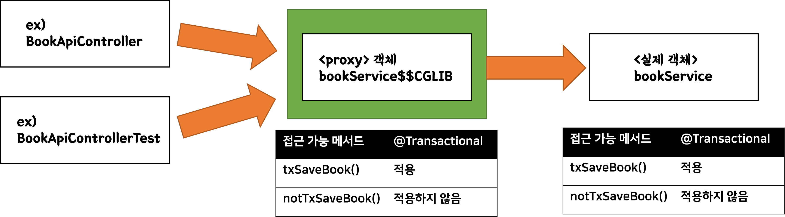
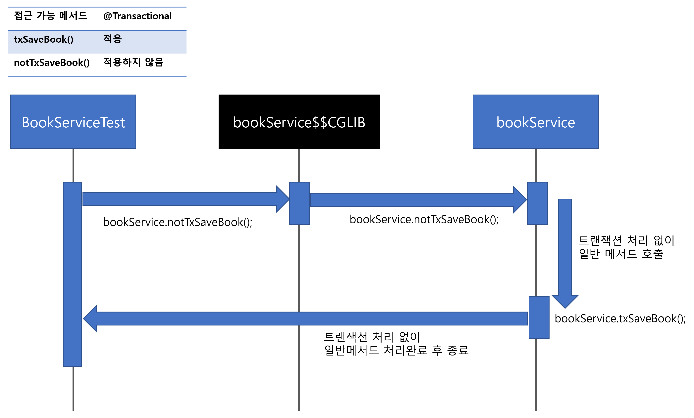
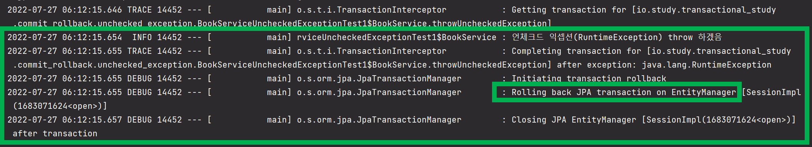
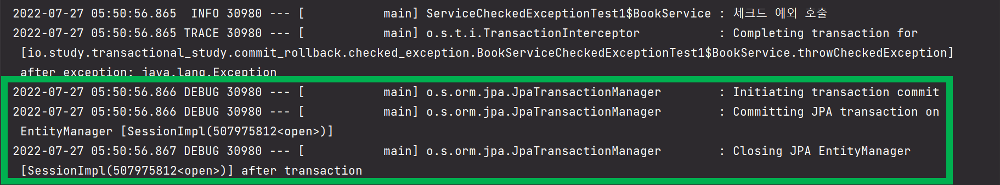
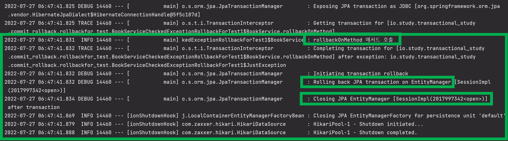
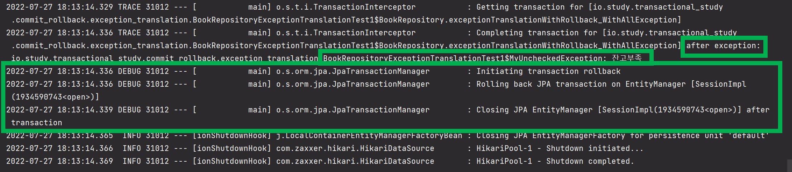
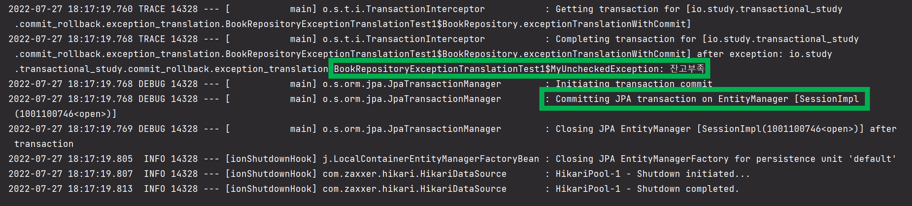

# 스프링의 트랜잭션 프록시, 커밋,롤백 원칙

# 예제 깃헙

- 예제는 [여기 - github.com/study-querydsl-jpa/codes/transactional_study/src/test/java/io/study/transactional_study](https://github.com/soon-good/study-querydsl-jpa/tree/develop/codes/transactional_study/src/test/java/io/study/transactional_study/commit_rollback) 에 정리해두었다.


# 참고자료

- [스프링 DB 2편 - 데이터 접근 활용 기술 - 인프런 | 강의](https://www.inflearn.com/course/%EC%8A%A4%ED%94%84%EB%A7%81-db-2)

오늘 정리하는 자료는 위의 자료를 요약한 내용이다. 강사님이 설명해주는 것에 비해 내가 요약하고 있는 내용은 턱없이 부족할 수 있다. 혹시라도 이 문서를 보는 누군가가 계신다면 가급적 강의를 들어보는 것을 추천. <br>

2배속으로 들어도 발음이 모두 잘 들려서 충분히 빠르게 훑어볼수 있다. 강의도 비싼편은 아닌듯.<br>

<br>

# 리마인드 - 스프링의 트랜잭션

- [리마인드 - 스프링의 트랜잭션](https://github.com/soon-good/study-querydsl-jpa/blob/develop/%ED%8A%B8%EB%9E%9C%EC%9E%AD%EC%85%98%20%EA%B0%9C%EB%85%90%EC%A0%95%EB%A6%AC/%EB%A6%AC%EB%A7%88%EC%9D%B8%EB%93%9C-%EC%8A%A4%ED%94%84%EB%A7%81%EC%9D%98%20%ED%8A%B8%EB%9E%9C%EC%9E%AD%EC%85%98.md)

<br>

# 스프링의 트랜잭션 프록시

스프링은 트랜잭션을 AOP로 제공한다. 이번 문서에서 AOP 에 대한 개념을 정리할 여건은 되지 않아서 AOP 개념정리는 스킵.<br>

대신 스프링에서 트랜잭션을 어떻게 프록시로 제공하고, 여기에 적용되는 우선순위 규칙 및 프록시가 적용되지 않는 예외 케이스에 대해서 정리하기로 했다.<br>

스프링의 트랜잭션 프록시는 아래의 순서로 개념을 정리하기로 했다.

- 트랜잭션 프록시 적용 주요 원칙
- 트랜잭션 프록시 객체 생성/등록 원리
- 예외케이스) 같은 클래스 내 non-tx 메서드 -> tx 메서드 호출하는 경우

<br>

## 트랜잭션 프록시 적용 주요 원칙

- 클래스레벨에 @Transactional 
  - 클래스레벨에 @Transactional 이 적용되면 모든 public 메서드에 @Transactional 자동 적용
- @Transactional 덮어쓰기
  - 최 하위레벨에서 덮어쓴 선언이 최종 @Transactional 선언이 된다.
- 인터페이스에 @Transactional
  - 인터페이스에도 @Transactional 이 적용될 수 있다.
- 예외케이스) 같은 클래스 내 non-tx 메서드 -> tx 메서드 호출하는 경우 
  - Transactional 이 적용되지 않은 메서드에서 같은 클래스내의 @Transactional 적용된 메서드 내부 호출하는 경우다.
  - ex) 가짜 객체의 일반 메서드 A 호출 -> 가짜객체는 실제 객체의 일반메서드 A 호출 -> 실제 객체의 일반 메서드A에서 @Transactional 메서드 AA 호출 -> @Transactional 적용 안됨.


<br>

**클래스레벨에 적용되면 모든 public 메서드에 @Transactional 자동 적용**<br>

@Transactional 이 클래스에 적용되어 있으면, 그 클래스 내의 모든 public 메서드는 @Transactional 이 적용된다. public 이 적용되지 않은 곳에 `@Transactional` 이 적용되어 있으면 예외가 발생하지는 않고 트랜잭션 적용만 무시된다.<br>

클래스 레벨에 트랜잭션을 적용하면 모든 public 메서드에 트랜잭션이 걸릴 수 있다. 이런 경우 트랜잭션이 의도하지 않은 곳까지도 과도하게 적용된다.<br>

<br>

**@Transactional 덮어쓰기, 최 하위레벨에서 덮어쓴 선언이 최종 @Transactional 선언이 된다.**

@Transactional 이 적용되는 것은 우선순위가 있다. 가장 작은 단위에 적용된 @Tranactional 이 그 윗레벨에 적용된 @Transactional 을 모두 덮어쓰게 된다. 예를 들면, readOnly = true , readOnly = false 같은 옵션이 적용된 @Transactional 이 호출스택 곳곳에 산재해있는 아래의 경우를 예로 들수 있다.<br>

아래 예제를 보자.<br>

```java
@Slf4j
@Transactional(readOnly = true)
public class BookService{
	// ...
	@Transactional(readOnly = false)
	public void txSaveBook(){
		printTxInfo();
	}

	// ...
	public void printTxInfo(){
		boolean txActive = TransactionSynchronizationManager.isActualTransactionActive();
		log.info("tx active = {}", txActive);
		boolean readOnly = TransactionSynchronizationManager.isCurrentTransactionReadOnly();
		log.info("tx readOnly = {}", readOnly);
	}
}
```

<br>

출력결과

```plain
tx active = true
tx readOnly = true
```

<br>

**인터페이스에도 @Transactional 이 적용될 수 있다.**

> 인터페이스에 @Transactional 을 사용하는 것은 스프링 공식 매뉴얼에서는 권장하지 않는 방법이다. 간혹 스프링 버전에 따라서 인터페이스에 @Transactional 이 적용하는 방식이 지원되지 않는 경우도 있다. (스프링 5.0 부터는 가능하지만, 가급적 사용하지 않는 것을 추천)<br>

<br>

인터페이스에도 @Transactional 이 적용되어 있다면, 이 경우 @Transactional 이 적용되는 우선순위를 높은 순서로 나열해보면 아래와 같다.

- 1 ) 클래스의 메서드 (가장 하위 레벨. 최종적으로 덮어쓰기 됨)
- 2 ) 클래스 레벨 (클래스 Type 레벨)
- 3 ) 인터페이스의 메서드
- 4 ) 인터페이스 레벨 (인터페이스 Type 레벨)

<br>

**예외상황) 같은 클래스 내 non-tx 메서드 -> tx 메서드 호출하는 경우**<br>

- 뒤에서 정리할 예정

<br>

## 트랜잭션 프록시 객체 생성/등록 원리

> 스프링에서 Bean 등록시 @Transactional 이 붙은 클래스에 대해 프록시 객체로 생성/등록 원리에 대해서 정리

<br>

목차

- 요약
- @Transactional 이 적용되지 않을수도 있는 예외 케이스
- ex) BookApiController, BookService
- (1) 트랜잭션 프록시 객체 빈 등록
- (2) BookApiController/BookApiControllerTest -> bookService.txSaveBook() or bokService.notTxSaveBook() 호출

<br>

**요약**

- @Transactional 이 적용된 트랜잭션 프록시 객체는 실제 객체를 부모로 해서 상속받은 가짜 객체다.
- 이 가짜 객체는 스프링 컨테이너가 로딩되면서, 스프링 컨테이너가 프록시 라이브러리를 통해 실제 객체를 상속받은 가짜 객체를 프록시 방식으로 생성해놓은 객체다. @Transactional 이 선언되있는 클래스는 내부적으로는 스프링의 컨테이너가 스프링 컨테이너 로딩시에 프록시 객체를 생성해서 빈으로 등록해준다.
- 그리고 이 트랜잭션 프록시 객체 내에는 트랜잭션의 시작/커밋/롤백 처리를 후처리 할 수 있는 내부 로직이 있다.
- 커스텀 어노테이션을 생성했을 때 스프링에서 사용할 수 있도록 하는 예제를 만들어봤다면, 이해가 쉽울듯.

<br>

**@Transactional 이 적용되지 않을수도 있는 예외 케이스**<br>

- (예외상황) Transactional 이 적용되지 않은 메서드에서 같은 클래스내의 @Transactional 적용된 메서드 내부 호출
  - 이 경우, 아래와 같은 방식으로 수행된다.
  - 가짜 객체의 일반 메서드 A 호출 -> 가짜객체는 실제 객체의 일반메서드 A 호출 -> 실제 객체의 일반 메서드A에서 @Transactional 메서드 AA 호출 -> @Transactional 적용 안됨.

<br>

**ex) BookApiController, BookService**<br>

예를 들어 BookApiController, BookService 클래스가 있다고 해보자. 이 경우 트랜잭션 프록시는 아래와 같은 흐름으로 호출된다.



<br>

**(1) 트랜잭션 프록시 객체 빈 등록**<br>

스프링은 트랜잭션 프록시를 적용해야 할 Bean이 보인다면, 컨테이너 로딩시에 해당 객체를 프록시 객체로 만들어서 해당객체의 Bean에 프록시 객체를 등록해둔다. 이때 스프링이 트랜잭션 프록시 객체 생성을 할 타입을 찾는 조건은 아래와 같다.<br>

- `@Transactional` 이 클래스 레벨에 선언된 클래스
- 클래스내의 public 메서드 들 중 단 하나의 메서드 라도 `@Transactional` 이 적용된 클래스
- implements 하고 있는 interface에 @Transactional 이 적용되어 있을 경우

이렇게 생성된 가짜 객체는 Proxy 역할을 수행하기 위해 스프링 컨테이너에 의해 생성된 객체다. 이 Proxy 객체는 트랜잭션의 시작/커밋/롤백 코드 수행을 담당하게 된다. (이렇게 스프링이 생성한 Proxy 객체는 보통 디버깅화면이나 로그 화면에서 보면 `$$CGLIB` 이라는 접미사가 붙어있는 것을 볼 수 있다.)<br>

<br>

**(2) BookApiController/BookApiControllerTest -> bookService.txSaveBook() or bokService.notTxSaveBook() 호출**

> **bookService.txSaveBook() 호출**<br>

BookApiController 에서 bookService 의 txSaveBook() 메서드를 호출하는 경우를 생각해보자. txSaveBook() 메서드는 메서드 정의시 메서드의 구현부 바로 위에`@Transactional` 어노테이션을 적용해둔 상태다. 이 경우, @Transactional 이 호출할 메서드 바디의 실행전/실행 후에 트랜잭션의 시작/커밋/롤백 처리가 적용된다.<br>

트랜잭션 프록시가 메서드 바디의 실행 전/후에 실행되는 절차는 아래와 같다.

- 메서드의 바디를 트랜잭션 프록시가 잡고 있고, 
- 메서드 시작전) 트랜잭션 프록시가 트랜잭션 시작로직을 호출한다. 
- 메서드 구현부 종료후) 트랜잭션 커밋/롤백 호출하는 방식으로 수행된다.

<br>

> **bookService.notTxSaveBook() 호출**<br>

BookApiController 에서 bookService 의 notTxSaveBook() 메서드를 호출하는 경우를 생각해보자. notTxSaveBook() 메서드는 메서드 정의시 메서드의 구현부에 @Transactional 이 적용되어있지 않은 상태다.<br>

이 경우, 같은 클래스 내의 txSaveBook( ) 메서드가 @Transactional 이 적용되어 있기에, 트랜잭션 프록시 객체가 소유한 notTxSaveBook() 메서드가 호출된다. 하지만 notTxSaveBook() 메서드에는 `@Transactioanl` 이 적용되어 있지 않은 상태이기 때문에, 트랜잭션 시작/커밋/롤백 처리는 적용되지 않는다.<br>

<br>

와... 머릿속에 있는 것을 다시 볼때 알아들을 수 있는 언어로 정리하는 게 이렇게 힘들줄이야... ㄷㄷㄷ하다.<br>

<br>

## 예외케이스) 같은 클래스 내 non-tx 메서드 -> tx 메서드 호출하는 경우

> 조금 단순하게 예를 들어보면, 이런 경우다.<br>
>
> Transactional 이 적용되지 않은 메서드에서 같은 클래스내의 @Transactional 적용된 메서드 내부 호출하는 경우
>
> - 이 경우, 아래와 같은 방식으로 수행된다.
> - 가짜 객체의 일반 메서드 A 호출 -> 가짜객체는 실제 객체의 일반메서드 A 호출 -> 실제 객체의 일반 메서드A에서 @Transactional 메서드 AA 호출 -> @Transactional 적용 안됨.

<br>

예제로 사용할 BookService 클래스를 보자.<br>

> 마크다운의 표 편집 기능에 익숙치 않아서 UML 표기법에 맞춰서 작성하지는 못했다. (단순 표로 정리함)

| **BookService**  (클래스)  |                                |
| -------------------------- | ------------------------------ |
| **notTxSaveBook() 메서드** | 일반 메서드                    |
| **txSaveBook()**           | @Transactional 어노테이션 선언 |
| …                          |                                |

<br>

 BookService 클래스는 아래와 같이 `notTxSaveBook()` , `txSaveBok()` 이렇게 두개의 메서드를 가지고 있다. txSaveBook() 메서드의 경우 메서드의 선언시 @Transactional 어노테이션을 붙여둔 상태다.<br>

이때 notTxSaveBook() 메서드 내에서 txSaveBook() 메서드를 호출하고 있다고 해보자. 예를 들면 아래와 같이 코드를 작성해둔 상태다.<br>

```java
class BookService{
	// ...
	public void notTxSaveBook(){
		txSaveBook();
	}

	@Transactional
	public void txSaveBook(){
		// some logic
	}

}
```

<br>

이때, notTxSaveBook() 메서드를 호출할 때 스프링의 트랜잭션이 적용될까? 결론은 `No` 다.<br>

호출 구조를 그림으로 표현해보면 아래와 같은 구조다.<br>



<br>

검은색으로 표시한 `bookService$$CGLIB` 객체는 트랜잭션 프록시가 적용된 객체다. 프록시가 적용된 객체는 보통 뒤에 `CGLIB` 이라는 접미사가 붙는다. 파란색으로 표시된 `bookService` 객체는 실제 객체다. 프록시 객체는 스프링이 빈으로 등록해둔 객체이고, bookService의 메서드들을 호출할때는 이 프록시 객체를 경유해서 실제 객체의 로직들을 사용하게 된다. (자세한 내용은 위에서 정리해두었기에, 여기서는 패스.)<br>

<br>

**트랜잭션이 적용되지 않는 이유**<br>

프록시 객체는 실제 객체를 상속받아 만들어진 가짜객체다. 만들어진 목적은 실제 객체의 메서드를 호출 전/후에 트랜잭션의 시작/커밋/롤백을 처리하기 위한 것이 목적이다. 즉, 프록시 객체가 실제 객체의 구현부를 직접 가지고 있는 것이 아니다. 부모객체의 로직은 상속받은 메서드를 그대로 사용하고 처리의 전/후에 트랜잭션의 커밋/롤백 등을 적용하는 것이다.<br>

상속 시에 자식객체는 부모객체의 메서드를 물려받는데, 상속받은 메서드를 자식객체에서 오버라이드 하지 않으면, 부모객체의 메서드를 기본적으로 호출한다. 또 말로 설명해서 이상하다. 그냥 예제로 정리하면 간단해질것 같다.<br>

아래는 BaseBookService 클래스다. 부모 클래스다.

```java
package io.study.transactional_study.hierachy_test;

public class BaseBookService {
    public void printMessage(){
        System.out.println("실제객체에요~~~");
    }
}
```

<br>

아래는 자식 클래스다. 클래스 명은 ExtendedBookService 클래스다.

```java
package io.study.transactional_study.hierachy_test;

public class ExtendedBookService extends BaseBookService{
    
    public void bookServiceStart(){
        System.out.println("bookService 시작");
    }

    public void bookServiceEnd(){
        System.out.println("bookService 종료");
    }

    public void somethingTodo(){
        bookServiceStart();
        printMessage(); // 부모객체의 메서드
        bookServiceEnd();
    }

}
```

<br>

이제 이걸 테스트한번 해보자. 자식 클래스인 ExtendedBookService 클래스의 somethingTodo() 메서드를 호출할때 printMessage()가 부모객체에 선언한 그대로의 메서드가 호출되는지 보자. 아직까지는 오버라이딩을 하지 않았기 때문에 부모객체의 메서드가 호출되어야 한다.

```java
package io.study.transactional_study.hierachy_test;

import org.junit.jupiter.api.Test;

public class BookServiceTest {

    @Test
    public void 자식객체에서_간접적으로_부모객체의_메서드를_호출하는_예(){
        ExtendedBookService s1 = new ExtendedBookService();
        s1.somethingTodo();
    }
}
```

<br>

출력결과

```plain
bookService 시작
실제객체에요~~~
bookService 종료
```

<br>

부모객체의 메서드에서 출력하는 메시지인 "실제객체에요~~~" 라는 문구가 출력됐다. 이유는 자식 클래스에서 오버라이딩하지 않았기 때문이다.<br>

이 예제를 통해 알 수 있는 것은 트랜잭션 프록시 객체가 부모객체인 실제 객체의 메서드를 호출할 때, @Transactional 이 적용되지 않은 메서드는 별도의 처리를 하지 않았기에 실제 객체의 메서드를 호출한다. 이때 호출하는 실제 객체의 메서드 내에서 @Transactional 메서드를 호출하면 트랜잭션 프록시의 메서드가 호출되는 것이 아니라 실제 객체의 @Transactional 메서드가 호출될 뿐이다<br>

이때 실제 객체에는 아무런 트랜잭션 처리가 되어 있지 않기 때문에 @Transactional 어노테이션은 단순한 문자로서의 역할, 마커인터페이스일 뿐이다. (실제 객체 내에 존재하는 이 마커인터페이스를 찾아서 바인딩해주는 주체가 따로 없다.)<br>

<br>

**non-tx 메서드 -> tx 메서드 호출 케이스 검증**<br>

지금까지의 예를 테스트해보기 위한 예제는 아래와 같다.

```java
@Slf4j
@SpringBootTest
public class BookServiceTest {

	@Autowired
	BookService bookService;

	@Test
	public void printProxy(){
		log.info("bookService class = {}", bookService.getClass());
	}

	@Test
	public void txMethodCall(){
		bookService.txSaveBook();
	}

	@Test
	public void notTxMethodCall(){
		bookService.notTxSaveBook();
	}

	@TestConfiguration
	static class InlineConfig {
		@Bean
		BookService bookService(){
			return new BookService();
		}
	}

	@Slf4j
	static class BookService{

		public void notTxSaveBook(){
			log.info("Not 트랜잭셔널 메서드 호출");
			printTxInfo();
			txSaveBook();
		}

		@Transactional
		public void txSaveBook(){
			log.info("트랜잭셔널 메서드 호출");
			printTxInfo();
		}

		// 트랜잭션 적용여부 로깅용도 메서드
		private void printTxInfo(){
			boolean txActive = TransactionSynchronizationManager.isActualTransactionActive();
			log.info("tx active ?? {}", txActive);
		}

	}

}
```

<br>

출력결과

위의 테스트 케이스 들 중에서 `notTxMethodCall()` 메서드를 호출했다고 해보자.

```plain
Not 트랜잭셔널 메서드 호출
tx active ?? false
트랜잭셔널 메서드 호출
tx active ?? false
```

<br>

**해결방법 - notTxSaveBook() 메서드에도 트랜잭션이 적용되게끔 하려면?**

아래 코드처럼 별도의 클래스로 분리해준다. 내부호출이 되지 않게끔하는 것이 목적이기에 다른 클래스의 메서드로 분리해뒀다. 이 외에도 실무에서 다양한 문제에 부딪히는데 이것과 관련해서는 글이 길어질것 같아 다른 문서에서 정리 예정이다.

```java
class BookService{
	// ...
	public void notTxSaveBook(){
		txBookService.txSaveBook();
	}
	// ...
}

class TxBookService{
    // txSaveBook 을 별도의 클래스로 분리해줬다.
	@Transactional
	public void txSaveBook(){
		// some logic
	}
}
```

<br>

## 트랜잭션 AOP 가 초기화되는 시점

- 애플리케이션 초기화 시점에 DB에서 어떤 데이터를 미리 로딩해와서 트랜잭셔널한 작업을 처리해야 하는 경우가 있다.
- 물론 내가 직접 경험한 케이스는 아니지만, 실무에서 충분히 경험할 수 있는 요구사항인 것 같다.
- 스프링에서 애플리케이션의 초기화 완료이벤트로 생각할 수 잇는 애플리케이션 이벤트로는 ApplicationReadyEvent, @PostConstruct 가 있다.
- 이 중 @PostConstruct 는 스프링 컨테이너의 로딩이 완료된 시점이 아니라, 의존성 주입이 완료된 후에 호출된다.
  - (참고: [PostConstruct (Java(TM) EE 7 Specification APIs)](https://docs.oracle.com/javaee/7/api/javax/annotation/PostConstruct.html))
- @ApplicationReadyEvent 는 스프링 컨테이너가 로딩된 시점에 호출된다.
  - (애플리케이션이 리퀘스트를 받을 준비가 되었을 때 ApplicationReadyEvent 가 발생한다. (참고: [ApplicationReadyEvent (Spring Boot 2.7.2 API)](https://docs.spring.io/spring-boot/docs/current/api/org/springframework/boot/context/event/ApplicationReadyEvent.html) ))

애플리케이션 로딩시에 트랜잭셔널한 작업을 할때에는, 가급적 `@ApplicationReadyEvent` 를 사용하는 것이 낫다.

<br>

**@PostConstruct 를 적용할 경우**

@PostConstruct 가 적용된 메서드는 스프링 컨테이너가 완전히 모두 로딩되지 않은 시점에 먼저 호출된다. 따라서 트랜잭션이 적용되지 않은 시점에 @PostConstruct 적용된 메서드가 호출된다.

```java
@SpringBootTest
public class SpringInitTest1{

	@PostConstruct
	@Transactional
	public void initTest(){
		boolean isActive = TransactionSynchronizationManager.isActualTransactionActive();
		log.info("Init Complete, txActive ?? {}", isActive);
	}
}
```

<br>

이 경우 로그를 보면 아래와 같이 출력된다.

```plain
Init Complete, txActive ?? false
```


**ApplicationReadyEvent 를 사용할 경우**

ApplicationReadyEvent 시점에는 트랜잭션이 초기화되는 것을 확인할 수 있다. ApplicationReadyEvent는 스프링 컨테이너가 완전히 로딩된 시점에 호출된다. 따라서 트랜잭션이 적용된 시점에 호출된다.

```java
@SpringBootTest
public class SpringInitTest2{

	@EventListener(value = ApplicationReadyEvent.class)
	@Transactional
	public void initTest(){
		boolean isActive = TransactionSynchronizationManager.isActualTransactionActive();
		log.info("Init Complete, txActive ?? {}", isActive);
	}
}
```

이 경우 로그를 보면 아래와 같이 출력된다.

```plain
Init Complete, txActive ?? true
```

<br>

# Exception 발생시 스프링의 트랜잭션 커밋/롤백정책

드디어 대망의 트랜잭션 커밋/롤백 정책이다.<br>

<br>

## 시스템 예외, 비즈니스 예외

여러가지 기준이 있을 수 있겠지만, 시스템예외, 비즈니스 예외라는 프레임으로 예외들을 구분해보자.

- 시스템 예외
  - 네트워크 에러 와 같은 예외상황이 발생하는 경우를 의미한다.
- 비즈니스 예외
  - ex) 주문시 잔고 부족 -> 주문데이터 저장 & 결재 상태 대기 처리
  - 주문이 실패하더라도 결재 상태를 대기처리하고, 다시 주문하게끔 하는 것이 나은 경우를 예로 들수 있다.

<br>

## UnCheckedException, CheckedException

JAVA의 Exception 은 아래의 두가지 종류가 있다.

- 언체크 예외(Unchecked Exception)
  - [RuntimeException (Java SE 9 & JDK 9 )](https://docs.oracle.com/javase/9/docs/api/java/lang/RuntimeException.html)
- 체크 예외(Checked Exception)
  - [Exception (Java Platform SE 8 )](https://docs.oracle.com/javase/8/docs/api/index.html?java/lang/Exception.html)

<br>

스프링에서는 Unchecked Exception, Checked Exception 을 처리하는 나름의 기준을 세워두고 있다. <br>

<br>

## 예외처리 기준

비즈니스 예외는 체크 예외로 처리하는게 맞을까? 시스템 예외는 언체크 예외로 두어 처리하는게 맞을까?<br>

<br>

비즈니스 예외

- 비즈니스 예외의 의미가 있을 때 사용
- 체크예외로 취급
- 비즈니스 적으로 예외가 발생한 것은 Checked 되어야 한다는 의미인것 같다.
- 비즈니스 적으로 예외가 발생하는 것은 어떤 상태에서 어떤 이유로 예외가 발생되었는지 기록이 되어야 하기에 예외가 발생하더라도 커밋이 되는 Checked Exception 을 사용한다. (=체크를 한다는 의미)

<br>

시스템 예외

- 복구할 수 없는 예외는 커밋이 되어야 하지 말아야 한다.
- 언체크드 예외로 취급한다.
- 예를 들면 네트워크 유실 등의 예외가 발생하면, 커밋이 발생하지 않는다.

<br>

## 스프링 트랜잭션 AOP 객체의 커밋/롤백 원칙

언체크, 체크 예외에 대한 스프링의 커밋/롤백 원칙은 아래와 같다.

- 언체크 예외에 대한 커밋/롤백 원칙
  - 예외 발생시 트랜잭션을 롤백한다.
  - 복구가 불가능한 예외로 여긴다.
  - 복구가 불가능한 상황은 커밋이 될수 없어야 하기에 트랜잭션을 롤백한다.
  - ex) RuntimeException, Error
- 체크 예외에 대한 커밋/롤백 원칙
  - 예외 발생시 트랜잭션을 커밋한다.
  - 복구 가능한 예외로 여긴다.
  - 예외가 발생했을 때의 원인과, 당시의 상황을 기록할 수 있다.
  - ex) Exception.class

단, 체크예외를 사용하더라도 `@Transactional` 에 rollbackFor 옵션에 원하는 예외 클래스를 지정하면, 예외가 발생하면 롤백을 한다. (오버라이딩하는 느낌?)

<br>

## 예외 번역

데이터(기술) 계층에서는 예외가 발생하더라도 현재 상태를 롤백시키지 않고 트랜잭션을 커밋해야 하는 경우가 분명히 존재한다. <br>

> ex) 주문시 잔고 부족 -> 주문데이터 저장 & 결재 상태 대기 처리

<br>

이 경우 @Transactional 에 의한 처리시, 위의 상황에서 체크드 예외를 사용한다면, 롤백이 일어나지 않고 현재 상태 및 다음 상태를 위한 데이터 처리가 가능하다.<br>

<br>

**체크드 익셉션(Checked Exception)의 단점**<br>

하지만, 가급적이면 체크드 익셉션은 자주 사용되면 안된다. Java8 에서부터 스트림 안에서 체크드 익셉션 메서드는 사용할 수 없고, 체크드 익셉션 하나를 처리하기 위한 메서드를 처리하기 위한 상위단의 메서드들을 오염시킨다는 점에서 체크드 익셉션은 좋지 않은 방식이다.([Item 71. 필요없는 검사예외 사용은 피하라](https://github.com/soon-good/study-effective-java-3rd/blob/develop/ITEM-71-%ED%95%84%EC%9A%94%EC%97%86%EB%8A%94-%EA%B2%80%EC%82%AC-%EC%98%88%EC%99%B8-%EC%82%AC%EC%9A%A9%EC%9D%80-%ED%94%BC%ED%95%98%EB%9D%BC.md))<br>

<br>

**예외번역**<br>

이런 이유로 예외번역이라는 것을 사용한다. 기술적인 개념은 아니고 코딩관례와 같은 개념이다. 예외 번역(Exception Translation)시 예외 연쇄(Exception Chaining)을 함께 적용해주면, 원인과 목적이 분명한 예외타입이 되는 좋은 사례가 된다.<br>

애플리케이션 계층에서 데이터(=기술)계층의 메서드를 호출할 때, 데이터(=기술)계층에서 체크드 예외(CheckedException)가 발생한다면, 가급적 예외를 언체크드 예외로 번역해서 예외를 내보내는 것이 좋은 코딩관례일 듯 하다.

> 예외 번역(Exception Translation)은 이펙티브 자바 Item 73 에서 설명하고 있는 개념이다. 해당 개념은 [Item 73. 추상화 수준에 맞는 예외를 던지라](https://github.com/soon-good/study-effective-java-3rd/blob/develop/ITEM-73-%EC%B6%94%EC%83%81%ED%99%94-%EC%88%98%EC%A4%80%EC%97%90-%EB%A7%9E%EB%8A%94-%EC%98%88%EC%99%B8%EB%A5%BC-%EB%8D%98%EC%A7%80%EB%9D%BC.md) 에서 정리해둔 글이 있다.<br>
>
> 예외 연쇄란, 발생한 Exception 객체와 에러 원인을 분명히해서 상위 예외의 생성자에 전달해서 예외의 원인과 증상을 정확하게 전달하는 것을 의미한다.<br>

<br>

아래와 같은 코드를 예로 들어보자. 여기서 사용한 `MyUncheckedException` 클래스는 `IllegalArgumentException` 클래스를 상속한 언체크드 익셉션이다.<br>

```java
@Transactional(dontRollbackOn = MyUncheckedException.class)
public void exceptionTranslationWithCommit(){
    try{
        throw new Exception();
    } catch(Exception e){
        throw new MyUncheckedException(BookPaymentErrorCode.NOT_ENOUGH_MONEY, e);
    }
}
```

<br>

자세한 전체 예제는 이글의 하단부에 정리해두었다.<br>

<br>

## 테스트로 검증

### 로깅을 위해 적용하는 jpa 옵션

- 아래에서부터는 가급적이면 직접 테스트코드를 작성해봐야 한다. 

테스트 시에 트랜잭션의 롤백을 확인할때 아래의 로깅옵션을 통해서 롤백이 되었는지 아닌지를 확인할 수 있다.<br>

`application.properties`

```plain
logging.level.org.springframework.transaction.interceptor=TRACE
logging.level.org.springframework.jdbc.datasource.DataSourceTransactionManager=DEBUG

# JPA 로그
logging.level.org.springframework.orm.jpa.JpaTransactionManager=DEBUG
# Hibernate 의 트랜잭션 관련 로그
logging.level.org.hibernate.resource.transaction=DEBUG
# SQL
logging.level.org.hibernate.SQL=DEBUG
```

<br>

- logging.level.org.springframework.transaction.interceptor
  - AOP가 적용된 스프링의 트랜잭션 프록시는 가급적이면 이 옵션에 대해 TRACE 로 해두면 동작을 확인하기에 유용하다.
- logging.level.org.springframework.jdbc.datasource.DataSourceTransactionManager
  - DataSourceTransactionManager 클래스는 기본적으로 JDBC 가 사용하는 트랜잭션 매니저 구현체 클래스다.  
    - 참고: [DataSourceTransactionManager (Spring Framework 5.3.22 API)](https://docs.spring.io/spring-framework/docs/current/javadoc-api/org/springframework/jdbc/datasource/DataSourceTransactionManager.html) 
  - 즉, JDBC의 트랜잭션 매니저를 로그에 찍히도록 켜둔 것.
- JpaTransactionManager
  - logging.level.org.springframework.orm.jpa.JpaTransactionManager=DEBUG
  - 스프링에서의 Jpa의 트랜잭션 매니저인 JpaTransactionManager 를 DEBUG 레벨로 켜둔다.
- hibernate
  - logging.level.org.hibernate.resource.transaction=DEBUG
  - logging.level.org.hibernate.SQL
  - hibernate 레벨의 로그를 켜두었다. 유의할 점은 transaction 역시도 켜두었다는 것.
  - 로그 레벨을 켜둘 패키지를 찾는 것도 꽤 번거로운 작업이었겠다 하고 생각했다.

<br>

### 예제 1) 언체크드 예외 (Unchecked Exception) 의 커밋/롤백 확인 예제

```java
@SpringBootTest
public class BookServiceUncheckedExceptionTest1 {

    @Autowired
    BookService bookService;

    @Test
    public void 언체크드_예외_발생시_트랜잭션은_롤백된다(){
        Assertions.assertThatThrownBy(() -> bookService.throwUncheckedException())
                .isInstanceOf(RuntimeException.class);
    }

    @TestConfiguration
    static class InlineConfiguration{
        @Bean
        BookService bookService(){
            return new BookService();
        }
    }

    @Slf4j
    static class BookService{
        @Transactional
        public void throwUncheckedException(){
            log.info("언체크드 익셉션(RuntimeException) throw 하겠음");
            throw new RuntimeException();
        }
    }
}
```

<br>

위의 예제에서 "언체크드\_예외\_테스트" 라고 적힌 테스트 케이스를 실행하는 결과는 아래와 같다. bookService 객체의 `throwUncheckedException()` 메서드를 호출하면, 롤백을 수행하는 것을 로그를 통해 확인할 수 있다.

```plain
언체크드 익셉션(RuntimeException) throw 하겠음

// ...

Initiating transaction rollback
Rolling back JPA transaction on EntityManager [SessionImpl(1683071624<open>)]
Closing JPA EntityManager [SessionImpl(1683071624<open>)] after transaction

// ...
```

<br>

(2022.07.27) 스크린샷을 보면 훨씬 직관적으로 경험적으로 이해하기 쉬울것 같아 스샷을 추가했다.<br>




### 예제 2) 체크드 (Checked) 예외의 커밋/롤백 확인 예제

```java
@SpringBootTest
public class BookServiceCheckedExceptionTest1 {

    @Autowired
    BookService bookService;

    @Test
    public void 체크드_예외_메서드_호출시_커밋되는지_테스트(){
        Assertions.assertThatThrownBy(()->bookService.throwCheckedException())
                .isInstanceOf(Exception.class);
    }


    @TestConfiguration
    static class InlineConfiguration{
        @Bean
        BookService bookService(){
            return new BookService();
        }
    }

    @Slf4j
    static class BookService{
        @Transactional
        public void throwCheckedException() throws Exception{
            log.info("체크드 예외 호출");
            throw new Exception();
        }
    }
}
```

<br>

위의 예제를 실행하는 결과는 아래와 같다. **"체크드\_예외\_메서드_호출시\_커밋되는지\_테스트"** 라고 적힌 테스트 케이스를 실행하는 결과는 아래와 같다. 체크드 예외가 발생할 때에는 커밋이 그대로 수행되는 것을 확인할 수 있다.

```java
...
체크드 예외 호출
...
Initiating transaction commit
Committing JPA transaction on EntityManager
```

<br>

(2022.07.27) 텍스트로보는 것보다 실제 스크린샷을 보는게 훨씬 이해가 잘 될수도 있겠다 싶어서 스크린샷을 추가함



<br>

### 예제 3) 체크드(Checked) 예외여도 rollbackFor에 예외를 지정하면 롤백되는지 확인

```java
@SpringBootTest
public class BookServiceCheckedExceptionRollbackOnTest1 {

    @Autowired
    BookService bookService;

    @Test
    public void 체크드_예외_메서드_호출시_rollbackOn에_등록한_타입에_대해서는_체크드예외_이더라도_트랜잭션_롤백을_해야한다(){
        Assertions.assertThatThrownBy(() -> bookService.rollbackOnMethod())
                .isInstanceOf(JustException.class);
    }

    @TestConfiguration
    static class InlineConfiguration{
        @Bean
        public BookService bookService(){
            return new BookService();
        }
    }

    static class JustException extends Exception{

    }

    @Slf4j
    static class BookService{
        @Transactional(rollbackOn = JustException.class)
        public void rollbackOnMethod() throws Exception{
            log.info("rollbackOnMethod 메서드 호출");
            throw new JustException();
        }
    }
}
```

<br>

예제를 실행한 결과는 아래와 같다. 롤백을 잘 수행하는 것을 볼 수 있다.


<br>

### 예제 4) 비즈니스 예외

> 이건 이따가 오후에... 시간 오바됐음 ㄷㄷㄷ

도서 정보를 저장하는 메서드인 `saveBook(Book book)` 메서드를 등록하는 테스트를 통해서 비즈니스 예외를 정의하고 어떻게 처리 되는지 확인해보기 위한 예제다.<br>

<br>

**체크드 익셉션 정의**

```java
public class NoPriceInformationException extends Exception {
	public NoPriceInformationException(String message){
		super(message);
	}
}
```

<br>

**BookRegisterService**

```java
@Slf4j
@Service
@RequiredArgsConstructor
public class BookRegisterService{
	private final BookRepository bookRepository;

	@Transactional
	public void saveBook(Book book) throws NotEnoughMoneyException {
		log.info("saveBook 메서드");
		bookRepository.saveBook(book);

		log.info("도서 정보 저장 프로세스 진입");
		if(book.getPrice() == null){
			log.info("가격 정보가 없습니다.");
			book.setRegisterStatus("등록대기");
			throw new NoPriceInformationException();
		}
		if(book.getRegisterStatus("네트워크에러"){
			log.info("네트워크 에러"); 
			throw new RuntimeException("네트워크 에러");
		}
		// 그 외의 경우는 정상 처리
		log.info("정상");
		book.setRegisterStatus("정상등록 완료");

		log.info("도서 정보 저장 프로세스 완료");
	}
}
```

<br>

**BookServiceTest**

```java
@Slf4j
@SpringBootTest
public class BookServiceTest{
	@Autowired 
	BookRegisterService bookService;
	
	@Autowired
	BookRepository bookRepository;

	@Test
	public void 정상수행_테스트(){
		Book book = new Book();
		book.setPrice(BigDecimal.valueOf(21000));
		bookService.saveBook(book);

		Book savedBook = bookRepository.findById(book.getId()).get();
		assertThat(savedBook.getRegisterStatus().isEqualTo("정상등록 완료"));
	}

	@Test
	public void 가격정보_없을_경우_등록상태는_저장되어야하고_NoPriceInformationException_이_발생해야한다(){
		Book book = new Book("박지성", "멈추지 않는 도전");
		bookService.saveBook(book);

		Book savedBook = bookRepository.findById(book.getId()).get();
		assertThat(savedBook.getRegisterStatus().isEqualTo("등록대기");
	}

	@Test
	public void 네트워크에러일때는_RuntimeException이_발생해야하고_데이터저장프로세스는_롤백되어야한다(){
		Book book = new Book("박지성", "멈추지 않는 도전");
		book.setRegisterStatus("네트워크 에러");
		bookService.saveBook(book);

		Assertions.assertThatThrownBy(() -> bookService.saveBook(book))
			.isInstanceOf(RuntimeException.class);

		Optional<Book> savedBook = bookRepository.findById(book.getId()).get();
		assertThat(savedBook.isEmpty()).isTrue();
	}
}
```

<br>

### 예제 5) 체크드 예외 번역을 통해 언체크드 예외로 변환을 한다

- 다만 이 경우는 체크드 예외가 언체크드 예외로 번역되기 때문에, 롤백이 된다.
- 만약 롤백되면 안되는 트랜잭션일 경우 아래 예제 6)을 참고

```java
package io.study.transactional_study.commit_rollback.exception_translation;

import lombok.Getter;
import lombok.extern.slf4j.Slf4j;
import org.assertj.core.api.Assertions;
import org.junit.jupiter.api.Test;
import org.springframework.beans.factory.annotation.Autowired;
import org.springframework.boot.test.context.SpringBootTest;
import org.springframework.boot.test.context.TestConfiguration;
import org.springframework.context.annotation.Bean;

import javax.transaction.Transactional;

@SpringBootTest
public class BookRepositoryExceptionTranslationTest1 {

    @Autowired
    BookRepository bookRepository;

    @Test
    public void 예외번역_테스트2_체크드예외를_언체크드예외로_번역하고_언체크드_예외로_번역되므로_rollback이_발생한다(){
        Assertions.assertThatThrownBy(()->bookRepository.exceptionTranslationWithRollback_WithAllException())
                .isInstanceOf(MyUncheckedException.class);
    }


    @TestConfiguration
    static class InlineConfiguration{
        @Bean
        BookRepository bookService(){
            return new BookRepository();
        }
    }

    @Slf4j
    static class BookRepository {
        // Unchecked, Checked 익셉션에 상관없이 롤백을 진행
        @Transactional
        public void exceptionTranslationWithRollback_WithAllException(){
            try{
                throw new Exception();
            } catch(Exception e){
                throw new MyUncheckedException(BookPaymentErrorCode.NOT_ENOUGH_MONEY, e);
            }
        }
    }

    static class MyUncheckedException extends IllegalArgumentException{
        public MyUncheckedException(){}

        public MyUncheckedException(BookPaymentErrorCode errorCode){
            super(errorCode.getMessage());
        }

        public MyUncheckedException(BookPaymentErrorCode errorCode, Throwable cause){
            super(errorCode.getMessage(), cause);
        }

        public MyUncheckedException(Throwable cause){
            super(cause);
        }
    }

    @Getter
    enum BookPaymentErrorCode{
        NOT_ENOUGH_MONEY("잔고부족");

        private final String message;

        BookPaymentErrorCode(String message){
            this.message = message;
        }
    }
}

```

<br>

트랜잭션을 롤백하는 것을 아래의 실행결과를 통해 확인할 수 있다. 자세한 설명은 스샷으로 대체하겠음



<br>

### 예제 6) 체크드 예외 번역을 통해 언체크드 예외로 변환하되, 커밋되지 않도록 한다.

```java
package io.study.transactional_study.commit_rollback.exception_translation;

import lombok.Getter;
import lombok.extern.slf4j.Slf4j;
import org.assertj.core.api.Assertions;
import org.junit.jupiter.api.Test;
import org.springframework.beans.factory.annotation.Autowired;
import org.springframework.boot.test.context.SpringBootTest;
import org.springframework.boot.test.context.TestConfiguration;
import org.springframework.context.annotation.Bean;

import javax.transaction.Transactional;

@SpringBootTest
public class BookRepositoryExceptionTranslationTest1 {

    @Autowired
    BookRepository bookRepository;

    @Test
    public void 예외번역_테스트1_체크드예외를_언체크드예외로_번역하더라도_커밋이_필요하면_dontRollbackOn을_사용한다(){
        Assertions.assertThatThrownBy(()->bookRepository.exceptionTranslationWithCommit())
                .isInstanceOf(MyUncheckedException.class);
    }

	// ... 

    @TestConfiguration
    static class InlineConfiguration{
        @Bean
        BookRepository bookService(){
            return new BookRepository();
        }
    }

    @Slf4j
    static class BookRepository {
        @Transactional(dontRollbackOn = MyUncheckedException.class)
        public void exceptionTranslationWithCommit(){
            try{
                throw new Exception();
            } catch(Exception e){
                throw new MyUncheckedException(BookPaymentErrorCode.NOT_ENOUGH_MONEY, e);
            }
        }

    }

    static class MyUncheckedException extends IllegalArgumentException{
        public MyUncheckedException(){}

        public MyUncheckedException(BookPaymentErrorCode errorCode){
            super(errorCode.getMessage());
        }

        public MyUncheckedException(BookPaymentErrorCode errorCode, Throwable cause){
            super(errorCode.getMessage(), cause);
        }

        public MyUncheckedException(Throwable cause){
            super(cause);
        }
    }

    @Getter
    enum BookPaymentErrorCode{
        NOT_ENOUGH_MONEY("잔고부족");

        private final String message;

        BookPaymentErrorCode(String message){
            this.message = message;
        }
    }
}

```

<br>

트랜잭션을 롤백하지 않고, 커밋하는 것을 아래의 캡처를 통해 확인할 수 있다. 자세한 내용은 스샷으로 대체함<br>



<br>

# @Trnasactional 의 옵션들

- [여기](https://github.com/soon-good/study-querydsl-jpa/blob/develop/%ED%8A%B8%EB%9E%9C%EC%9E%AD%EC%85%98%20%EA%B0%9C%EB%85%90%EC%A0%95%EB%A6%AC/Transactional%20%EC%9D%98%20%EA%B0%81%20%EC%98%B5%EC%85%98%EB%93%A4.md) 에 정리해둔 내용으로 대체


