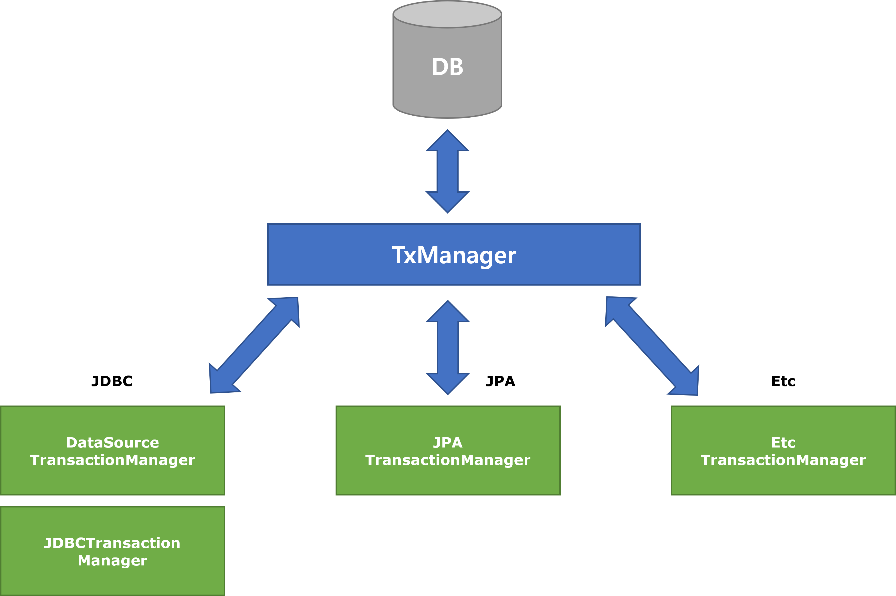
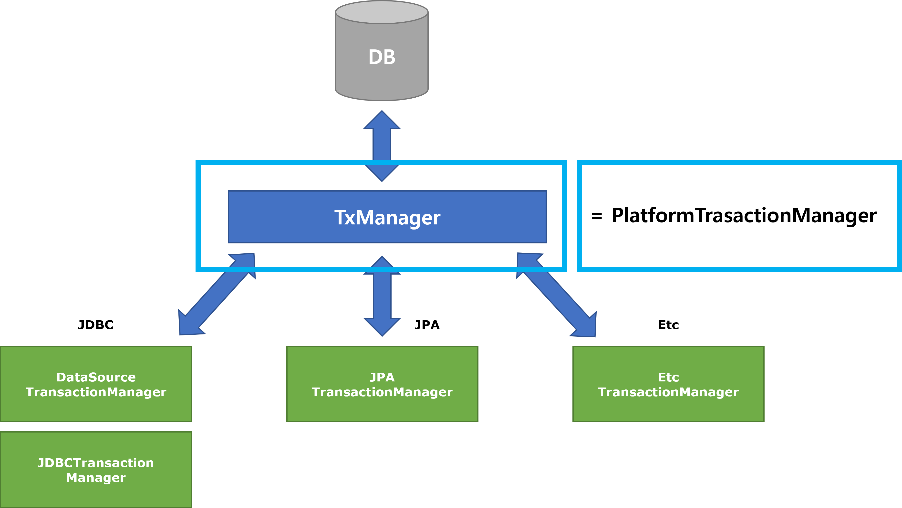
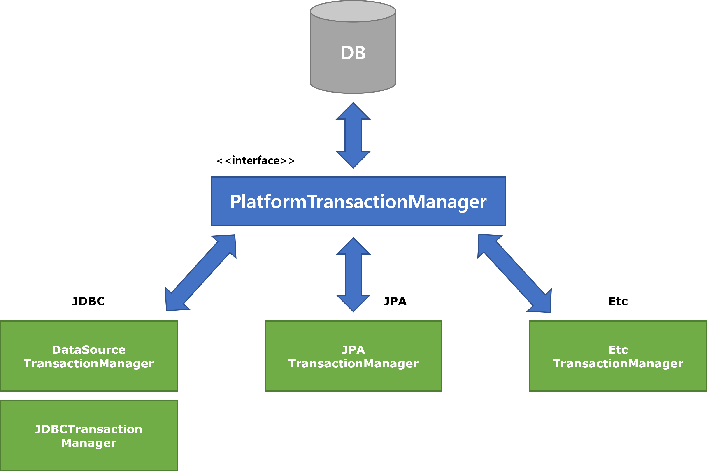
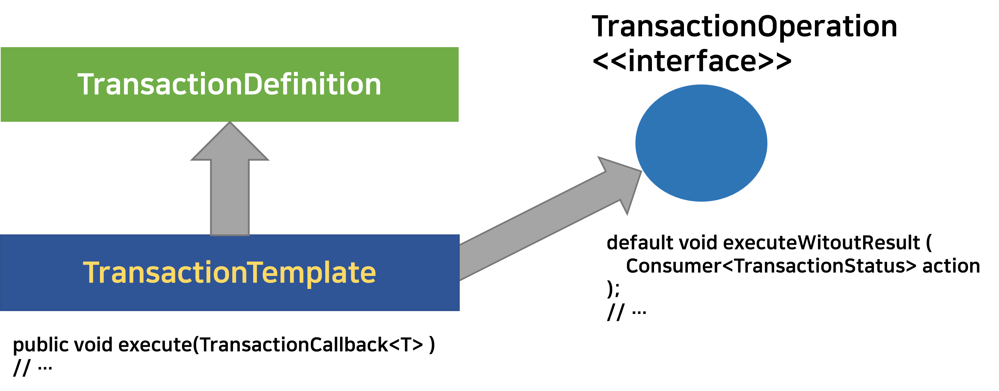

# 스프링이 트랜잭션 기능을 제공하는 방식들

> 처음 문서를 작성할 때는 나 조차도 어떻게 글을 써야 할지 막막해서 이것저것 다 쓰느라 글이 꽤 지저분했는데, 일주일 동안 다른 취준공부 등을 하느라 생각을 접어뒀었는데, 그 동안 뇌가 치유의 과정을 겪었나보다. <br>
>
> 오늘 트랜잭션 템플릿을 정리하면서, 어떻게 요약할지 조금 감이 잡히기 시작했다. 역시 초본은 깨끗하지 않다. 지속적으로 다듬어야 한다.<br>

<br>

# 참고자료

- [스프링 DB 1편 - 데이터 접근 핵심 원리 대시보드 - 인프런 | 강의 (inflearn.com)](https://www.inflearn.com/course/스프링-db-1/dashboard)
- [16. Transaction Management](https://docs.spring.io/spring-framework/docs/4.2.x/spring-framework-reference/html/transaction.html)
- [PlatformTransactionManager (Spring Framework 5.3.20 API)](https://docs.spring.io/spring-framework/docs/current/javadoc-api/org/springframework/transaction/PlatformTransactionManager.html)
- [JdbcTransactionManager (Spring Framework 5.3.20 API)](https://docs.spring.io/spring-framework/docs/current/javadoc-api/org/springframework/jdbc/support/JdbcTransactionManager.html) 
- [DataSourceTransactionManager (Spring Framework 5.3.20 API)](https://docs.spring.io/spring-framework/docs/current/javadoc-api/org/springframework/jdbc/datasource/DataSourceTransactionManager.html)
- [JpaTransactionManager (Spring Framework 5.3.20 API)](https://docs.spring.io/spring-framework/docs/current/javadoc-api/org/springframework/orm/jpa/JpaTransactionManager.html)

<br>

# 요약

요약해둘 내용은 아래와 같다.

- 트랜잭션 추상화
- 트랜잭션 동기화
- 트랜잭션 템플릿
  - jdbc commit/rollback
- 트랜잭션 리소스 초기화/회수 코드 분리
  - 선언적방식 : `@Transactional` 
  - AOP 를 사용한 로직 직접 구현
  - 프로그래밍 방식

<br>

# 트랜잭션 매니저 (feat. PlatformTransactionManager)

> **스프링이 제공하고 있는 JDBC 라이브러리 종류별 구현체 라이브러리들...**<br>

스프링은 데이터 라이브러리마다 다른 Transaction 을 얻어오는 동작, Transaction begin/end, commit, rollback 동작들을 공통적인 3가지의 메서드로 분류해서, 각 라이브러리로 구현하도록 하는 유연한 방식으로 TrnasactionManager 기능을 제공하고 있다.<br>

그리고 JDBC 기능 구현체마다 다른 트랜잭션 관련된 구체 기능이 구현된 트랜잭션 매니저들은 스프링에서 아래의 구체클래스들로 제공해주고 있다.

- JDBCTemplate : DataSourceTransactionManager, JdbcTransactionManager
  - [DataSourceTransactionManager (Spring Framework 5.3.20 API)](https://docs.spring.io/spring-framework/docs/current/javadoc-api/org/springframework/jdbc/datasource/DataSourceTransactionManager.html)
  - [JdbcTransactionManager (Spring Framework 5.3.20 API)](https://docs.spring.io/spring-framework/docs/current/javadoc-api/org/springframework/jdbc/support/JdbcTransactionManager.html) 
- JPA : JpaTransactionManager
  - [JpaTransactionManager (Spring Framework 5.3.20 API)](https://docs.spring.io/spring-framework/docs/current/javadoc-api/org/springframework/orm/jpa/JpaTransactionManager.html)
- Etc : EtcTransactionManager

<br>

> **만약 스프링의 도움 없이 스프링이 제공하는 TransactionManager 기능을 사용하려면?**<br>

이렇게 스프링 데이터에서 기본으로 제공되는 구체클래스들을 스프링 프레임워크의 도움 없이 직접 프로그램 내에서 인스턴스를 생성하고, JAVA 프로그램을 구현한다고 해보자. 그리고 이 프로그램은 JDBCTemplate, JPA, Etc 라이브러리를 모두 사용한다.<br>

이런 경우 가장 쉽게 생각할 수 있는 것은 `TxManager` 라고 부르는 클래스를 만들어서 이 안에서 구현체 라이브러리마다 다른 동작을 수행할 수 있도록 하는 메서드를 제공하도록 구현하게 될 것이다. 예를 들면 아래 그림과 같은 방식으로 구현하게 될 것이다.<br>

<br>



<br>

> **스프링을 이용해 JDBC 종류별 TransactionManager를 여러 개 생성해 사용하려면?**<br>

스프링은  JDBC 구현체 라이브러리마다 각각 다른 코드들에 대해 PlatformTrasactionManager 타입으로 의존성을 주입받을 수 있도록 PlatformTransactionManager 라는 인터페이스를 제공하고 있다. 

DataSourceTransactionManager, JDBCTransactionManager, JPATransactionManager 등과 같은 구체 타입의 인스턴스를 스프링 컨테이너에 PlatformTransactionManager 타입의 빈으로 빈의 이름을 특정지어서 등록해두고, 애플리케이션 계층 코드에서는 이것을 의존성주입받아서 사용하는 것만으로 깔끔하게 해결된다.<br>



<br>

예를 들면 JPATransactionManager 객체를 생성할 경우 아래와 같이 스프링 컨테이너에 빈으로 등록해서 사용한다. (참고 : [Spring Data JPA - Reference Documentation](https://docs.spring.io/spring-data/jpa/docs/current/reference/html/#jpa.java-config) )

```java
@Configuration
@EnableJpaRepositories
@EnableTransactionManagement
class ApplicationConfig {

  @Bean
  public DataSource dataSource() {

    EmbeddedDatabaseBuilder builder = new EmbeddedDatabaseBuilder();
    return builder.setType(EmbeddedDatabaseType.HSQL).build();
  }

  @Bean
  public LocalContainerEntityManagerFactoryBean entityManagerFactory() {

    HibernateJpaVendorAdapter vendorAdapter = new HibernateJpaVendorAdapter();
    vendorAdapter.setGenerateDdl(true);

    LocalContainerEntityManagerFactoryBean factory = new LocalContainerEntityManagerFactoryBean();
    factory.setJpaVendorAdapter(vendorAdapter);
    factory.setPackagesToScan("com.acme.domain");
    factory.setDataSource(dataSource());
    return factory;
  }

  @Bean
  public PlatformTransactionManager transactionManager(EntityManagerFactory entityManagerFactory) {

    JpaTransactionManager txManager = new JpaTransactionManager();
    txManager.setEntityManagerFactory(entityManagerFactory);
    return txManager;
  }
}
```

<br>

이 외에도 JDBCTemplate, Mybatis 와 같은 JDBC 라이브러리에 대한 트랜잭션 매니저 인스턴스 객체도 위와 같은 방식으로 PlatformTransactionManager 타입으로 스프링 컨테이너에 등록해두면 된다.<br>

<br>

`PlatformTransactionManager` 인터페이스는 아래와 같은 모양이다.

```java
public interface PlatformTransactionManager extends TransactionManager {
    TransactionStatus getTransaction(@Nullable TransactionDefinition definition)
			throws TransactionException;
    void commit(TransactionStatus status) throws TransactionException;
    void rollback(TransactionStatus status) throws TransactionException;
}
```

<br>

이런 `PlatformTrasactionManager` 라는 interface 를 `implements` 한 클래스로는 대표적으로 아래의 클래스들 이 있다.

- `DataSourceTransctionManager` 
- `JdbcTransactionManager`
- `JpaTransactionManager` 
- `EtcTrasactionManager`

<br>



스프링에서는 이렇게 `implements` 한 트랜잭션 매니저 클래스 들 중 하나를 선택해서 인스턴스화 하고 이것을 Bean 으로 등록해서 사용할수 있다.<br>

<br>

# 트랜잭션 동기화 매니저 (feat. TransactionSynchronizationManager)

트랜잭션은 동기화가 필요하다. 스프링에서 제공하는 `PlatformTrasactionManager` 는 트랜잭션 동기화 매니저를 제공해주고 있다.<br>

스프링에서 제공하는 각각의 `PlatformTransactionManager` 클래스를 implmenets 하는 각각의 구체 타입들은 내부적으로 트랜잭션 동기화 매니저클래스인 `TransactionSyncronizationManager` 를 이용해 트랜잭션을 얻는 과정을 동기화 한다.(자세한 내용은 `TheadLocal` 을 통해 구현되어있다고 한다.)<br>

즉, `DataSourceTransactionManager` , `JdbcTransactionManager`, `JpaTransactionManager`, `EtcTransactionManager` 등은 각각의  클래스 내부에서 `TransactionSyncronizationManager` 클래스를 사용한다.<br>

JDBC 라이브러리 별로 각각의 라이브러리 내부에서 트랜잭션 동기화는, 각 라이브러리 내에서 내부적으로 트랜잭션 동기화 매니저(`TransactionSynchronizationManager`)를 사용해 동기화를 수행하게끔 되어 있으므로, 사용자는 트랜잭션 동기화에 크게 신경쓰지 않아도 된다.<br>

각 구현체의 구체적인 소스코드의 동작을 간단하게 요약해보면 이렇다.<br>

JDBC<br>

- TransactionSynchronizationManager 클래스의 getResource(Datasource) 메서드를 통해 `ConnectionHolder` 타입의 객체를 얻는다.

JPA<br>

- TransactionManager 클래스의 getResource(DataSource) 메서드를 통해 `ConnectionHolder` 타입의 객체를 얻는다.
- 다만, JPA 의 경우 EntityManagerHolder 타입으로 다운캐스팅한다. 아마도 EntityManagerHolder 의 경우 JPA 에서만 제공해주는 기능이 있기에 그렇지 않을까 싶다.

<br>

> `0000Holder` <br>
>
> 스프링 시큐리티에도 보면 SecurityContextHolder 라는 클래스가 있다. 스프링의 jdbc 에서도 비슷하게 ConnectionHolder 라는 클래스를 제공해주고 있다. Connection을 제공해주는 역할을 한다. 스프링에서는 Connection 을 잡고 있거나, Authentication 문맥을 잡고 있는 등의 역할을 하는 것을 보통 접미사로 `-Holder` 를 사용한다.<br>

<br>

**나머지 내용(UML)은 추후 정리 예정**<br>

<br>

### (JDBC) DataSourcTransactionManager 에서의 동기화 매니저

`DataSourceTransactionManager` 클래스에서 동기화 매니저를 사용하는 부분을 살펴보자.

```java
public class DataSourceTransactionManager extends AbstractPlatformTransactionManager
		implements ResourceTransactionManager, InitializingBean {
    
    // ...

    @Override
	protected Object doGetTransaction() {
		DataSourceTransactionObject txObject = new DataSourceTransactionObject();
		txObject.setSavepointAllowed(isNestedTransactionAllowed());
		ConnectionHolder conHolder =
				(ConnectionHolder) TransactionSynchronizationManager.getResource(obtainDataSource());
		txObject.setConnectionHolder(conHolder, false);
		return txObject;
	}
    
    // ...
}
```

<br>

`TransactionSynconizationManager` 를 통해서 `ConnectionHolder` 를 얻고 있다.<br>

> ConnectionHolder conHolder = (ConnectionHolder) TransactionSynchronizationManager.getResource(obtainDataSource());

<br>

### (Jpa) JpaTransactionManager 에서의 동기화 매니저

이번에는 `JpaTransactionManager` 클래스 내에서 동기화 매니저를 사용하는 부분을 살펴보자.<br>

```java
public class JpaTransactionManager extends AbstractPlatformTransactionManager
		implements ResourceTransactionManager, BeanFactoryAware, InitializingBean {
    
    // ...
    
    @Override
	protected Object doGetTransaction() {
		JpaTransactionObject txObject = new JpaTransactionObject();
		txObject.setSavepointAllowed(isNestedTransactionAllowed());

		EntityManagerHolder emHolder = (EntityManagerHolder)
				TransactionSynchronizationManager.getResource(obtainEntityManagerFactory());
		if (emHolder != null) {
			if (logger.isDebugEnabled()) {
				logger.debug("Found thread-bound EntityManager [" + emHolder.getEntityManager() +
						"] for JPA transaction");
			}
			txObject.setEntityManagerHolder(emHolder, false);
		}

		if (getDataSource() != null) {
			ConnectionHolder conHolder = (ConnectionHolder)
					TransactionSynchronizationManager.getResource(getDataSource());
			txObject.setConnectionHolder(conHolder);
		}

		return txObject;
	}
    
    // ...
    
}
```

<br>

`TransactionSychronizationManager` 를 통해서 EntityManagerHolder 를 얻은 후에 이후의 동작을 수행한다.

> EntityManagerHolder emHolder = (EntityManagerHolder) TransactionSynchronizationManager.getResource(obtainEntityManagerFactory());

<br>

# 트랜잭션 템플릿

> **TransactionTemplate 을 이용해 commit, rollback 메서드 실행로직 공통화**<br>

스프링에서는 TransactionTemplate 클래스를 제공하고 있다. 이 TransactionTemplate 클래스를 사용하면 commit, rollback을 모든 코드에 일일이 적어주는 대신 execute, executeWithoutResult 등의 메서드를 이용해, commit, rollback 코드의 실행은 TransactionTemplate 객체가 대신 수행하도록 할 수 있다.<br>

<br>

> **TransactionTemplate -> TransactionDefinition, TransactionOperations 객체관계**<br>

TransactionTemplate 클래스가 상속하는 클래스인 TransactionDefinition 클래스, implements 하고 있는 interface인 TransactionOperation 인터페이스의 구조는 아래와 같다.(그림 참고)<br>

<br>



<br>

TransactionTemplate 클래스는 TransactionOperations 인터페이스를 implements하고 있다. <br>

그리고 TransactionOperations 인터페이스를 통해 execute(), executeWitoutResult() 메서드를 사용할 수 있다.<br>

- 참고 : [TransactionTemplate (Spring Framework 5.3.21 API)](https://docs.spring.io/spring-framework/docs/current/javadoc-api/org/springframework/transaction/support/TransactionTemplate.html) <br>

<br>

> **TrasnactionOperations 인터페이스**<br>

TransactionOperations 인터페이스에서 제공하는 메서드는 아래와 같다.<br>

execute, executeWithoutResult, withoutTransaction 등의 메서드를 제공하고 있다.<br>

아래는 TransactionOperations 라는 이터페이스의 실제 코드다. 유의해서 볼 것은  `executeWithoutResult(...)` 메서드는 default 메서드인 것을 확인가능하다.

```java
public interface TransactionOperations {
	@Nullable
	<T> T execute(TransactionCallback<T> action) throws TransactionException;
    
	default void executeWithoutResult(Consumer<TransactionStatus> action) throws TransactionException {
		execute(status -> {
			action.accept(status);
			return null;
		});
	}
    
	static TransactionOperations withoutTransaction() {
		return WithoutTransactionOperations.INSTANCE;
	}
}
```

<br>

> **execute() 메서드, executeWithoutResult 메서드**<br>

**execute**<br>

- 참고 : [TransactionCallback (Spring Framework 5.3.20 API)](https://docs.spring.io/spring-framework/docs/current/javadoc-api/org/springframework/transaction/support/TransactionCallback.html) 
- commit, rollback 을 수행하는 역할을 한다. 
- 이때 commt, rollback 은 TransactionOperation 객체가 수행해주고, commit, rollback 사이에 수행할 비즈니스 로직은 라이브러리 사용자(=개발자)로부터 `TransactionCallback` 인스턴스로 인자로 받아서 수행한다.

<br>

**executeWithoutResult**<br>

- 참고 : [TransactionOperations](https://docs.spring.io/spring-framework/docs/current/javadoc-api/org/springframework/transaction/support/TransactionOperations.html)
- commit, rollback을 수행하는 역할을 한다.
- 이때 commit, rollback 은 TransactionOperation 객체가 수행해주고 commit, rollback 사이에 수행할 비즈니스 로직은 라이브러리 사용자(=개발자)로부터 `Consumer<TransactionStatus>` 인스턴스를 전달받아서 수행한다.<br>

<br>

> **트랜잭션 매니저의 장점.. 하지만, commit, rollback 을 일일이 호출해줘야 한다는 단점도 아직은 있다.**<br>

예를 들어 JDBCTemplate 로직을 스프링 프레임워크 위에서 작성한다고 해보자. 스프링의 트랜잭션 매니저 기능 덕에  JDBC 커넥션 획득, 트랜잭션 시작/종료, 트랜잭션 커밋등의 JDBC코드를 일일이 작성하지 않아도 된다. 그냥 PlatformTransactionManager 타입의 객체 txManager를 의존성 주입 받아서 `txManager.commit()` 등과 같은 코드를 사용하면 된다. 내부적인 JDBC 코드까지 사용자가 고민하지 않아도 되는 것이 트랜잭션 매니저를 사용할 때의 장점이다.<br>

이렇게 아래 계층의 JDBC 코드를 직접 구현하지 않아도 되는 것은 장점이지만, 아직도 실제 애플리케이션에서는 `txManager.commit()` , `txManager.rollback()` 등의 코드를 직접 호출하게끔 코드를 작성해줘야 한다는 단점이 있다.<br>

Service 계층에 이런 코드가 남아있으면 애플리케이션의 코드가 특정 기술에 종속적으로 되어 기술계층과 애플리케이션 계층의 경계를 명확히 해두기 쉽지 않게 된다. 실제 애플리케이션 코드를 작성하면서 그 끝마다 `commit` , `rollback` 을 호출하는 것은 테스트를 쉽지 않게 만드는 요인이기도 하다.<br>

<br>

> **TransactionTemplate 을 사용하면? **<br>
>
> - **commit, rollback 메서드의 호출은 TransactionTemplate이 대신 수행하게끔해주는 역할**

이렇게 여기저기 산재해있는 commit, rollback 코드는 TransactionTemplate 객체를 사용해 공통화할 수 있다.<br>

트랜잭션 템플릿은, commit, rollback 과 같은 로직은 execute(), executeWitoutResult() 와 같은 메서드 내에서 수행하고 비즈니스 로직은 `Consumer<TransactionStatus>` , `TransactionCallback<T>` 를 받아서 처리하도록 하는 역할을 수행할 수 있도록 해준다.<br>

<br>

## TransactionTemplate 도입 전/후 를 예제로 비교해보기

### (Before) TransactionTemplate 도입 전

>  **PostService.java**

PostJdbcDao 라는 객체를 의존성 주입받아서 사용하고 있다. 코드를 자세히 살펴보면, commit, rollback 코드가 있다. 이렇게 하면, commit, rollback 메서드가 여기 저기에 존재하게 된다.<br>

```java
@Service
public class PostService{
    
    private final PostJdbcDao postJdbcDao;
    
    public PostService(PostJdbcDao postJdbcDao){
        this.postJdbcDao = postJdbcDao;
    }
    
    public void modifyPost(PostDto postDto){
        TransactionStatus status = transactionManager.getTransaction(new DefaultTransactionDefinition());
        
        try{
	        postJdbcDao.updatePost(postDto);          
            transactionManager.commit(status);
        }
        catch(Exception e){
            transactionManager.rollback(status);
        }

    }
    
}
```

<br>

> **PostJdbcDaoImpl.java**

JDBCTemplate 코드다. 특별한 점은 없다. DB 기술계층의 코드이다.<br>

(version 필드를 두어서 optimistic 락을 하게끔 흉내를 냈는데, 여기에 대해서는 다른 문서에서 정리 예정이다.)<br>

```java
@Component
public class PostJdbcDaoImpl implements PostDao{
    private final JdbcTemplate jdbcTemplate;
    public PostJdbcDao(DataSource dataSource){
        this.jdbcTemplate = new JdbcTemplate(dataSource);
    }
    
    @Override
    public void update(PostDto postDto){
        StringBuilder builder = new StringBuilder();
        builder.append("update Post set content = ?, version = ? where id = ?");
        jdbcTemplate.update(builder.toString(), postDto.getId(), postDto.getVersion()+1, postDto.getId());
    }
}
```

<br>

자세히 보면 아래와 같은 로직이 `@Service` 로직에 남아있다. `commit` 과 `rollback` 메서드를 애플리케이션에서 직접 호출해서 사용하고 있다.

```java
    public void modifyPost(PostDto postDto){
        TransactionStatus status = transactionManager.getTransaction(new DefaultTransactionDefinition());
        
        try{
	        postJdbcDao.updatePost(postDto);          
            transactionManager.commit(status);		// 이 부분
        }
        catch(Exception e){
            transactionManager.rollback(status);	// 이 부분 
        }

    }
```

이렇게 하면, 모든 애플리케이션 계층 코드에 기술계층의 메서드인 `commit()`, `rollback()` 메서드의 호출이 곳곳에 산재해있게 된다.<br>

TransactionTemplate 을 사용하면, commit, rollback 메서드를 호출하는 역할은 TransactionTemplate 객체가 전담하게끔 하고, 비지니스 로직은 `Consumer<TransactionStatus>` , `TransactionCallback<T>`  에 담아서 Transaction commit, rollback 사이에 실행되게끔 할 수 있다.<br>

<br>

## (After) TransactionTemplate 도입 후

위의 코드와 비교했을 때 달라지는 부분은 서비스측의 코드다. 코드를 보자.

```java
@Service
public class PostService{
    private final PostJdbcDao postJdbcDao;
    private final TransactionTemplate transactionTemplate;
    
    public PostService(
        PlatformTransactionManager transactionManager,
        PlatPostJdbcDao postJdbcDao
    ){
        this.transactionManager = new TransactionTemplate(transactionManager);
        this.postJdbcDao = postJdbcDao;
    }
    
    public void modifyPost(PostDto postDto){
        // 이 부분이 달라졌다.
        // 실제 commit(), rollback() 코드는 TransactionTemplate 메서드가 수행한다.
        transactionTemplate.executeWithoutResult((stats)->{
           try{
               postJdbcDao.updatePost(postDto);
           } 
           catch(Exception e){
               e.printStackTrace();
           }
        });
    }
    
}
```

commit, rollback 코드가 사라졌다. 기술계층의 코드에서 조금은 독립적으로 변했다.<br>

이제는, 이 transactionTemplate 을 사용하는 코드 조차도 독립되게끔 할수 있는데 AOP나 스프링의 `@Transactional` 을 사용하면 가능하다. 이번 문서에서는 `@Transactional` 에 초점을 맞춰서 요약을 할 예정이다.<br>

<br>

# @Transactional

> **스프링의 @Transactional**

- 스프링에서는 어노테이션 방식으로 애플리케이션 코드의 시작 전/후에 트랜잭션의 획득,커밋,롤백을 수행하도록 할 수 있다. `@Transactional` 어노테이션을 사용하는 것으로 이런 방식이 지원된다.
- @Transactional 어노테이션은 메서드, 클래스레벨 모드에 붙일수 있다. 클래스에 붙이면 외부에서 클래스의 모든 public 메서드가 AOP 적용대상이 된다.
- 이렇게 어노테이션 기반으로 트랜잭션을 관리하는 코드의 방식을 선언적 트랜잭션 관리(Declarative Transaction Management) 라고 부른다.

<br>

> **선언적 트랜잭션 관리, 프로그래밍 방식의 트랜잭션 관리**

**선언적 트랜잭션 관리**

- `@Transactional` 어노테이션을 통해 트랜잭션을 적용한 코드는 선언적 트랜잭션 관리 코드라고 이야기 할 수 있다.
- 선언적 트랜잭션 관리는 xml 설정 방식에서도 사용 가능하다.

<br>

**프로그래밍 방식의 트랜잭션 관리**

- TransactionTemplate, TransactionTemplate 을 이용해서 직접 트랜잭션을 관리하는 코드를 프로그래밍 방식의 트랜잭션 관리 라고 한다.

<br>

# 스프링 부트에서의 DataSource, TransactionManager 자동설정

## DataSource

- 스프링부트는 데이터소스(DataSource)를 스프링 빈으로 등록해둔다.
- 별다른 설정이 없으면 기본으로 스프링 부트의 기본설정으로 등록된다.
- 스프링 컨텍스트에 등록시 `dataSource` 라는 이름으로 등록된다.
- 개발자가 직접 DataSource 를 생성해 빈으로 등록하는 순간, `dataSource` 는 빈으로 등록되지 않는다. (스프링부트의 자동설정 기능때문)
- dataSource 를 자동으로 생성할 때 참고하는 커넥션 정보는 [application.properties](http://application.properties) 에 작성한다.

<br>

ex) application.properties

```properties
spring.datasource.url=jdbc:h2:tcp://localhost/~/test
spring.datasource.username=sa
spring.datasource.password=
```

<br>

스프링부트가 기본으로 생성하는 데이터소스는 `HikariDataSource` 다.<br>

만약, `spring.datasource.url` 속성이 없으면 스프링부트는 내장 데이터베이스(메모리DB)를 사용하기 위한 시도를 하게 된다.<br>

<br>

## TransactionManager

- 스프링부트는 트랜잭션매니저(TransactionManager)를 스프링 빈으로 등록해둔다.
- 별다른 설정이 없으면 기본으로 스프링 부트의 기본설정으로 등록된다.
- 스프링 컨텍스트에 등록시 `transactionManager` 라는 이름으로 등록된다.
- 개발자가 직접 TransactionManager 를 생성해 빈으로 등록하는 순간, `transactionManager` 는 빈으로 등록되지 않는다.(스프링부트의 자동설정 기능 때문)
- 자동설정시 스프링부트는 어떤 트랜잭션매니저를 선택할지 결정해야 하는데, 이 때 JDBC가 기본데이터 소스로 되어있으면 DataSourceTransactionManager 를 `transactionManager` 로 등록하고, JPA가 기본데이터소스로 되어있으면 JpaTransactionManager 를 `transactionManager` 로 등록한다.
- JpaTransactionManager 는 DataSoruceTransactionManager가 제공하는 기능들을 모두 지원한다.

<br>

# etc..

투머치한 내용이긴 하지만, 그렇다고 안쓰긴 애매한 내용들

## @TestConfiguration

테스트에서만 사용할 설정클래스를 테스트 패키지 내에만 만들어두고 사용할 것이라면 `@TestConfiguration` 을 붙이고 사용하자.

```java
@TestConfiguration
static class TestConfig{
	@Bean
	DataSource dataSource(){
		return new DriverManagerDataSource(URL, USERNAME, PASSWORD);
	}

	// ...
}
```

<br>

또는 아래와 같이 인라인으로...

```java
@SpringBootTest
class SomethingTest{
	// ...
	@TestConfiguration
	static class TestConfig{
		private final DataSource dataSource;
		public TestConfig(DataSource dataSource){this.dataSource = dataSource);
	}

	// ...

}
```

<br>
