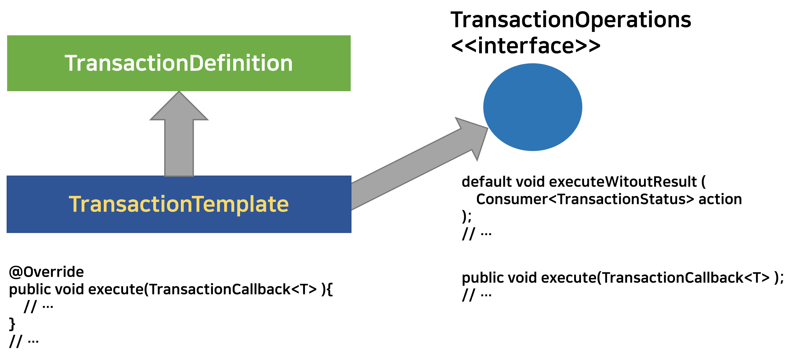

# 스프링이 트랜잭션 기능을 제공하는 방식들

> 처음 문서를 작성할 때는 나 조차도 어떻게 글을 써야 할지 막막해서 이것저것 다 쓰느라 글이 꽤 지저분했는데, 일주일 동안 다른 취준공부 등을 하느라 생각을 접어뒀었는데, 그 동안 뇌가 치유의 과정을 겪었나보다. <br>
>
> 오늘 트랜잭션 템플릿을 정리하면서, 어떻게 요약할지 조금 감이 잡히기 시작했다. 역시 초본은 깨끗하지 않다. 지속적으로 다듬어야 한다.<br>

<br>

오늘 이 문서에서 정리하는 내용은 아래와 같다.

- 트랜잭션 추상화
- 트랜잭션 동기화
- 트랜잭션 템플릿
- 트랜잭션 템플릿 코드 분리
  - 여기에 대해서는 다음주...에 정리 예정!! 쿨럭... 오늘은 일단 요약만 살포시...
  - 스프링 기능을 개발하는 것이 아니고, 제품을 만드는 제품개발을 하는 제품개발자 입장에서는 스프링의 트랜잭션 기능을 일일이 테스트할 필요까지는 없다. (기술계층에 종속된 테스트까지는 불필요) 그래서 트랜잭션을 수행하는 부분을 아예 proxy 객체가 대행해서 수행할 수 있도록 스프링은 `@Transactional` 이라는 어노테이션을 제공한다. 
  - 예외의 경우가 있다. 트랜잭션을 테스트해야 하는 경우가 있기는 하다. 어떤 로직이 트랜잭션 계층에서 rollback, commit을 하는지 테스트를 해야하는 경우 역시 존재한다. 예를 들면, 티켓을 예매하는 동작 중에 예외가 발생하면 어떤 로직까지를 롤백시킬지 등에 대한 로직은 트랜잭션이 롤백됐는지, 커밋됐는지를 테스트 케이스로 검증하면 좋다.  (ex. 결제, 예매 등등)

<br>

# 참고자료

- [스프링 DB 1편 - 데이터 접근 핵심 원리 대시보드 - 인프런 | 강의 (inflearn.com)](https://www.inflearn.com/course/스프링-db-1/dashboard)
- [16. Transaction Management](https://docs.spring.io/spring-framework/docs/4.2.x/spring-framework-reference/html/transaction.html)
- [PlatformTransactionManager (Spring Framework 5.3.20 API)](https://docs.spring.io/spring-framework/docs/current/javadoc-api/org/springframework/transaction/PlatformTransactionManager.html)
- [JdbcTransactionManager (Spring Framework 5.3.20 API)](https://docs.spring.io/spring-framework/docs/current/javadoc-api/org/springframework/jdbc/support/JdbcTransactionManager.html) 
- [DataSourceTransactionManager (Spring Framework 5.3.20 API)](https://docs.spring.io/spring-framework/docs/current/javadoc-api/org/springframework/jdbc/datasource/DataSourceTransactionManager.html)
- [JpaTransactionManager (Spring Framework 5.3.20 API)](https://docs.spring.io/spring-framework/docs/current/javadoc-api/org/springframework/orm/jpa/JpaTransactionManager.html)

<br>

# 요약

요약해둘 내용은 아래와 같다.

- 트랜잭션 추상화
- 트랜잭션 동기화
- 트랜잭션 템플릿
  - jdbc commit/rollback
- 트랜잭션 리소스 초기화/회수 코드 분리
  - 선언적방식 : `@Transactional` 
  - AOP 를 사용한 로직 직접 구현
  - 프로그래밍 방식

<br>

# 트랜잭션 추상화

**트랜잭션 추상화**<br>

JDBC를 사용하는 스프링은 DB 접근 라이브러리에 따라 서로 다르게 작성해야만 하는 Transaction 객체를 얻는 로직들을 하나로 통일해서 제공해주는 멋진 라이브러리이다. 예를 들면 JDBC, JPA, Mybatis를 실무에서 사용하고 있다고 해보자. 이때 만약 스프링 라이브러리를 사용하고 있지 않다고 한다면, 각각의 JDBC, JPA, Mybatis 라이브러리마다 각각 다른 Transaction 객체 생성, Connection 생성 로직을 따로 각각 구현해야 할 것이다.<br>

스프링은 이렇게 데이터 라이브러리마다 다른 Transaction 관련 로직들에서 공통적으로 필요로 하는 기능들을 메서드로 분류해 [PlatformTransactionManager (Spring Framework 5.3.20 API)](https://docs.spring.io/spring-framework/docs/current/javadoc-api/org/springframework/transaction/PlatformTransactionManager.html) 라는 인터페이스를 만들어두었다.<br>

그리고 이렇게 분류한 interface를 기준으로 각각 세부 데이터 접근 로직들을 구현해둔 구현체들을 제공해주고 있다. 대표적인 PlatformTransactionManager구현체클래스들은 아래와 같다. 

- [JdbcTransactionManager (Spring Framework 5.3.20 API)](https://docs.spring.io/spring-framework/docs/current/javadoc-api/org/springframework/jdbc/support/JdbcTransactionManager.html) 
- [DataSourceTransactionManager (Spring Framework 5.3.20 API)](https://docs.spring.io/spring-framework/docs/current/javadoc-api/org/springframework/jdbc/datasource/DataSourceTransactionManager.html)
- [JpaTransactionManager (Spring Framework 5.3.20 API)](https://docs.spring.io/spring-framework/docs/current/javadoc-api/org/springframework/orm/jpa/JpaTransactionManager.html)

<br>

이렇게 세부적으로 구현된 클래스들은 스프링에서는 Bean 으로 등록해서 생성자/setter/필드 의존성 주입방식으로 의존성을 `PlatformTransactionManager` 타입으로 주입받아 사용가능하다.<br>

<br>

**PlatformTransactionManager**<br>

스프링은 데이터 라이브러리마다 다른 Transaction 을 얻어오는 동작, Transaction begin/end, commit, rollback 동작들을 공통적인 3가지의 메서드로 분류해서, 각 라이브러리로 구현하도록 하는 유연한 방식으로 TrnasactionManager 기능을 제공하고 있다.<br>

만약 스프링이 없었을 경우는 JdbcTransactionManager, JpaTransactionManager 등의 클래스를 직접 구현해야 했을 거다. 또는 `TxManager` 같은 이름의 클래스 내에 데이터 라이브러리마다 다른 Transaction 생성, commit, rollback 동작들을 각각 구현해서 사용하고 있었을지도 모른다.<br>

그림추가해야 함.

`PlatformTransactionManager` 인터페이스는 아래와 같은 모양이다.

```java
public interface PlatformTransactionManager extends TransactionManager {
    TransactionStatus getTransaction(@Nullable TransactionDefinition definition)
			throws TransactionException;
    void commit(TransactionStatus status) throws TransactionException;
    void rollback(TransactionStatus status) throws TransactionException;
}
```

<br>

이런 `PlatformTrasactionManager` 라는 interface 를 `implements` 한 클래스로는 대표적으로 아래의 클래스들 이 있다.

- `DataSourceTransctionManager` 
- `JdbcTransactionManager`
- `JpaTransactionManager` 
- `EtcTrasactionManager`

<br>

스프링에서는 이렇게 `implements` 한 트랜잭션 매니저 클래스 들 중 하나를 선택해서 인스턴스화 하고 이것을 Bean 으로 등록해서 사용할수 있다.<br>

단순한 예제기반의 요약본은 추후 다른 문서에 정리 예정이다.<br>

<br>

# 트랜잭션 동기화

트랜잭션은 동기화가 필요하다. 스프링에서 제공하는 `PlatformTrasactionManager` 는 트랜잭션 동기화 매니저를 제공해주고 있다.

스프링에서 제공하는 각각의 `PlatformTransactionManager` 클래스를 implmenets 하는 각각의 구체 타입들은 내부적으로 트랜잭션 동기화 매니저클래스인 `TransactionSyncronizationManager` 를 이용해 트랜잭션을 얻는 과정을 동기화 한다.<br>

자세한 내용은 `TheadLocal` 을 통해 구현되어있다고 한다.<br>

즉, `DataSourceTransactionManager` , `JdbcTransactionManager`, `JpaTransactionManager`, `EtcTransactionManager` 등은 각각의  클래스 내부에서 `TransactionSyncronizationManager` 클래스를 사용한다.<br>

내부적으로 트랜잭션 동기화 매니저를 사용해 동기화를 수행하게끔 되어 있으므로, 사용자는 트랜잭션 동기화에 크게 신경쓰지 않아도 된다.<br>

**나머지 내용(UML)은 추후 정리 예정**<br>

`DataSourceTransactionManager` 클래스테서 동기화 매니저를 사용하는 부분을 살펴보자.

```java
public class DataSourceTransactionManager extends AbstractPlatformTransactionManager
		implements ResourceTransactionManager, InitializingBean {
    
    // ...

    @Override
	protected Object doGetTransaction() {
		DataSourceTransactionObject txObject = new DataSourceTransactionObject();
		txObject.setSavepointAllowed(isNestedTransactionAllowed());
		ConnectionHolder conHolder =
				(ConnectionHolder) TransactionSynchronizationManager.getResource(obtainDataSource());
		txObject.setConnectionHolder(conHolder, false);
		return txObject;
	}
    
    // ...
}
```

`TransactionSynconizationManager` 를 통해서 `ConnectionHolder` 를 얻고 있다.<br>

이번에는 `JpaTransactionManager` 클래스 내에서 동기화 매니저를 사용하는 부분을 살펴보자.<br>

```java
public class JpaTransactionManager extends AbstractPlatformTransactionManager
		implements ResourceTransactionManager, BeanFactoryAware, InitializingBean {
    
    // ...
    
    @Override
	protected Object doGetTransaction() {
		JpaTransactionObject txObject = new JpaTransactionObject();
		txObject.setSavepointAllowed(isNestedTransactionAllowed());

		EntityManagerHolder emHolder = (EntityManagerHolder)
				TransactionSynchronizationManager.getResource(obtainEntityManagerFactory());
		if (emHolder != null) {
			if (logger.isDebugEnabled()) {
				logger.debug("Found thread-bound EntityManager [" + emHolder.getEntityManager() +
						"] for JPA transaction");
			}
			txObject.setEntityManagerHolder(emHolder, false);
		}

		if (getDataSource() != null) {
			ConnectionHolder conHolder = (ConnectionHolder)
					TransactionSynchronizationManager.getResource(getDataSource());
			txObject.setConnectionHolder(conHolder);
		}

		return txObject;
	}
    
    // ...
    
}
```

<br>

**트랜잭션 추상화란? 요약**<br>

`Transaction` 객체를 얻어오는 로직, jdbc 및 JPA, Mybatis와 같은 데이터 접근 라이브러리마다 다르게 JAVA 코드로 작성되는 commit, rollback 로직들은 트랜잭션 추상화를 통해 해결됐다. 스프링에서는 `PlatformTransactionManager` 를  `implements` 하는 각각의 구체 타입인 아래와 같은 클래스들을 제공하고 있다.<br>

- `DataSourceTransctionManager` : JDBC
- `JdbcTransactionManager` : JDBC
- `JpaTransactionManager` : JPA
- `EtcTrasactionManager` : Mybatis, etc...

즉, 다른 종류의 JDBC 추상화 라이브러리를 사용하면서 코드가 달라지는 코드들을 추상화하고 공통화해서 같은 메서드로 다른 JDBC로직을 사용할 수 있도록 해둔 것이 트랜잭션 추상화이다.<br>

<br>

# 트랜잭션 템플릿

트랜잭션을 얻어오고 커밋을 하는 동작을 같은 메서드로 처리할 수 있게끔 하는 것은 트랜잭션 추상화다.<br>

트랜잭션 추상화를 지원하는 코드를 작성한다고 해도 여전히 코드 여기저기에 직접 execute, commit 관련 코드를 작성해야 한다는 점은 여전히 불편하다.<br>

<br>

**TransactionTemplate 을 이용해 commit, rollback 메서드 실행로직 공통화**<br>

스프링에서는 TransactionTemplate 클래스를 제공하고 있다. 이 TransactionTemplate 클래스를 사용하면 commit, rollback을 모든 코드에 일일이 적어주는 대신 execute, executeWithoutResult 등의 메서드를 이용해, commit, rollback 코드의 실행은 TransactionTemplate 객체가 수행하도록 할 수 있다.<br>

TransactionTemplate 클래스가 상속하는 클래스인 TransactionDefinition 클래스, implements 하고 있는 interface인 TransactionOperation 인터페이스의 구조는 아래와 같다.(그림 참고)<br>



<br>

TransactionTemplate 클래스에는 execute() 라는 메서드를 제공하고 있고, TransactionOperation 인터페이스를 implements하는 executeWitoutResult() 메서드 역시도 사용할 수 있다.<br>

> [TransactionTemplate (Spring Framework 5.3.21 API)](https://docs.spring.io/spring-framework/docs/current/javadoc-api/org/springframework/transaction/support/TransactionTemplate.html) <br>

<br>

**TrasnactionOperations 인터페이스**<br>

위에서 정리한 그림에 나타난 클래스/인터페이스 중에서 오늘 살펴볼 클래스는 TransactionOperation 인터페이스다.

TransactionOperations 인터페이스에서 제공하는 메서드는 아래와 같다.<br>

execute, executeWithoutResult, withoutTransaction 등의 메서드를 제공하고 있다.<br>

그리고 이것은 구현체인 TransactionTemplate 클래스에서 execute, executeWithoutResult 클래스 내에서 구현해야 한다.<br>

```java
public interface TransactionOperations {
	@Nullable
	<T> T execute(TransactionCallback<T> action) throws TransactionException;
    
	default void executeWithoutResult(Consumer<TransactionStatus> action) throws TransactionException {
		execute(status -> {
			action.accept(status);
			return null;
		});
	}
    
	static TransactionOperations withoutTransaction() {
		return WithoutTransactionOperations.INSTANCE;
	}
}
```

<br>

각 메서드를 간단하게 요약해서 정리해봤다.

**execute**<br>

- 참고 : [TransactionCallback (Spring Framework 5.3.20 API)](https://docs.spring.io/spring-framework/docs/current/javadoc-api/org/springframework/transaction/support/TransactionCallback.html) 
- commit, rollback 을 수행하는 역할을 한다. 
- 이때 commt, rollback 은 TransactionOperation 객체가 수행해주고, commit, rollback 사이에 수행할 비즈니스 로직은 라이브러리 사용자(=개발자)로부터 `TransactionCallback` 인스턴스로 인자로 받아서 수행한다.

<br>

**executeWithoutResult**<br>

- 참고 : [TransactionOperations](https://docs.spring.io/spring-framework/docs/current/javadoc-api/org/springframework/transaction/support/TransactionOperations.html)
- commit, rollback을 수행하는 역할을 한다.
- 이때 commit, rollback 은 TransactionOperation 객체가 수행해주고 commit, rollback 사이에 수행할 비즈니스 로직은 라이브러리 사용자(=개발자)로부터 `Consumer<TransactionStatus>` 인스턴스를 전달받아서 수행한다.<br>

<br>

**예제 시나리오 - TransactionTemplate 도입 Before/After 비교**<br>

예를 들어 JDBC 로직을 작성한다고 해보자. JdbcTransactionManager 타입의 인스턴스를 생성해서 빈으로 등록해두고, PlatformTransactionManager 타입으로 받아온 후에 일련의 처리 로직을 거치게 된다.<br>

이때 여전히 commit(), rollback() 코드가 Service 계층에도 남아있게 된다. 이렇게 되는 이유는 commit, rollback 하는 시점은 DB계층이 아닌 논리적 계층인 Service 계층에서 커밋/롤백의 단위를 논리적으로 구분해두어야 하기 때문이다.<br>

이렇게 여기저기 산재해있는 commit, rollback 코드는 TransactionTemplate 객체를 사용해 공통화할 수 있다. 

트랜잭션 템플릿은, commit, rollback 과 같은 로직은 execute(), executeWitoutResult() 와 같은 메서드 내에서 수행하고 비즈니스 로직은 `Consumer<TransactionStatus>` , `TransactionCallback<T>` 를 받아서 처리하도록 하는 역할을 수행할 수 있도록 해준다.<br>

<br>

물론 이렇게 해도 아직은 DB계층을 서비스 코드에서 아직까지는 완전히 제거하지 못한다. TransactionTemplate 틀 여전히 서비스 코드에 의존성으로 존재하기 때문이다. 가급적이면 DB에 관련된 동작은 DB계층에 대해 독립적으로 코드가 구현되어야, 테스트시에도 경계를 명확히 구분지을 수 있다는 점에서 아직까지는 불편한 코드다.<br>

<br>

이제 예제를 한번 보자.<br>

<br>

## (Before) TransactionTemplate 도입 전

>  **PostService.java**

PostJdbcDao 라는 객체를 의존성 주입받아서 사용하고 있다. 코드를 자세히 살펴보면, commit, rollback 코드가 있다. 이렇게 하면, commit, rollback 메서드가 여기 저기에 존재하게 된다.<br>

```java
@Service
public class PostService{
    
    private final PostJdbcDao postJdbcDao;
    
    public PostService(PostJdbcDao postJdbcDao){
        this.postJdbcDao = postJdbcDao;
    }
    
    public void modifyPost(PostDto postDto){
        TransactionStatus status = transactionManager.getTransaction(new DefaultTransactionDefinition());
        
        try{
	        postJdbcDao.updatePost(postDto);          
            transactionManager.commit(status);
        }
        catch(Exception e){
            transactionManager.rollback(status);
        }

    }
    
}
```

<br>

> **PostJdbcDaoImpl.java**

JDBCTemplate 코드다. 특별한 점은 없다. DB 기술계층의 코드이다.<br>

(version 필드를 두어서 optimistic 락을 하게끔 흉내를 냈는데, 여기에 대해서는 다른 문서에서 정리 예정이다.)<br>

```java
@Component
public class PostJdbcDaoImpl implements PostDao{
    private final JdbcTemplate jdbcTemplate;
    public PostJdbcDao(DataSource dataSource){
        this.jdbcTemplate = new JdbcTemplate(dataSource);
    }
    
    @Override
    public void update(PostDto postDto){
        StringBuilder builder = new StringBuilder();
        builder.append("update Post set content = ?, version = ? where id = ?");
        jdbcTemplate.update(builder.toString(), postDto.getId(), postDto.getVersion()+1, postDto.getId());
    }
}
```

<br>

자세히 보면 아래와 같은 로직이 `@Service` 로직에 남아있다. execute와 commit 을 Service 계층에서 물리적으로 수행하고 있다.

```java
    public void modifyPost(PostDto postDto){
        TransactionStatus status = transactionManager.getTransaction(new DefaultTransactionDefinition());
        
        try{
	        postJdbcDao.updatePost(postDto);          
            transactionManager.commit(status);
        }
        catch(Exception e){
            transactionManager.rollback(status);
        }

    }
```

모든 서비스코드마다 이렇게 commit, rollback 로직이 남아있게 된다. <br>

위에서 요약해두었듯이 스프링에서는 TransactionTemplate 이라는 인터페이스를 제공하고 있다. 트랜잭션 템플릿은, commit, rollback 과 같은 로직은 execute(), executeWithoutResult() 와 같은 메서드 내에서 수행하고 비즈니스 로직은 `Consumer<TransactionStatus>` , `TransactionCallback<T>` 를 받아서 처리하도록 하는 역할을 수행한다.<br>

<br>

## (After) TransactionTemplate 도입 후

위의 코드와 비교했을 때 달라지는 부분은 서비스측의 코드다. 코드를 보자.

```java
@Service
public class PostService{
    private final PostJdbcDao postJdbcDao;
    private final TransactionTemplate transactionTemplate;
    
    public PostService(
        PlatformTransactionManager transactionManager,
        PlatPostJdbcDao postJdbcDao
    ){
        this.transactionManager = new TransactionTemplate(transactionManager);
        this.postJdbcDao = postJdbcDao;
    }
    
    public void modifyPost(PostDto postDto){
        transactionTemplate.executeWithoutResult((stats)->{
           try{
               postJdbcDao.updatePost(postDto);
           } 
           catch(Exception e){
               e.printStackTrace();
           }
        });
    }
    
}
```

commit, rollback 코드가 사라졌다. commit, rollback 코드는 transactionTemplate 에서 수행하고, 라이브러리 사용자(=개발자)가 수행할 비지니스로직은 Consumer 타입으로 받고있다.<br>

<br>

여기까지 해서 트랜잭션 템플릿까지 정리했다. TransactionTemplate을 이용하게 되면서 commit, rollback 로직을 여기 저기에서 사용하지 않고, 라이브러리 내부에서 비지니스로직과 함께 사용할 수 있었다. commit, rollback 메서드가 여기저기 퍼져있지 않게되었다.<br>

<br>

하지만, 아직 SQL 관련 Exception 을 처리하는 코드, 그리고 transactionTemplate 객체를 직접 주입받아서 처리하는 부분 등, DB 계층의 기술에 의존적인 코드가 남아있기는 하다. 이런 코드는 AOP 또는 `@Transactional` 인터페이스를 통해서 조금 더 발전시켜나갈 수 있다.<br>

<br>

<br>

<br>

<br>

아래에서부터는 이번주 금요일 부터 정리 예정... 이거 정리하다가 늙는것...같다... 당분간은 WebFlux 개념정리, 함수형 프로그래밍 관련해서 외국강의 들은 내용들 개념정리하는 데에 시간을 더 분배할 생각이기 때문이다...<br>

<br>

<br>

<br>

<br>

<br>

<br>

<br>

<br>

<br>

<br>

<br>

<br>

<br>

<br>

<br>

<br>

<br>

<br>

<br>

<br>

<br>

<br>

<br>

<br>

<br>

<br>

<br>

<br>

<br>

<br>

<br>

<br>

# AOP, @Transactional

정리가 덜됐다...

- 트랜잭션 리소스 초기화/회수 코드 분리
  - 선언적 방식
    - `@Transactional` 
  - AOP 를 사용한 로직 직접 구현
  - 프로그래밍 방식 
    - 테스트코드에서 트랜잭션을 검증할 때 사용
    - 자세한 내용은 스티브 프리드먼의 객체지향 설계와 실천 이라는 책에서도 언급되고 있다.

<br>


